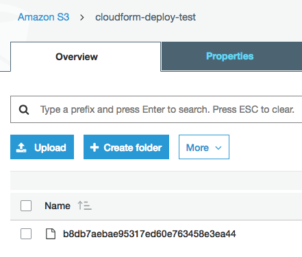
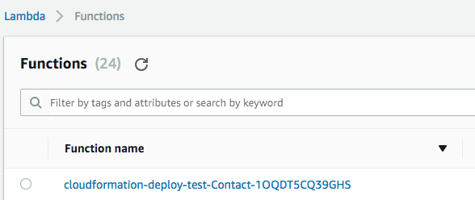
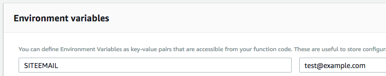
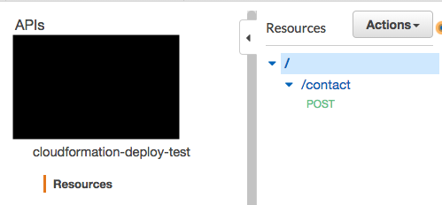

# Introduction to CloudFormation

Note: this guide will pick up where the [guide on Webpack](../webpack/webpack.md) left off. It is highly advisable to read and implement the steps covered in that guide before moving on to this one. This guide will also assume that the AWS command line interface (CLI) is installed globally and all necessary credentials are already set up. See [this guide](../../introduction-to-aws/credentials-setup/credentials-setup.md) for more info on AWS credentials.

Before beginning the tasks in this guide, it is important to tell your console which AWS profile to use. Once you have opened the terminal window you will be using for this project, run `$ export AWS_PROFILE=your-profile-name-here` with the actual name of the AWS profile substituted after the equals sign.

## What Is CloudFormation?

An API implemented on the AWS cloud is not made from just one single service. An API endpoint might be set up with API Gateway. This may trigger a function deployed to Lambda. The Lambda function may use any number of AWS services such as DynamoDB, SES or S3 just to name a few examples. While it is perfectly possible for a developer to set up each of these resources manually using the AWS console in the web browser, this can be time-consuming and very tedious. Development by its nature involves a lot of trial-and-error, and having to manually deploy each service any time you want to make a small change is a poor use of a developer's time.

This is where AWS CloudFormation comes into play. With CloudFormation, it is possible to have a single template file that describes all the resources needed for a project. The developer can make a change to a resource's settings just by changing this template file. Then, using the AWS CLI, it is possible to deploy all specified resources all at once. While this can take time to set up initially, the time saved in the long-term will more than make up for this as a developer can spend more time writing and testing code, and less time deploying and redeploying the same resources the hard way over and over.

## The Serverless Application Model

There are multiple ways to set up a project and have the various AWS resources interact with each other. The API created in this demonstration will follow the Serverless Application Model (SAM). The deploy template created here will be following this model. Information for SAM provided by the AWS team can be found [here](https://github.com/awslabs/serverless-application-model), as well as the official SDK documentation located [here](https://docs.aws.amazon.com/lambda/latest/dg/serverless_app.html) While this repository has little in the way of descriptive documentation, the readme does link to examples of projects built around this model with an accompanying deploy template for each one. This can be a very useful resource for developers creating their own templates from scratch.

If you intend to use a model other than SAM, it is important to research that model thoroughly to make sure the format of the template is correct. Information about templates for other models can be found in the official AWS SDK documentation located [here](https://docs.aws.amazon.com/AWSCloudFormation/latest/UserGuide/template-reference.html).

## The Deploy Template

In your project directory, create a file called `deploy.yml`. This will be our template where we specify all the resources we want to create when we deploy.

Recall that in the project we set up in the Webpack documentation, we've created a handler called `contact`. We are going to write our template to automatically deploy this function to Lambda whenever we enter the relevant script in the terminal.

To keep this tutorial focused on CloudFormation, let us assume that the IAM role intended for the AWS function has already been created. For more information about using IAM to create roles and add permissions, please see our [documentation on IAM](../../introduction-to-aws/iam/iam.md).

Here is the code we will use for our `deploy.yml` template.

```yaml
AWSTemplateFormatVersion: '2010-09-09'
Transform: AWS::Serverless-2016-10-31
Resources:
  Contact:
    Type: AWS::Serverless::Function
    Properties:
      Handler: contact.handler
      Runtime: nodejs8.10
      CodeUri: ./build/contact.js
      Timeout: 3
      MemorySize: 128
      Role: arn:aws:iam::963067304288:role/tfe-lambda-role
      Events:
        RootPost:
          Type: Api
          Properties:
            Path: /contact
            Method: post
      Environment:
        Variables:
          SITE_EMAIL: 'test@example.com'
```

Let's break down these properties:

* `AWSTemplateFormatVersion: '2010-09-09'`: According to the [SDK documentation](https://docs.aws.amazon.com/AWSCloudFormation/latest/UserGuide/format-version-structure.html) as of May 2018, this must be set to 2010-09-09.

* `Transform: AWS::Serverless-2016-10-31`: This is where we declare that we are using the SAM model. Setting this will simplify the configuration we have to do to the Lambda function itself. AWS SDK documentation for this property is [here](https://docs.aws.amazon.com/AWSCloudFormation/latest/UserGuide/transform-aws-serverless.html).

* `Resources`: This takes up most of the template. All resources we want to be deployed will be described here.

* In this example, `Contact` is the name we want to give to the function when it is deployed to Lambda. All settings related to this handler will go inside this property.

* `Type: AWS::Serverless::Function`: The type must be set to this for Lambda functions when using the Serverless Application Model.

* `Handler: contact.handler`: `handler` is the name that we have given the function being exported from the contact file.

* `Runtime: nodejs8.10`: This is the version of Node.js we are telling Lambda to use. Recall that when we created the configuration for Babel in the Webpack guide, we set Node 8 as the version to transpile our code to.

* `CodeUri: ./build/contact.js`: This is the directory that our build of this function is written to when we run our Webpack script. This is where we want CloudFormation to pull our code from to be deployed.

* `Timeout: 3`: When the function has been deployed and is being run, this is the maximum amount of time (in seconds) that it will be allowed to run before it is terminated. 3 seconds should be more than enough time for simple functions. This can be raised if desired, but this can be more expensive as resources used for longer periods of time will cause AWS to bill for a higher amount. In general, it shouldn't be set for a much higher duration than the actual function is expected to take to run.

* `MemorySize: 128`: Similarly to timeout, raising this number will allow more memory to be allocated to running the function, but using more memory is more costly than using less.

* `Role`: The value of this property should be the ARN of the role that will be assigned to the function.

* `Events`: in the SAM model, this is where we specify the API endpoint that will be triggering this function. The `RootPost` property and the `post` value for the `Method` property are being used because the API will be set to trigger this function on post requests. `/contact` is the name of the API resource to which the post method will be assigned.

* `Environment: Variables: SITE_EMAIL`. This allows us to set environmental variables that will be made available to the function. The value set here can be called in the function with `process.env.SITE_EMAIL`. These variables can even be used by other AWS resources, by having that resource's environmental variable section reference this one.

For now, the Lambda function is the only resource we will be creating. However, if we wanted to set up other resources such as an S3 Bucket or DynamoDB table, we would place each one under the `Resources` properly. For example, the SDK documentation for SAM also shows how to create a simple DynamoDB table on deployment [here](https://docs.aws.amazon.com/lambda/latest/dg/serverless_app.html#simpletable).

Keep in mind that with `.yml` files, spacing and tabbing are syntactically important. If you are experiencing errors when running your scripts, check and make sure the template is formatted correctly.

## Scripts

As stated above, all AWS resources for this project will be created programatically once we run the scripts we've written to package and deploy. There is one exception, however, that we must create first: the S3 bucket to store the built site before it is deployed to Lambda. This can be done in the web console. We have named our bucket `cloudform-deploy-test`.

Open `package.json`. Before we actually write the scripts, we have to write some configuration to provide information to those scripts.

```json
"config": {
	"code_bucket": "cloudform-deploy-test",
	"stack_name": "cloudformation-deploy-test"
},
```
The `code_bucket` value is the bucket we have just created to store the code. The `stack_name` will be applied to the title of all resources that are created when we are deployed.

The first script we will write is the one to package the repository and upload it to our code bucket.

```json
"scripts": {
	"package": "npm run build && aws cloudformation package --template-file ./deploy.yml --output-template-file cloudform-deploy.yml --s3-bucket $npm_package_config_code_bucket",
}
 ```

There are two main actions going on with this script, separated by `&&`. The first thing that is happening is that our build script is being run. This means that the transpiled bundled code in the `build` folder will be updated.

The second action is an AWS CLI command `cloudformation package`. AWS SDK Documentation for this command can be found [here](https://docs.aws.amazon.com/cli/latest/reference/cloudformation/package.html). This command takes some flags:

* `--template-file /.deploy.yml`: this tells AWS to base its packaging off of the template.
* `--output-template-file: cloudform-deploy.yml`: The deploy template we wrote is very human-readable and easy to modify. However, it is not in the optimal format for AWS to read. This part of the script creates a new file, `cloudform-deploy.yml`, when it is run. This file will contain all of the same information that `deploy.yml` does, but it will be in a syntax more readable for AWS. This new template will also contain the information of the S3 bucket where the packaged code will be uploaded.
* `--s3-bucket $npm_package_config_code_bucket"`: This tells AWS to find the bucket whose name we specified earlier in our config settings, and upload the code to this bucket.

Let's run this script with `$ pnpm run package` and see what happens.

A `cloudform-deploy.yml` file has appeared in our repository:

```yml
AWSTemplateFormatVersion: '2010-09-09'
Resources:
  Contact:
    Properties:
      CodeUri: s3://cloudform-deploy-test/b8db7aebae95317ed60e763458e3ea44
      Environment:
        Variables:
          SITEEMAIL: test@example.com
      Events:
        RootPost:
          Properties:
            Method: post
            Path: /contact
          Type: Api
      Handler: contact.handler
      MemorySize: 128
      Role: arn:aws:iam::963067304288:role/tfe-lambda-role
      Runtime: nodejs8.10
      Timeout: 3
    Type: AWS::Serverless::Function
Transform: AWS::Serverless-2016-10-31
```

Most of the information here is exactly the same as was in the template we created. One thing that has changed is the CodeUri under the handler's properties. This is now pointing to the S3 bucket we specified as the `code_bucket` in our config. Let's check that bucket now in the web console.



As we can see, an item has been added to the bucket. Let's create one more script, this one to deploy our code from the bucket to create the Lambda function and any other resources we have specified.

```json
 "deploy": "aws cloudformation deploy --template-file cloudform-deploy.yml --stack-name $npm_package_config_stack_name --capabilities CAPABILITY_IAM",
 ```

This script runs the aws command `cloudformation deploy` with a number of flags.
* The `--template-file` is set to the new `cloudform-deploy.yml` file that was created when we ran the package script, which contains the info of the S3 bucket where the code is.
* The `--stack-name` will be added to the names of all resources created by this deployment.
* --`capabilities CAPABILITY_IAM` is described in the SDK documentation [here](https://docs.aws.amazon.com/cli/latest/reference/cloudformation/deploy/index.html). This is declaring that when we deploy, the stack has the ability to make changes to the IAM
settings in your AWS account. This allows you to set your deploy template to, for example, create new IAM users if needed.

Since we've already run our package script, let's run `pnpm run deploy` to finish the process of creating our resources.

Looking in the Lambda web console, our function has been created. Its name consists of the stack name, followed by the handler name specified in the deploy template, followed by a random string.



When we open the function, we can see that it already has an environmental variable set to what we entered in our deploy template.



And if we open API Gateway, we can see that an API with the name of our stack has been created, with a resource called `/contact` and a post method, both of which we specified in our deploy template.



There is a lot more to CloudFormation than what's been covered here, but this guide and the previous one on Webpack should give a new developer enough information to create a Node.js repository from scratch and set up a few scripts to easily deploy resources to AWS.
