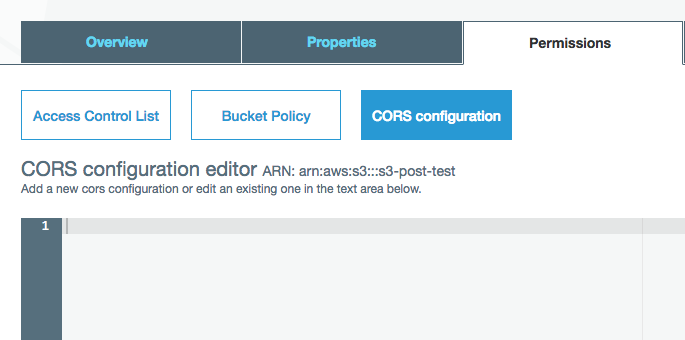
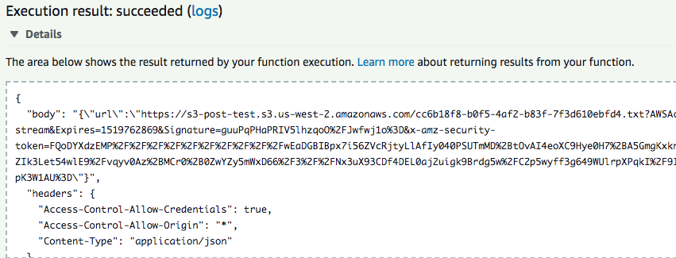
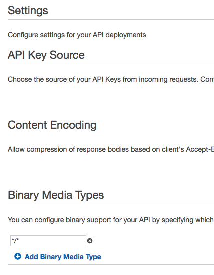
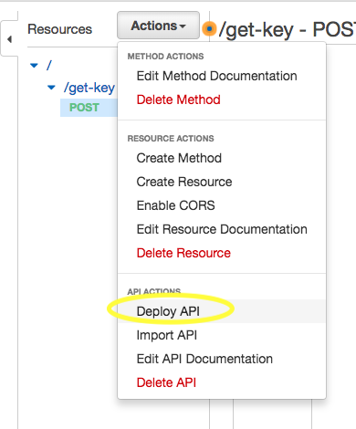
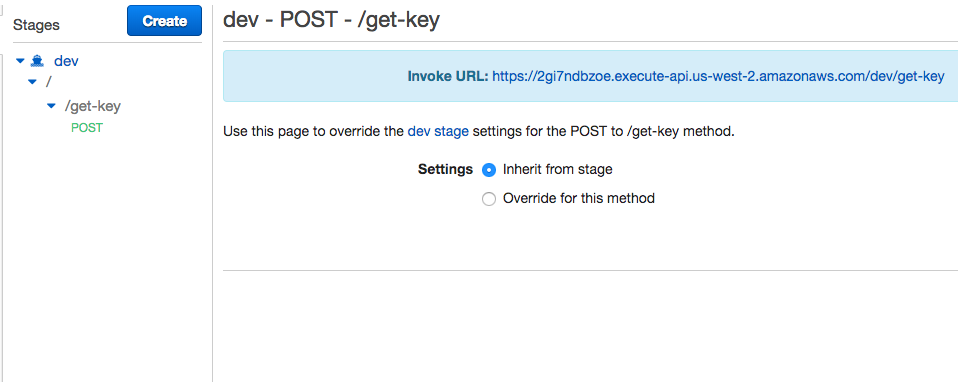
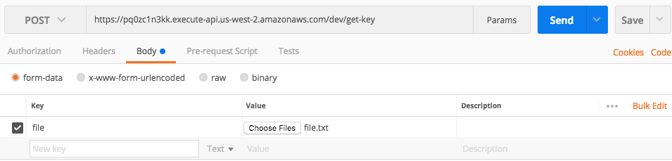
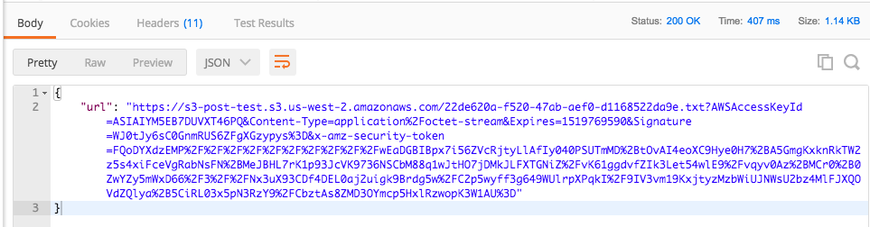
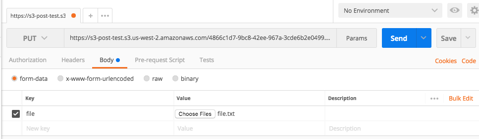
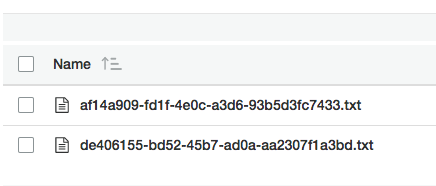

# Getting a Signed S3 URL from Lambda and Uploading from the Front End

In this tutorial we will demonstrate how to set up a function in AWS Lambda to generate a signed URL, which can be used to upload a file into a designated S3 bucket. We will then create a front end function that obtains and uses these URL's to upload a file from an HTML form directly into the bucket.

## Set Up

To get started, we will need to configure our S3 bucket to allow us to perform the necessary actions on it.

Something we will need to keep in mind throughout this project is a mechanism called Cross-Origin Resource Sharing, or CORS. From the Mozilla Development Network [reference]((https://developer.mozilla.org/en-US/docs/Web/HTTP/CORS)) on CORS:
> Cross-Origin Resource Sharing (CORS) is a mechanism that uses additional HTTP headers to let a user agent gain permission to access selected resources from a server on a different origin (domain) than the site currently in use. A user agent makes a cross-origin HTTP request when it requests a resource from a different domain, protocol, or port than the one from which the current document originated.

This is applicable to us as it's one thing to obtain our S3 URL to upload an object, but in order to allow a front end function to make use of the URL we must be be sure to allow requests from different origins.

Open your bucket in S3, select the "Permissions" tab, and click the "CORS configuration" button.



S3 CORS configuration is written in XML format. We are going to set our bucket to allow requests from all origins, to allow put requests, to allow all object headers, and to set a maximum age of the request. Here is the code we will use for the CORS configuration:

```xml
<?xml version="1.0" encoding="UTF-8"?>
<CORSConfiguration xmlns="http://s3.amazonaws.com/doc/2006-03-01/">
<CORSRule>
    <AllowedOrigin>*</AllowedOrigin>
    <AllowedMethod>PUT</AllowedMethod>
    <MaxAgeSeconds>3000</MaxAgeSeconds>
    <AllowedHeader>*</AllowedHeader>
</CORSRule>
</CORSConfiguration>
```

It is also important to make sure that the Lambda function has a role that allows appropriate access to the bucket. Your technical supervisor may provide you this role, or you may need to create it. The AWS SDK methods we will be using are [s3.putObject](https://docs.aws.amazon.com/AWSJavaScriptSDK/latest/AWS/S3.html#putObject-property) and [s3.getSignedUrl](https://docs.aws.amazon.com/AWSJavaScriptSDK/latest/AWS/S3.html#getSignedUrl-property), so if you are creating the role in AWS IAM make sure that it grants permission to perform both of these methods on the bucket you are using.

## Lambda Function - s3.getSignedUrl()

As already mentioned, the AWS SDK method we will be using in our Lambda function is `s3.getSignedUrl()`.  This method returns a URL. When this URL is called by an HTTP request, it will contain all the information and authorization needed to upload a file to an S3 bucket.

We want the objects in our bucket to have unique filenames. For that, we'll be using a package to create universally unique identifiers. After we've initialized our function locally using [pnpm](https://github.com/pnpm/pnpm), we need to open the project in the command line and run `pnpm install uuid`. We can then use the uuid as the s3 object's key parameter, which S3 uses to create its filename.

Let's create our function's entry point (index.js) and import the uuid package. We will also import the AWS SDK, which the function will have access to once it is uploaded to Lambda.

```javascript
const AWS = require('aws-sdk');
const uuid4 = require('uuid/v4');
```

Next we create our handler function. We'll create an S3 instance to give us access to the `getSignedUrl()` method, and a uuid instance to serve as our key.

```javascript
exports.handler = function(event, context, callback) {
	const s3 = new AWS.S3();
	const uuid = uuid4();
}
```

 Now for `s3.getSignedUrl()`. It takes two parameters: an S3 method, and an object. The method is whatever S3 method we want to make available to the front end, in this case `putObject`. The object will be a set of parameters that the method will be used to construct the URL, which the Lambda function will return via its callback method.

```javascript
s3.getSignedUrl('putObject', {
    Bucket: 's3-post-test',
    Key: `${uuid}.txt`,
    Expires: 10000,
    ContentType: 'application/octet-stream'
}
```

* `Bucket` is obviously the name of the bucket we are uploading to.
* `Key` is the name of the file that will appear in the bucket. We are setting its name as our uuid instance and setting it as a .txt file.
* `Expires` is how long the created URL is good for, in milliseconds. After that time has elapsed, the URL expires and is no longer usable. In general we want to set this number as low as possible. However, since when we first make this function we'll be testing it using Postman, we need to give ourselves some time to copy the generated URL from Lambda and paste it into Postman. When we are ready to actually call the URL via a the browser, we can shorten the time.
* `ContentType` is the format in which the uploaded file will be sent to S3. `octet-stream` designates that it will be encoded as binary. It is necessary to have this set in the Lambda function and in the front end function or else we will receive a "403 Forbidden" error when we try to call the URL from the browser.

Now that we've set up our function to generate a URL, we are going to wrap it in a promise. The reason for doing this is that when we return information to the client, it needs to be in the valid syntax of a response to an HTTP request. We want to make sure our Lambda function does not create this response object until `getSignedUrl()` resolves and the URL exists. Here's what the "promisified" function looks like:

```javascript
const signedUrlPromise = new Promise(function(resolve, reject) {
	s3.getSignedUrl('putObject', {
		Bucket: 's3-post-test',
		Key: `${uuid}.txt`,
		Expires: 10000,
		ContentType: 'application/octet-stream'
	}, function(err, url) {
		if (err) {
			reject(err);
		} else {
			resolve(url);
		}
	});
});
```

Now we are ready to create the response object that will be returned by the Lambda function. This object will be in JSON format and must have a status code property (200 on success). Any other information such as the URL must be contained in a body object. If we don't use this format we will just get an error when we make the POST request.

Here's what it looks like once we set up our promise chain to construct a response object containing the URL.

```javascript
signedUrlPromise
	.then(function(url){
		console.log(url);
		const response = {
			body: JSON.stringify({
				url: url
			}),
			headers: {
				'Access-Control-Allow-Credentials': true,
				'Access-Control-Allow-Origin': '*',
				'Content-Type': 'application/json',
			},
			statusCode: 200
		};
		callback(null, response);
	}).catch(function(err){
		callback(err, null);
});
```
Note the `headers` object nested in the response object. Setting these values is another necessary step to prevent CORS errors.

At the bottom of our `.then()` block we have our callback function returning the response object, which will be the function's output. We also of course have a `.catch()` block to log any errors.

Here is the completed Lambda function in full:

```javascript
const AWS = require('aws-sdk');
const uuid4 = require('uuid/v4');
exports.handler = function(event, context, callback) {
	const s3 = new AWS.S3();
	const uuid = uuid4();

	const signedUrlPromise = new Promise(function(resolve, reject) {
        s3.getSignedUrl('putObject', {
            Bucket: 's3-post-test',
            Key: `${uuid}.txt`,
            Expires: 10000,
            ContentType: 'application/octet-stream'
        }, function(err, url) {
            if (err) {
            	reject(err);
            } else {
            	resolve(url);
            }
        });
    });

    signedUrlPromise
	.then(function(url){
		console.log(url);
		const response = {
			body: JSON.stringify({
				url: url
			}),
			headers: {
				'Access-Control-Allow-Credentials': true,
				'Access-Control-Allow-Origin': '*',
				'Content-Type': 'application/json',
			},
			statusCode: 200
		};
		callback(null, response);
	}).catch(function(err){
		callback(err, null);
	});
};
```

Once we deploy the function to Lambda, we can test it there. The default Lambda "Hello World" test will suffice.



We can see that our test has run without error. Furthermore, as expected our return has a body object containing our URL.


## Setting Up and Testing the API

We will be covering just the basics of setting up and testing the API. For more information on API Gateway, see MK Decision's [documentation](file:///Users/andrewlevy/Desktop/mk/devdocs/aws/pass-file-through-API-gateway/pass-file-through-API-gateway.md) on the subject.

Create the API, then in the settings add all files to the accepted binary media types with `*/*`.



Then link the function to an API Gateway Resource. Create the resource and add a POST method.

The integration type is "Lambda Function." Select "Use Lambda Proxy integration," select the function's region, and specify the function.


After saving the method, deploy the API.



Obtain the URL for the POST method, and we'll test it out by invoking it in Postman.




Create a POST request in Postman with the method's URL and select form-data for the body. We'll try running it with a dummy file as the event.



Send the request and check the response.



We can see that we are getting the 200 status code that we specified for success, and that our body object correctly contains our URL. This URL is good for exactly one use and lasts as long as the "expires" value we passed into the function that created it. We can then test the URL by making a PUT request in Postman with the URL that was returned. Make sure your request body contains your dummy .txt file as the URL will upload that to the bucket.



We won't get a response body from this request, but when we check our bucket, we can see that the file was uploaded correctly with the key that we specified: the `<uuid>.txt.`

Now that we've finished testing the API and generated URL, we can go back to the Lambda function and lower the `Expires` parameter for `getSignedUrl()` to 3000. That should still be enough time for the URL to be used when the requests are done from the browser.

## Front End and Axios

Create a directory for the front-end. For our purposes we'll just need an html file for our file upload form, and a JavaScript file to contain the function that will be called when the form is submitted.

Our front end function will be making two HTTP requests, which will mirror the ones we just made in Postman: the first will call the API to trigger our Lambda function and will return a URL. The second will make a PUT request with the URL and the file.

For our HTTP requests we will be using a tool called [Axios](https://www.npmjs.com/package/axios) in our script. Axios allows us to make HTTP requests using promise syntax, so we can easily write code that makes our first request, returns the URL, and then passes the URL into the parameters of the second request. An introduction to the basics of using Axios can be found [here](https://medium.com/codingthesmartway-com-blog/getting-started-with-axios-166cb0035237).

If we were using a front end framework such as Spike, we would install Axios as a dependency. Luckily for our simple project, Axios also has a CDN that we can link in our HTML file.

In our `index.html` file, we'll create a form that is nothing more than a file input and submit button. At the bottom of the body tag, we'll link the Axios CDN and our JavaScript file.

```html
<!DOCTYPE html>
<html>
<head>
	<meta charset="utf-8" />
	<meta http-equiv="X-UA-Compatible" content="IE=edge">
	<title>Page Title</title>
	<meta name="viewport" content="width=device-width, initial-scale=1">
</head>
<body>
	<form enctype="multipart/form-data" id="postForm" name="postForm">
		<input type="file" id="fileUpload" name="file">
		<br />
		<button type="submit">Submit</button>
	</form>
	<script src="https://unpkg.com/axios/dist/axios.min.js"></script>
	<script src="./main.js"></script>
</body>
</html>
```

Then in `main.js` we'll add an event listener for when the form is submitted. All of our code will be inside this function.

```javascript
const form = document.getElementById('postForm');
form.addEventListener('submit', function(event){

});
```

We need to make the file we're uploading available to the rest of the function. To do this we'll be creating a [FormData](https://developer.mozilla.org/en-US/docs/Web/API/FormData) object. We'll base this object off the contents of the form at the time it is submitted - as the form submission is the trigger of the event and the form itself is the target, we can signify the form's contents using `event.target` and use it as the basis of the FormData object.
```javascript
const formdata = new FormData(event.target);
```
We can now specifically target the contents of the file submission field using the [FormData.get()](https://developer.mozilla.org/en-US/docs/Web/API/FormData/get) method on that field.

```javascript
const file = formdata.get('file');
```

Next we need to prevent the default behavior of the form submission so the page doesn't reload.

```javascript
event.preventDefault();
```

The next step is to make a POST request of our API, which will return a signed URL. Using the promise syntax made available by Axios, we can pass the resulting URL into our next request once the first request is resolved.

```javascript
axios.post(' https://pq0zc1n3kk.execute-api.us-west-2.amazonaws.com/dev/get-key', JSON.stringify({'data': 'data'}))
	.then(function(response) {
		return response.data.url;
	})
	//next request will go here
});
```

The stringified data object parameter isn't actually being used by anything, but is an example of how to pass additional data in case we had a more complicated Lambda function that needed the data for something else.

The request to upload the file to S3 will be a PUT request. For its parameters we'll use:
* the URL we've just obtained
* the `file` constant which is the file to upload
* a `headers` object with the same `'content-type': 'application/octet-stream'` property we used in the Lambda function. Again, this is to stop us from getting a "403 - Forbidden" error when we make our request.


```javascript
.then(function(url) {
	return axios.put(url, file, {
		headers: {
			'content-type': 'application/octet-stream'
		}
	});
})
```

Finally after our last `.then()` block we'll add a `.catch()` block to log any errors to the console.

```javascript
.catch(function(error){
		console.log(error);
	});
```

And that will close out our event listener function. Here is the completed JavaScript file:

```javascript
const form = document.getElementById('postForm');
form.addEventListener('submit', function(event){
	const formdata = new FormData(event.target);
	const file = formdata.get('file');
	event.preventDefault();
	axios.post(' https://pq0zc1n3kk.execute-api.us-west-2.amazonaws.com/dev/get-key', JSON.stringify({'data': 'data'}))
	.then(function(response) {
		return response.data.url;
	})
	.then(function(url) {
		return axios.put(url, file, {
			headers: {
				'content-type': 'application/octet-stream'
			}
		});
	})
	.catch(function(error){
		console.log(error);
	});
});
```

When we load the page in our browser we can see our form. From there we can choose our test text file to load, and submit the form.

We're not logging any errors, so let's check the bucket.



We can see that we have successfully uploaded a second file to the bucket, this time from the browser, and so our task is completed.
