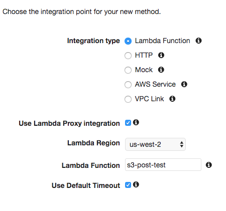

# Getting a Signed S3 URL from Lambda and Uploading from the Front End

### By Andrew Levy

In this tutorial we will demonstrate how to set up a function in AWS Lambda to generate a signed URL, which can be used to upload a file into a designated S3 bucket. We will then create a front end that obtains and uses these URL's to upload a file from an HTML form directly to the bucket.

## Set Up

To get started, we will of course need an S3 bucket. We will also need to configure our bucket to allow us to perform the necessary actions on it.

A hurdle we will face in completing this project is a mechanism called Cross-Origin Resource Sharing, or CORS. From the Mozilla Development Network [reference]((https://developer.mozilla.org/en-US/docs/Web/HTTP/CORS)) on CORS:
> Cross-Origin Resource Sharing (CORS) is a mechanism that uses additional HTTP headers to let a user agent gain permission to access selected resources from a server on a different origin (domain) than the site currently in use. A user agent makes a cross-origin HTTP request when it requests a resource from a different domain, protocol, or port than the one from which the current document originated.

This is applicable to us as it's one thing to obtain our S3 URL to upload an object, but in order to allow a front end function to make use of the URL we must be be sure to allow requests from different origins.

Open your bucket in S3, select the "Permissions" tab, and click the "CORS configuration" button.


The CORS configuration is written in XML format. We are going to set our bucket to allow requests from all origins, to allow put requests, to allow all object headers, and to set a maximum age. Here is the code we will use for the CORS configuration:

```xml
<?xml version="1.0" encoding="UTF-8"?>
<CORSConfiguration xmlns="http://s3.amazonaws.com/doc/2006-03-01/">
<CORSRule>
    <AllowedOrigin>*</AllowedOrigin>
    <AllowedMethod>PUT</AllowedMethod>
    <MaxAgeSeconds>3000</MaxAgeSeconds>
    <AllowedHeader>*</AllowedHeader>
</CORSRule>
</CORSConfiguration>
```

It is also important to make sure that the Lambda function has a role that allows appropriate access to the bucket. Your technical supervisor may provide you this role, or you may need to create it. The AWS SDK methods we will be using are [s3.putObject](https://docs.aws.amazon.com/AWSJavaScriptSDK/latest/AWS/S3.html#putObject-property) and [s3.getSignedUrl](https://docs.aws.amazon.com/AWSJavaScriptSDK/latest/AWS/S3.html#getSignedUrl-property), so if you are creating the role in AWS IAM make sure that it grants permission to perform both of these methods on the bucket you are using.


## Lambda Function - s3.getSignedUrl()

The AWS SDK method we will be using in our Lambda function, as already mentioned, is `s3.getSignedUrl`, which returns a URL. The URL will contain all the information the front end function needs to put the file in the bucket, and will also contain any needed authorization.

When we upload files to our S3 bucket, we want them to have unique filenames. For that, we'll be using a package to create universally unique identifiers. After we've initialized our function locally using [pnpm](https://github.com/pnpm/pnpm), we need to open the project in the command line and run `pnpm install uuid`. We can then use the uuid as the s3 object's key parameter, which S3 uses to create its filename.

Let's create our function's entry point (index.js) and import the uuid package. We will also import the AWS SDK but don't need to install it as all functions have access to the SDK once they are uploaded to Lambda.

```javascript
const AWS = require('aws-sdk');
const uuid4 = require('uuid/v4');
```

Next we create our exports.handler function. We'll create an S3 instance to give us access to the getSignedUrl() method, and a uuid instance to serve as our key.

```javascript
exports.handler = function(event, context, callback) {
	const s3 = new AWS.S3();
	const uuid = uuid4();
}
```

 Now for `s3.getSignedUrl()`. This method takes two parameters: an S3 method, and an object. The method is whatever S3 method we want to make available to the front end, in this case s3.putObject. The object will be a set of parameters that the method will be used to construct the URL, which the Lambda function will return via the callback method.

```javascript
s3.getSignedUrl('putObject', {
        Bucket: 's3-post-test',
        Key: `${uuid}.txt`,
        Expires: 10000,
        ContentType: 'application/octet-stream'
```

*`Bucket` is obviously the name of the bucket we are uploading to.
*`Key` is the name of the file that will appear in the bucket. We are setting its name as our uuid instance and setting it as a .txt file.
*`Expires` is how long the created URL is good for, in milliseconds. After that time has elapsed, the URL expires and is no longer usable. In general we want to set this number as low as possible. However, since when we first make this function we'll be testing it using Postman, we need to give ourselves some time to copy the generated URL from Lambda and paste it into Postman. When we actually call the URL via a front end function, we can shorten the time.
*`ContentType` is the format in which the uploaded file will be sent to S3. `octet-stream` designates that it will be encoded as binary. It is necessary to have this set in the Lambda function and in the front end function or else we will receive a "403 Forbidden" error when we try to call the URL on the front end.

<!-->
Next we create our exports.handler function. We'll create an S3 instance to give us access to the createPresignedPost() method, and a uuid instance to serve as our key.

The createPresignedPost() method takes parameters that must include the bucket we are using, and returns a data object that includes a large fields object. This object includes information such as our region and the bucket that we have passed as a parameter. We will also add a Key property to this object and assign it our uuid as this is what we want to return to the front end.

```javascript
exports.handler = function(event, context, callback) {
	const s3 = new AWS.S3();
	const uuid = uuid4();

	const params = {
		Bucket: 's3-key-test',
		Fields: {
			Key: uuid

		}
	};
}
```

Now we're ready to call createPresigedPost(). When we set up our front end later on, we will have it call an API Gateway POST method that will call this Lambda function. As such, the function's return must be a response object in JSON format with a status code to notify the client of success, and any other information must be wrapped in a body object. If we don't use this format we will just get an error when we make the POST request. The response object in the body will in turn contain the fields object, which will contain our key.

```javascript
exports.handler = function(event, context, callback) {

	...

	s3.createPresignedPost(params, function(err, s3Data) {
		if (err) {
			callback(err, null);
		}
		else {
			const response = {
				statusCode: 201,
				//status code 201 is for a successful request that results in a new resource being created.
				headers: {
					'Access-Control-Allow-Credentials': true,
					'Access-Control-Allow-Origin': "*",
					'Content-Type': 'application/json',
				},
				//The headers object with these values is necessary to allow the response to be
				//returned when the function is called with a front end script.
				body: JSON.stringify({
					data: s3Data.fields
				})
			};
			callback(null, response);
		}
	});
};

```

Once we deploy the function to Lambda, it's time to test it. Firt we'll run a Lambda test (the default "Hello World" test will suffice).


We can see that our test has run without error. Furthermore, as expected we have a body object containing a data object containing our uuid Key.

## Setting Up the API

We will be covering just the basics of setting up and testing the API. For more information on API Gateway, see MK Decision's [documentation](file:///Users/andrewlevy/Desktop/mk/devdocs/aws/pass-file-through-API-gateway/pass-file-through-API-gateway.md) on the subject.

First create the API.


Next, in the API's settings, add all files to the accepted binary media types with:
```
*/*
```


Then link the function to an API Gateway Resource. First create the resource.




Create a POST method in the resource.


The integration type is "Lambda Function." Select "Use Lambda Proxy integration," select your region, and specify the function.


After saving the method, deploy the API.


Obtain the URL for the POST method, and we'll test it out by invoking it in Postman.


Create a POST request in Postman with the method's URL and select form-data for the body. We'll try running it with a dummy file as the event.


We can see that we are getting the 201 status code that we specified for success, and that our body object correctly contains the data object with a uuid key. We're now ready to set up a front end to call the API.

## Front End and Axios -->
