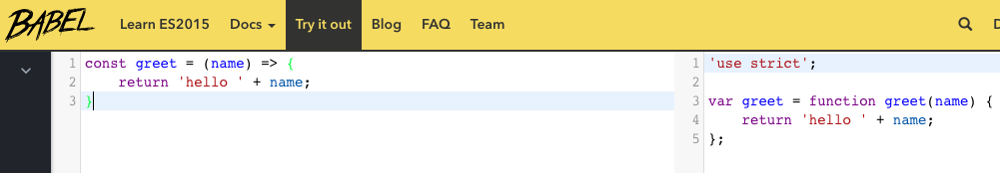

# Setting Up Webpack in a Repository

When using AWS, it is useful to write functions and designate resources in a local repository, then to use a command line script to deploy functions and set up the resources with the relevant AWS services all at once. This can be done with AWS's CloudFormation service via the AWS command line interface (CLI). However, before you can use CloudFormation in this way, it is important to have the repository set up to use Webpack with a Babel loader. This tutorial will cover the steps to do that. Setting up CloudFormation to actually deploy to Lambda will be the subject of a future tutorial.

## Babel

Node.js has had improvements, features, and flavors added over the years, such as with ES6, the version of JavaScript released in 2015. It can also be customized to have additional features via the addition of libraries, such as TypeScript, which we will use in this tutorial.

Depending on where Javascript is run (such as in a browser), its environment may not understand the newer features provided by ES6 or libraries such as TypeScript. This will cause the code to fail to execute properly.

This problem can be solved via the use of transpilers, such as Babel.js. This allows code using newer features and/or external libraries to be translated into language that its environment can handle. Let's look at an example, using Babel's [web console](https://babeljs.io/repl/):


We will write a very simple function, but use ES6 syntax:

```javascript
const greet = (name) => {
	return 'hello ' + name;
}
```

If we put this into the Babel web console, here's what we get:



```javascript
'use strict';

var greet = function greet(name) {
	return 'hello ' + name;
};
```

All of the newer features we initially used, such as const and arrow functions, have been replaced with the pre-ES6 conventions. Babel has translated our newer-style code into JavaScript that can be run even in environments and browsers that don't support ES6. Not only is this useful for client-side JavaScript, it also can be used for AWS Lambda, as at any given time AWS Lambda may not support the most up-to-date version of Node.js.

## Webpack

Webpack is a module builder that can be used to bundle a project. It will bundle every handler function and all its sources into a single file. We will configure it to create a build directory containing the bundled version of each handler. These built handler files can then be deployed to Lambda. When used alongside Babel, Webpack will also transpile the function and the module it builds will be compatible with environments that are not compatible with ES6 and/or TypeScript.

## Setting Up Repository and Adding Dependencies

We'll start by initializing a repository using pnpm, the package manager of choice for MK Decision. This guide will assume that node and pnpm are already installed globally.

Create a project directory, and in it, using the command line run `$ pnpm init `. Follow the prompts (you can use the default values for all of the setup questions if desired). You will now have a package.json file.

In the project directory, add a folder called `services`. This will be where we write our handler functions. In that folder also create a subfolder called `lib`, where we can eventually write helper functions that are used by the handlers. These will be bundled together with the handlers that import them when Webpack runs.

Let's install some dependencies. Our example repository will use [TypeScript](https://www.typescriptlang.org/). This adds useful features to JavaScript. One of things it assists with is keeping track of complicated data structures, which makes it ideal for use on the backend. TypeScript is not required for using any of the other tools covered in this guide, but if you intend to use TypeScript on a project, it is a very good idea to set it up early. To install TypeScript, use the command `$ pnpm install typescript --save` (you can also use `i` as an abbreviation for `install`). If you are not planning to use Typescript, use `.js` as a file extension any time this guide uses `.ts`.

The other dependency that is required for production is Source Map Support. This is important for Webpack, and setting it up will be a necessary configuration step. Install it with `$ pnpm i source-map-support --save`.

All other dependencies we install, including all of the ones we need for Webpack and Babel, are dev dependencies. None of these tools will actually be used when the code is in production, but many of them are important to get it to production status.

We must install a number of types so that Typescript recognizes some of the tools we will use and does not throw errors when we are writing our code or running webpack to create our build. One command will install most of the ones that should be necessary: `$ pnpm i @types/body-parser @types/cors @types/dotenv @types/es6-promisify @types/node --save-dev`. If you are planning to write tests using Jest, you should also install `@types/jest` in the same way.

Next we'll install Webpack and its CLI so we can write scripts using it: `$ pnpm i webpack webpack-cli --save-dev`.

ts-loader allows TypeScript to interact properly with Webpack: `$ pnpm i ts-loader --save-dev`.

Let's install all the dev dependencies we'll need for Babel: `$ pnpm i babel-core babel-loader babel-plugin-transform-async-to-generator babel-plugin-transform-es2015-modules-commonjs babel-preset-env --save-dev`.

Finally, let's add the AWS SDK. We don't need this as a dependency in production, as any function uploaded to Lambda automatically has access to the entire SDK. However, since this is not the case in a dev environment, let's install it with `pnpm i aws-sdk --save-dev` so we can use AWS functions when testing (though normally API's such as this should be mocked when testing).

## Setting Up Babel and Webpack

In the main project directory, create a file called `.babelrc`. This is where we configure the settings for Babel. Here is what we'll have in that file:

```json
{
	"presets": [
		[
			"env",
			{
				"targets": {
					"node": 8
				}
			}
		]
	],
	"plugins": [
		"transform-async-to-generator"
	]
}
```

There are a couple of important things to note: the `"node": 8` line indicates that we'll be transpiling our JavaScript into Node version 8. As of May 2018, this is the latest version of Node.js that Lambda supports.

The `transform-async-to-generator` plugin that we installed earlier is being used here. Async functions are an extremely convenient, but very recently added, tool to write asynchronous JavaScript. This plugin ensures that any instances of async functions will be transpiled into an older syntax.

We also need to add a configuration file for the source-map-support dependency. in `/services/lib/`, add a file called sourceMapSupports.ts. This file only needs one line:
```javascript
require('source-map-support').install();
```

One more configuration file is needed for Webpack. In the top level of the project, create the file `webpack.config.js`.

Here is the code we'll be using for this file:

```javascript
const path = require('path');
const webpack = require('webpack');

const entryPoints = {
	contact: [
        './services/lib/sourceMapSupport.ts',
        './services/contact.ts'
    ]
}

module.exports = {
	entry: entryPoints,
	output: {
		libraryTarget: 'commonjs',
		path: path.resolve(__dirname, 'build'),
		filename: '[name].js',
	},
	mode: 'development',
	target: 'node',
	externals: { 'aws-sdk': { commonjs: 'aws-sdk' } },
	stats: {
		all: false,
		assets: true,
		timings: true,
	},
	devtool: 'inline-source-map',

	resolve: {
		extensions: ['.ts', '.js', '.d.ts'],
	},

	plugins: [
		new webpack.SourceMapDevToolPlugin({
			exclude: /node_modules/,
		}),
	],

	module: {
		rules: [
			{
				test: /\.ts$/,
				exclude: /node_modules/,
				use: [
					'babel-loader',
					'ts-loader',
				],
			},
		],
	},
};
```
The important part of this code to look at is the entryPoints object near the top. Let's say we want to create a Lambda function called `contact`. This is what tells Webpack to bundle the handler and all its dependencies. We create a property of entryPoints which is an array with the name of the handler. The array contains the path of the handler itself, which we will add to the project momentarily, and the sourceMapSupport file that we created. Any time a new handler is created in this repository, it must be added to Webpack's entry points in this way so it is bundled when we run Webpack.

## Scripts

Earlier we installed the Webpack CLI to this project. This allows us to create our build from the command line. Let's create some scripts in our `package.json` to streamline this process.

```json
"scripts": {
    "build:webpack": "webpack --display errors-only",
    "build": "npm run build:webpack",
  },
```

The first script creates a build of the site and prints any errors to the console. For now, the second one is just a shortcut for the first one. We can type nothing more than `$ pnpm run build` into the terminal, and Webpack will bundle the handlers and display any errors. An additional reason we've created a second script for this purpose as once we start using CloudFormation, it may be useful to add scripts to execute other build commands (for example, build:template might relate to creating a CloudFormation template).

## Handler

It's finally time to write a handler function. In `/services/`, create a file called `contact.ts`. We'll keep it very simple for the time being:

```javascript
import * as AWS from 'aws-sdk';

export default async function handler(event, context, callback) {
	callback(null, 'hello world');
};
```

This is how one might write such a handler using vanilla Node.js with ES6 syntax. As always with any Lambda handler we must import the AWS SDK (or just any parts we are planning to use) above the handler function. Let's add some TypeScript features and syntax:

```javascript
import * as AWS from 'aws-sdk';

let handler: any;
handler = async function handler(event: any, context: any, callback: any) {
    callback(null, 'hello world');
}

export { handler };
```

 For those unfamiliar with TypeScript, the use of `any` to describe each of the handler's arguments is declaring that these parameters may be of any type. Of course, the point of TypeScript is that these descriptors should be made more specific as the function is fleshed out more. For instance, if you're expecting the `event` parameter to be an object, this can be specified. This can make it easier to find errors in larger projects.

As a reminder, a Lambda callback function returns its first parameter as an error, and the second parameter as a non-error.

We have now set up all the tools we need for Webpack to create a bundle of this funciton, so let's run our script and try it: in the terminal run the script created earlier: `$ pnpm run build`.

If there are any errors, they will be displayed in the terminal. When using TypeScript in conjunction with Webpack, one possible source of errors is if one of the dev dependencies is missing, particularly one of the ones involving types.

However, if everything goes well there should be no errors, and we can see that our directory now has a `build` folder with a `contact.js` file in it: this is what Webpack has built, and what we will eventually get deployed to Lambda once we have CloudFormation scripts set up to deploy from the command line.

## A Quick and Easy Way to Run Handlers Locally

For projects involving the use of external API's such as the AWS SDK, the best practice is to test functions locally by mocking the API. While this is very advisable for projects of any size, it does require a bit of setup. It may be useful to have an easier way to run these functions locally before deploying to AWS, even in the absence of testing suites and mocks of AWS services.

Let's create a file called `index.js`. Here is the code we'll write there:

```javascript
const contact = require('./build/contact.js').handler;

contact({}, {}, function(err, data) {
	if (err) console.log(err)
	else console.log(data)
 })
```
This is a very simple setup: it imports the build file we've created by running the Webpack script. It then runs the handler function in that file that was built from the one we wrote in `contact.ts`, and logs the result to the console.

We can then run this file directly from the command line with `$ node index.js`. The handler's output should be logged directly to the terminal:

```
hello world
```

Many handler functions use parameters passed in from the triggering event. Let's change our handler to show an example of this so we can test it:

```javascript
import * as AWS from 'aws-sdk';

export default async function handler(event: any, context: any, callback: any) {
	try {
		const name: string = event.name
		callback(null, 'hello ' + name);
	} catch (err) {
		callback(err, null);
	}
};
```

Now we can alter `index.js` to pass in an event object of our choosing:

```javascript
const contact = require('./build/contact.js').default;

const event = {
	name: 'Joe',
}

contact(event, {}, function(err, data) {
	if (err) console.log(err)
	else console.log(data)
 })
```

Once we run `$ node index.js` again we can see the result:

```
hello world
```

This is not what we expected. Why isn't the handler using the name we've set as the input?

We've forgotten one crucial factor about how our index function works: it doesn't import our function from the code we've just written, but from the version that was built when we ran `$ pnpm run build`. In our case, that file is still the one built from the old version of the handler. That means every time we make a change to the handler, we have to run the command to build it again so `index.js` has access to the most up-to-date version. Here's what happens when we run `$ pnpm run build && node index.js` so Webpack creates a build and it is executed immediately:

```
hello Joe
```

Now that we see that our build is working correctly, we are ready to set up CloudFormation and deploy our code to AWS. As mentioned before, the steps to do this will be covered in a future guide.
