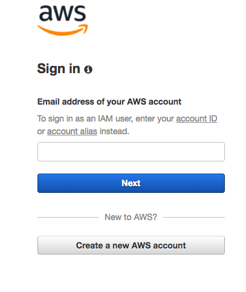
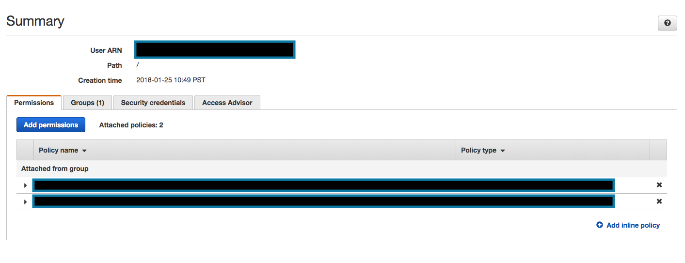
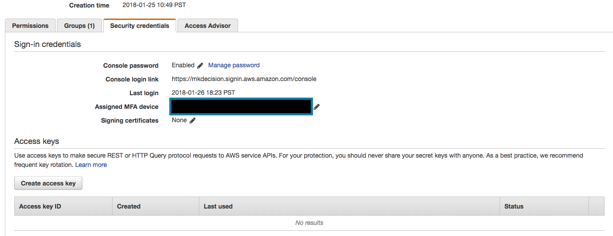
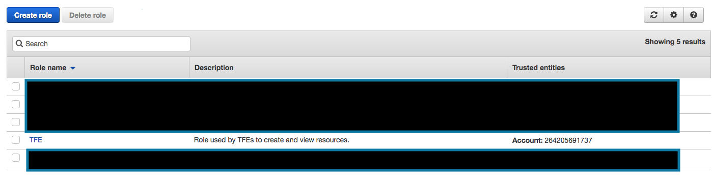
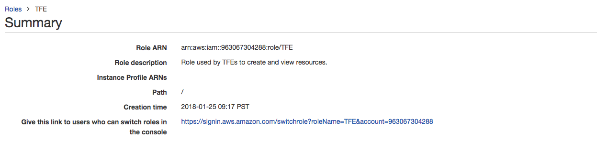

# Setting Up Your Credentials

## Overview

This tutorial will teach you how to set up your AWS CLI keys in order to upload your Lambda functions within the repository. If you follow these instructions, you should in theory be able to upload to the TFE Workspace so long as you use `pnpm run package` and `pnpm run deploy`.

## Installing the AWS CLI

To be able to access AWS from your own command line, you will first need the AWS CLI.
* If you're a Windows user, you should follow the instructions [here](https://docs.aws.amazon.com/cli/latest/userguide/awscli-install-windows.html). You should use the MSI installer.
* If you're an OS X user, you should use `brew` (as you should with any tool). Assuming you have brew installed, enter `brew install awscli` in your console, and then you'll be good to go.
* If you're a Linux user, you should use the bundled installer. Instructions are [here](https://docs.aws.amazon.com/cli/latest/userguide/awscli-install-bundle.html).

## Configuring Your Credentials

First, you must log into AWS with your MK Decision account. Assuming you signed in with your own account, log out, and when you’re given the option to log in again, look for the link that says "Sign in to a different account." It should look like this:

Type in "mkdecision". When you hit "Next," you’ll be brought to a new login page where you can sign in using your MK Decision username and password. Once you’re logged in, go to IAM. On the left side of the page, click on "Users". Then select your username. You will be brought to this page:

Click on the "Security Credentials" tab. You will see this.

You need to click "Create access key". (Note: If you are unable to do so, that probably means that you haven’t enabled multi factor authentication, so get that done and then try this again. If this still doesn't work, contact an admin.) You will see a pop up with a column that says "Access key ID" and another that says "Secret access key," which will be masked unless you click "Show" next to it.

Do not close the window, but type in your console `aws configure --profile mkdecision`. You will be asked to input your Access Key ID, Secret access key, default region, and default output format. You should input your data as follows:

	$ aws configure --profile mkdecision
	AWS Access Key ID [None]: [paste the access key ID you just created]
	AWS Secret Access Key [None]: [paste the secret access key that you also got]
	Default region name [None]: us-west-2
	Default output format [None]: json

Now, this is important: you cannot get your key again after you close the popup window. This means that if you delete or lose your secret key, you’ll need to generate a new AWS Access Key ID and start over with configuring your profiles.

When you’ve finished that, you will need to switch your role to the TFE workspace. If you haven’t done this yet, ask the AWS administrator to send you a link to do this and make your name for the role "TFE Workspace". Go to IAM within TFE Workspace. You will no doubt notice that there are a lot less permissions now. Go to the Roles tab. You will see these roles:

Click on the role that says TFE. You will see this page.

Look at the row that says "Role ARN". Copy this role. Then run `vim ~/.aws/config` or `nano ~/.aws/config` to update your profiles. Append this to the end of the file:

    [profile TFEWorkspace]
    role_arn = [the ARN from earlier]
    source_profile = mkdecision
    region = us-west-2
    output = json
    
You must also add a new profile to your `~/.aws/credentials`. Run `vim ~/.aws/credentials` or `nano ~/.aws/credentials` and append this to the end of the file:

    [TFEWorkspace]
    role_arn = [the ARN from earlier]
    source_profile = mkdecision

Notice that this profile inherits from the mkdecision profile and that the ARN is your TFE role’s ARN. Keep in mind that you generally should not be touching this file. Use `aws configure --profile [somename]` to create roles. However, in this case, you need to update the file because without the role you won’t be able to run `pnpm run package` and `pnpm run deploy`. Note also that you MUST have a default region and unless otherwise specified that will be us-west-2.

## Note to Windows Users

Right now, MK's implementation will only work if you’re on a \*NIX system (OS X, Unix, or Linux) or if you’ve managed to get Bash to work on Windows. If you have not set up Bash, you should set it up using Git (you may need to reinstall Git to get it to work, tutorial to come later).

When you get Bash installed, type `which bash` in your Bash console. This tells you where your Bash binary is. If you installed using Git, it will probably print out `/usr/bin/bash`. After this, type in `npm config set script-shell /usr/bin/bash` (or whatever path your Bash binary is).

## Working With Credentials

At this point you can use credentials in your projects. To make them available, type `export AWS_PROFILE=TFEWorkspace`. This will allow you to run `pnpm run package` and `pnpm run deploy` in backend repositories. You can also use AWS SDK functions in your code base.

Note that whenever you open a new terminal window you will need to run `export AWS_PROFILE=TFEWorkspace`, so if you're not able to package or deploy this is the first thing you should do.
