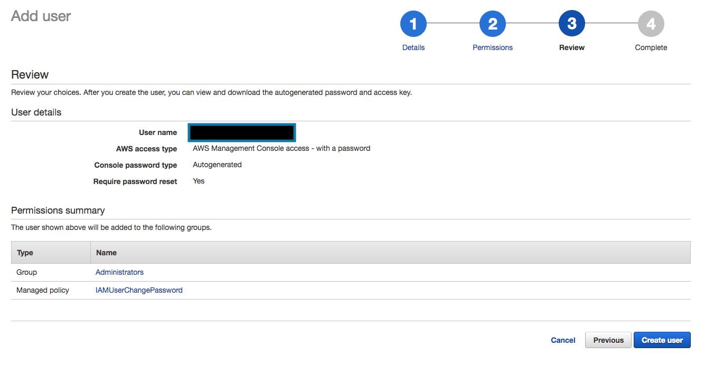
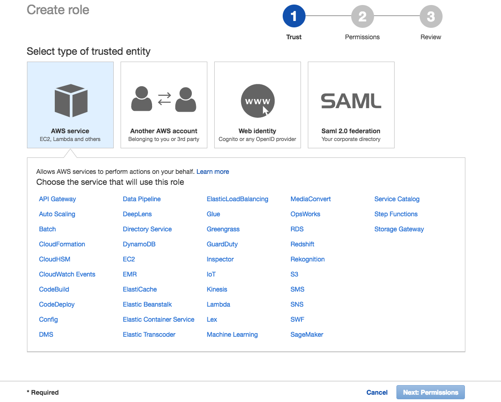
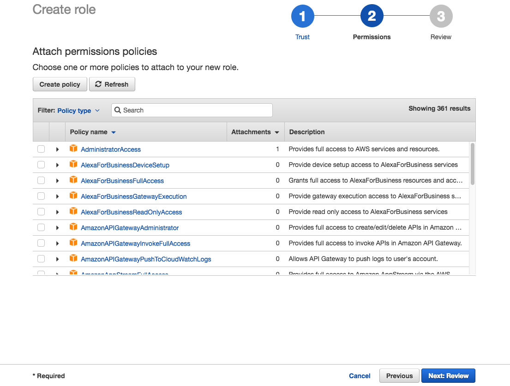

# IAM Explained

## Overview

Identity and Access Management, or IAM, is the way that AWS regulates the scope of an entity's abilities. By "entity," I mean users and services, like Lambda functions. IAM can also configure multi factor authentication for users signing into the AWS console. IAM is also directly involved in the creation of keys so a user in a remote development environment can deploy a project on AWS.

## Permissions

In order to understand permissions, you must understand the entities I mentioned above. These are users and services.

* **Users:** As you can probably guess, users are, well, just users signed into AWS. Users can be given permissions directly or assigned to **groups** in order to receive permissions.
* **Services:** Services are AWS processes, such as Lambda functions. Services are assigned **roles** in order to receive permissions.

Unless a user or a service is explicitly given a permission, it cannot do anything in AWS. Thus, in order to have permissions, users need to have permissions added to them or to be assigned to groups with permissions. Services need to be assigned roles that have permissions attached to them. Permissions are given to users, groups, and roles in the form of policies.

### What Is a Policy?

A policy is a JSON object that contains a permission. Take this policy for example:

```json
{
    "Version": "2012-10-17",
    "Statement": [
        {
            "Effect": "Allow",
            "Action": [
                "logs:*"
            ],
            "Resource": "*"
        }
    ]
}
```

This policy, when added to a role, will allow whatever service that role is assigned to to write logs for anything. Its official name is CloudWatchLogsFullAccess. Let's break it down further:

* **Version:** The policy version. Don't change this value.
* **Statement:** This field is an array of objects that give permissions. The fields within the object in this example are:
  * **Effect:** Determines whether a policy allows or denies access. Usually you're going to see "Allow" in this field, simply because as stated before, permissions are denied by default.
  * **Action:** An array of actions. They are formatted as "service:function". In this case, `logs` refers to the CloudWatch service, and `*` refers to every single function in CloudWatch.
  * **Resource:** The specific arn, or id, that you want to access. This could refer to a specific DynamoDB table, S3 bucket, or whatever. In this particular case, `*` refers to every resource.

When you add policies to a user, group, or role, you can either choose from a group of preset policies (such as the one mentioned above) or create your own. If you create your own policies, make sure you research the documentation for the AWS service you're trying to effect. You want to give your entity enough permissions to accomplish the task you want it to do, but you also need to make sure it doesn't have more permissions than it needs.

For more information on policies, check out the [AWS documentation](https://docs.aws.amazon.com/IAM/latest/UserGuide/access_policies.html).

### Managing Permissions

In general, it is smart to follow these guidelines:

1. Add policies to groups and then assign users to groups, instead of granting individual permissions to individual users.
2. In the final product, make certain that there is only one role per service and that that role only has policies absolutely essential to its task, and nothing more.

In a development environment it is okay to be lax on the second point, because you are just figuring out how to do a certain thing. This is also why we created the role "tfe-lambda-role" in the TFE Workspace. However, even during the development process, you should make an effort to understand what specific permissions are necessary for your task.

## Setting Up IAM on Your Own Account

Sign in to your own AWS account (not the `mkdecision` account) or create your own, if you haven't yet. You should see this page:


In the search bar, search for "IAM" if you don't already see it. Click on IAM, and you'll be directed to this page:


Notice the boxes under "Security Status". We will not go into details with them right now, but keep in mind that these boxes will give you recommendations on how to make your account more secure. Click on "Users" to the left.


Click on "Add user". You'll be brought to this page:


You should input your username. I recommend you use the settings shown in the picture. Continue by clicking "Next: Permissions".


You should select "Add user to group". Below that, click "Create group". This pop up will appear:


You can name your group name whatever you want, but make sure this is an administrator's account, so I recommend naming this "Administrators". Below that, you can see that there are a list of policies. You certainly should click "AdministratorAccess," as that will allow your user to do anything. If you want to make heavy use out of your account at some point, I also recommend typing "Billing" into the search bar and selecting the policy named "Billing". Since these two policies allow everything an administrator might need, you can proceed by clicking "Create group". You will now see that the group "Administrators" has been added below and that it is checked. This means that your user will be added to the Administrators group and through that group receive all the permissions associated with being in that group. Click "Next: Review".



Make certain that all your information is correct, then click "Create user". You'll see a page confirming that you've created a user.


You'll notice that your user has been created. Note two things in particular:

1. There is a button called "Download .csv". This allows you to download your user credentials in the comma-separated variables (CSV) format. You should download this right now and save it in a safe location.
2. The link after "Users with AWS Management Console access can sign in at:". Copy this link (it is also available in the CSV folder that you just downloaded).

After you do those two things, you can log out. Paste the link that you just copied into the browser, and it will allow you to log in as your user. This is the way you should always log in to your AWS account. Log in. Depending on how you configured your new user, you may have to reset your password. Go back to IAM and you will see this:


If you found the link you used to sign in too hard to remember, you can customize the link to have an alias. To do this, click "Customize" to the right of the link up top (here it is covered by a black box). Notice also that the security status has changed. The only things that are left undone are to activate MFA (which we will do in a later chapter) and to provide a password policy. On your individual account you can manage these however you like.

## Creating a Role and Adding Policies to It

Finally, you can create a role and add policies to it. On the IAM Dashboard, click "Roles". You should see this page:


Click "Create role". You'll be directed to this page:



These are AWS services that you want your role associated with. In general, roles are going to be associated with Lambda functions, so for now choose "Lambda". Click "Next: Permissions".



Notice that you can continue making the role without adding any permissions policies. But where's the fun in that? There are two ways to add policies. You can either select a default AWS policy or make one of your own. We are going to do both.

To add a default AWS policy we just have to select one (much like when we were adding permissions to our user group). Type "CloudWatchLogsFullAccess" in the search bar and check it. As we already know, this policy will allow our role to write and access logs anywhere.


And that's it! Now, let's create our own policy. Click "Create policy". You'll be brought to this page:


Notice that there are two tabs: "Visual editor" and "JSON". Using either is fine, although you should get in the habit of at least viewing every policy in JSON format so you can know how to configure a policy. Let's use Visual editor.

1. Click "Choose a service". You'll see a lot of services appear. Type "S3" into the search bar, then select S3.
2. Next to Actions, click "Select actions". Before you click any boxes, look at the boxes. Depending on which of these boxes you choose, you will get certain permissions. I am going to choose "List," which according to the [documentation](https://docs.aws.amazon.com/IAM/latest/UserGuide/access_policies_understand-policy-summary-access-level-summaries.html) means that I will have the permission to list all the buckets owned by the role and what's in them (for more information on look at [S3's documentation on managing resources](https://docs.aws.amazon.com/AmazonS3/latest/dev/s3-access-control.html)).
4. Click the link next to "Resources". We are going to select "All resources," which as suggested means that this policy can access all buckets, but if you only wanted this policy to access individual buckets, you would select "Specific" and then click "Add ARN" under "bucket".
5. You don't need to select anything under "Request conditions," but you should know that there may be times when we want some conditions, such as whether to allow actions only from a specific IP address or if you want MFA involved (the former is more likely to apply to services whereas the latter is more likely to apply to users).

You'll notice that there are some warnings. That's okay, but get used to reading and trying to understand these warnings. Before you click "Review policy," click the "JSON" tab. You'll see this in the JSON editor:

```json
{
    "Version": "2012-10-17",
    "Statement": [
        {
            "Sid": "VisualEditor0",
            "Effect": "Allow",
            "Action": [
                "s3:ListAllMyBuckets",
                "s3:ListBucket",
                "s3:HeadBucket",
                "s3:ListObjects"
            ],
            "Resource": "*"
        }
    ]
}
```

Notice that the list permissions you selected are listed under "Action" and the resources we chose (in this case all resources, symbolized by "\*") is listed by "Resource". Click "Review policy" and you'll see this page.


Make sure you create a descriptive name for your policy and then review the "Summary" section one last time. Then click "Create policy". Go back to the tab where you were creating your role, click "Refresh", search for the policy you just created, and select it. Then click "Next: Review".


Like with the policy review, add a descriptive name for your role. Note that next to "Policies" you can see the CloudWatchLogsFullAccess policy and the policy you just created. Click "Create role" and you will be directed back to your roles page in IAM.


And that's it. You can use this role with AWS Lambda. You can click it to see its information and attach or remove policies. You can also edit policies themselves, although this is not recommended with default AWS policies.

## What Comes Next

At MK Decision, we require our developers to have multi factor authentication set up on their AWS accounts. You will also need to configure your AWS CLI keys. The next two articles will teach you how to do these things in the context of the TFE Workspace.
