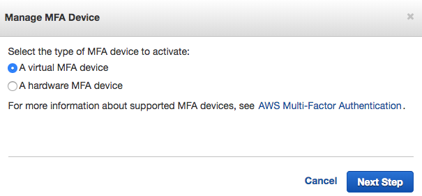
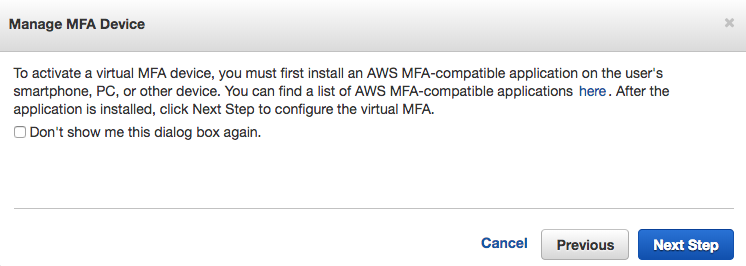
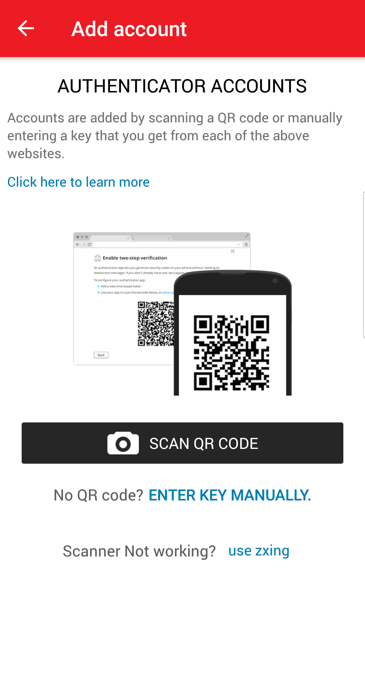
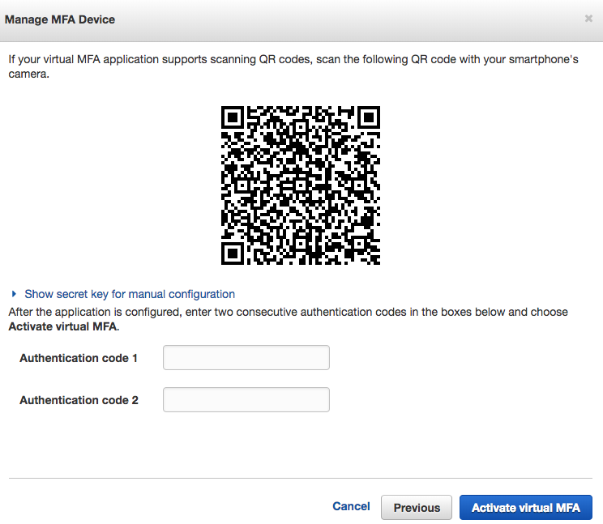
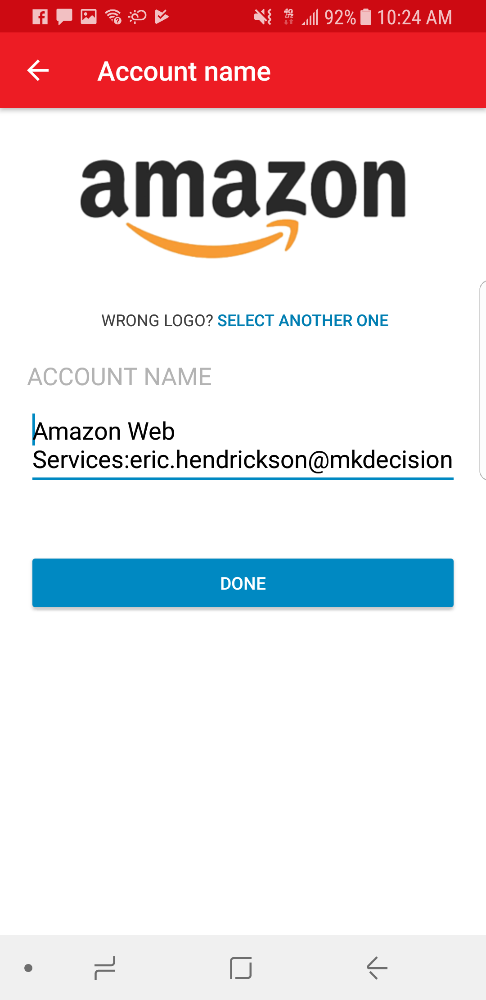
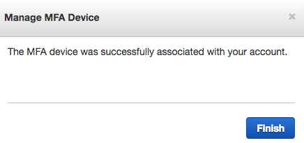
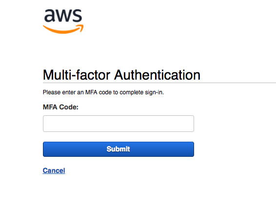

# Setting Up Multi Factor Authentication

### By Eric Hendrickson

## Overview

At MK Decision, security is key. Multi Factor Authentication, or MFA for short, is a great way to ensure that no one except you can get access to your account. In this chapter, you will learn how to set up MFA on the MK Decision master account.

## Signing into the Master Account

First, you must log into AWS with your MK Decision account. Assuming you signed in with your own account, log out, and when you’re given the option to log in again, look for the link that says "Sign in to a different account." It should look like this:

Type in "mkdecision". When you hit "Next," you’ll be brought to a new login page where you can sign in using your MK Decision username and password. Once you’re logged in, go to IAM. On the left side of the page, click on "Users". Then select your username. You will be brought to this page:

When you click the "Security credentials" tab, you will see this:

Notice that "Assigned MFA device" says "No". Click on the pencil next to "No". This pop up dialog will be displayed:

With "A virtual MFA device" selected, click "Next Step". There will be another pop up dialog.

The gist of this is that you need a third party app in order to continue setting up MFA. For that we can use [Authy](https://authy.com/), a mobile app that is available on both IOS and Android. Download Authy on your phone and create an account. Once that's done, click "Add an Account". You'll see this screen on your phone:

As you can see, you're ready to sign a QR code. You're now ready to add your account. On your AWS console, click "Next Step". You'll see this:

On your phone, scan the QR code. You'll get this screen on your phone:

Name the account whatever you like, and tap "Done". On the next page, you will see a six digit code. On AWS, type in the code you see next to "Authentication code 1". Wait a little bit. You'll notice on your phone that a new code has rendered on your phone screen. Type that code into "Authentication code 2", then click "Activate virtual MFA". If you did it right, you'll get this pop up dialog:

Click Finish. Congratulations. You've set up MFA on AWS! To verify, log out of AWS and log back in. Enter your credentials again, and you'll be directed to this page:

Look at your AWS account on Authy, and input the 6 digit code (quickly, before the code changes), and click "Submit". You'll see you have successfully logged in to your account. 
