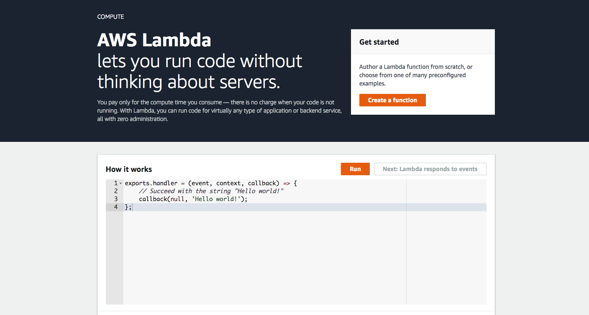
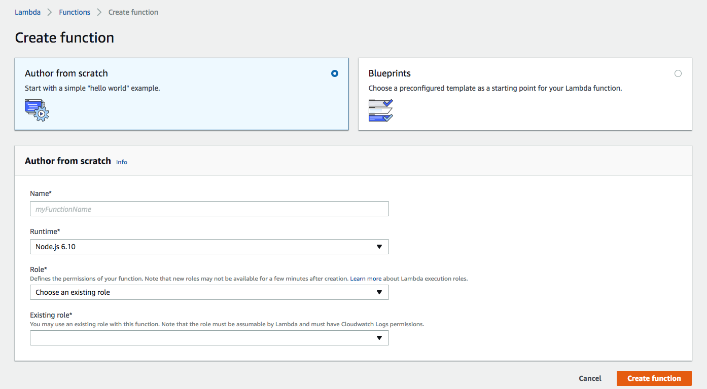
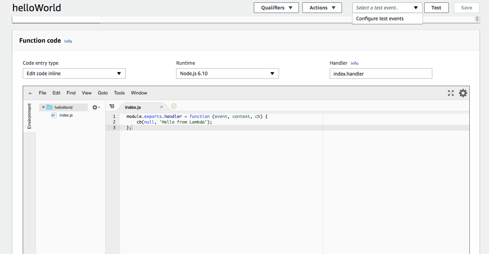
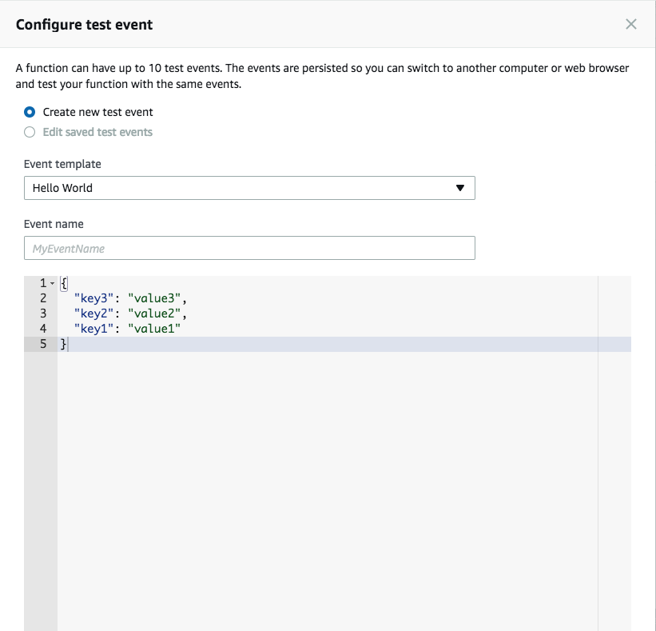
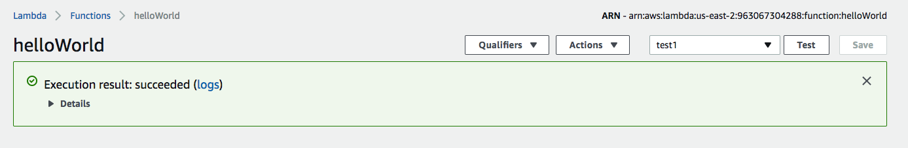
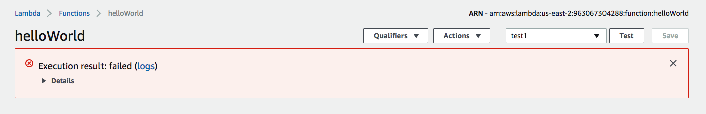

# Introduction to Lambda

### By Eric Hendrickson

## Overview

AWS Lambda is a framework that runs stateless, serverless code. This may sound confusing at first, but it really isn't. Let's define "stateless" and "serverless" before we continue:

* "stateless": This is basically just a fancy way of saying that all Lambda does by itself is run code. That's it. When you trigger a Lambda function, Lambda creates a sandbox, runs the code in the function, and when it finishes, that sandbox is gone and nothing new is saved by default. To save or access data, you'd have to call other AWS services (for example, you can call RDS or DynamoDB for database storage).
* "serverless": This is a bit of a misnomer, because Lambda code actually *does* run on a server. It's just not run on servers owned or operated by us, but rather servers that are specifically dedicated to running individual Lambda functions.

Lambda is incredibly cost effective for us, because all we pay for is each time the code is run, instead of paying to operate a server that is running 24 hours a day 7 days a week. It's also convenient because we don't have to worry about load balancing when our system is busy; Amazon does all that work for us.

## Tutorial: Setting Up a Basic Lambda Function

At the same time, you may have already noticed that one of the downsides of Lambda is that you have to put in a lot more work hooking Lambda functions up to other services. Perhaps some readers are even feeling a little intimidated at this point, possibly asking questions like "But wait, how can I make an API endpoint?" Don't worry, those questions will be answered in time. For now, just focus on making a simple Lambda function.

Search for AWS Lambda. Assuming you're logged in, you'll find a page that looks like this:

Go ahead and click "Create a function". You'll come to this page:

Select "Author from scratch" and name your function helloWorld. At MK Decisioning Systems, we use the Node.js 6.10 Runtime (although Lambda also offers other languages, like Java, Python, C#, or even Go). The tricky part is Role. For your purposes, on the TFE Workspace, you will select "Choose an existing role" and then select "tfe-lambda-role". If you're working on your AWS account though you may need to create a custom role (that falls under the scope of IAM, article to be added later). Click "Create function".

You'll be brought to your Lambda function page. Scroll down and you'll see a section called "Function code". This code is below:

    exports.handler = (event, context, callback) => {
        // TODO implement
        callback(null, 'Hello from Lambda');
    };

This code is fine (it'll work), but for our purposes we are going to format it differently. Change it to this:

    module.exports.handler = function (event, context, cb) {
        cb(null, 'Hello from Lambda');
    };

This fits with MK's backend coding standards. Click the "Save" button on the top right.

This function's name, as you may have noticed, is "handler". In your code, you should always refer to it as such, because that's the best way to call your Lambda function. Take a good look at the parameters also. They are:

* **event**: This is the input from the event. If you call a Lambda function and put in an input, it can be accessed through this parameter. Examples of valid input are strings, the `null` keyword, and JSON.
* **context**: This generally contains data about the Lambda runtime environment. In some tutorials you may see it omitted (along with callback/cb), but you should always input it.
* **cb**: Stands for "callback," but we've shortened it to save time when coding. Lambda doesn't return anything in handlers. Instead, you are expected to input your response in a callback function. If your code is successful, you must finish your function with `cb(null, [value])`, and if it is unsuccessful and you want to callback an error, you must finish your function with `cb([error], null)`. Some tutorials will omit the callback function, but keep in mind that if you want your Lambda function to yield a response you must include the callback function.

At the top right of the page, you'll see a button entitled "Test". To the left of that is a dropdown that says "Select a test event."

Click it and then select "Configure test events". You'll be brought to this popup:

You can keep the configuration as is, with two exceptions. Change "Event name" to "test1". In the code editor below, change this JSON

    {
      "key3": "value3",
      "key2": "value2",
      "key1": "value1"
    }

To be just `{}`. This reflects the fact that any event input is irrelevant, although it's good practice to get in the habit of ALWAYS passing in a JavaScript object. Save the test event. You will notice that "test1" is selected in the dropdown menu next to "Test". Now click "Test". You will notice that below the code editor you get output similar to this:

    Response:
    "Hello from Lambda"

    Request ID:
    "fd9061bb-1288-11e8-b4a3-d349b6ea60ef"

    Function Logs:
    START RequestId: fd9061bb-1288-11e8-b4a3-d349b6ea60ef Version: $LATEST
    END RequestId: fd9061bb-1288-11e8-b4a3-d349b6ea60ef
    REPORT RequestId: fd9061bb-1288-11e8-b4a3-d349b6ea60ef	Duration: 2.23 ms	Billed Duration: 100 ms 	Memory Size: 128 MB	Max Memory Used: 19 MB

Your "Response" is what the callback function sends back to whatever invoked the Lambda function. If you scroll to the very top, you will see this green box:

If you click "Details" within this box, you will see the same info that was below the code editor.

Now change your function to this:

    module.exports.handler = function (event, context, cb) {
        cb('Random error', null);
    };

Save the function and click "Test" again. This time you should get output that looks something like this:

    Response:
    {
      "errorMessage": "Random error"
    }

    Request ID:
    "c488a8d3-1289-11e8-a568-9f97a53d994d"

    Function Logs:
    START RequestId: c488a8d3-1289-11e8-a568-9f97a53d994d Version: $LATEST
    2018-02-15T19:52:35.436Z	c488a8d3-1289-11e8-a568-9f97a53d994d	{"errorMessage":"Random error"}
    END RequestId: c488a8d3-1289-11e8-a568-9f97a53d994d
    REPORT RequestId: c488a8d3-1289-11e8-a568-9f97a53d994d	Duration: 23.46 ms	Billed Duration: 100 ms 	Memory Size: 128 MB	Max Memory Used: 19 MB

What's happening here is the callback is sending back an error to whatever called the Lambda function. Scroll up again. This time you will see a red box that looks like this:

Like the green box before, you can see the same output from the console when you click "Details".

And that is it. One thing you should get used to thinking now is that you may not always be able to edit your Lambda function in the inline code editor. Sometimes Lambda functions get pretty big and this option is not available. In any case, you should learn how to deploy your code from the command line or at least uploading your code as a zip file.

However, for now, this is really all it takes to create a Lambda function. The following tutorials will help you learn how to hook up Lambda functions with other AWS services.
