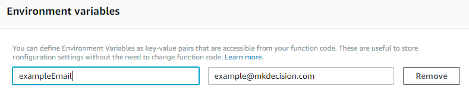

# How to Assign Environmental Variables in Lambda

Sometimes, while writing code, there are a few pieces of information you would like to change throughout your entire project all at once without having to change each instance or there are pieces of information that you do not want exposed to the entire world (e.g., the name of your database table, the region your servers are in, an email address you want people to contact, etc.) For these cases, we use environmental variables. Environmental variables can be set in AWS Lambda and be incorporated throughout your code. Anyone looking at your code will just see that variable names and not the information behind it.

To do this, simply create a Lambda function and scroll down to the environmental variables section right under the code. From here, you can see two fields for each variable. The first is where you name your variable and the second is where you assign its value. A new line will appear each time you enter a variable. Note that the variable name can only include alphanumeric characters and underscores.

To use this new variable in your code, simply type in `process.env.[variable name]` into your code. For instance, if you wanted to send an email to `example@mkdecision.com`, you might name an environmental variable something like `exampleEmail` and assign it the value `example@mkdecision.com`.



Then in your code, you might have a block of code that looks like this, where you can insert the new variable:

```javascript
let params = {
    Message: { Data: new Buffer(email) },
    Destinations: [ process.env.exampleEmail ],
    Source: <' + process.env.otherEmail + '>
};
```
