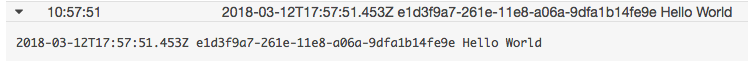

# Using a Lambda Function to Invoke Another Lambda Function

This tutorial will demonstrate how to write a Lambda function that calls a second Lambda function. To do this, we will make use of Lambda's `invoke()` operation, the AWS Documentation for which can be found [here](https://docs.aws.amazon.com/AWSJavaScriptSDK/latest/AWS/Lambda.html#invoke-property).

As always, if you are responsible for creating your function's role in AWS IAM, be sure that it has the necessary permissions to use `invoke()` on the Lambda function it will be invoking. More information about using IAM can be found [here](../../introduction-to-aws/iam/iam.md).

We'll need two Lambda functions: the one that calls the invoke function, and the one that is invoked. For this example they are respectively called `LambdaInvokeTrigger` and `LambdaInvokeEvent`.

## Invoking a Lambda Function as an Event

The first example we will look at is how to make our function "fire and forget," meaning that our first function will not be expecting a response from the second one. This will involve invoking our function as an event.

 We'll keep `LambdaInvokeEvent` as simple as possible to demonstrate `invoke()`: if the function's event param object contains a `message` property it logs that property's value and calls back a string to let us know it's finished. Otherwise it calls back an error.

```javascript
exports.handler = function(event, context, callback) {
    try {
        if (event.message) {
            console.log(event.message);
            callback(null, 'Finished');
        } else {
            throw new Error('Invalid params');
        }
    } catch(err) {
        callback(err, null);
    }
```

For `LambdaInvokeTrigger`, we need to first require the AWS SDK, and then create a Lambda instance to give the function access to `invoke()`.

```javascript
const AWS = require('aws-sdk');

exports.handler = function(event, context, callback) {
    const lambda = new AWS.Lambda();
};
```

`lambda.invoke()` will take a set of parameters. The way we configure these parameters will depend on the manner in which we want to call the function.

We need to define a set of params to pass into the `invoke()` function.

```javascript
const params = {
    FunctionName: 'LambdaInvokeEvent',
    InvocationType: 'Event',
    Payload: Buffer.from(JSON.stringify({message: 'Hello World'}))
};
```

* `FunctionName` is naturally the name of the function that will be invoked.
* Setting `InvocationType` to `Event` means that our Lambda function will not be expecting a response from the one it invokes.
* `Payload` is what the invoked function will use as its `event` parameter. This is an object consisting of any information we want to make available to the second function. The object needs to be made from stringified JSON into a buffer before it can be passed into another Lambda function to be used as an event object.

There are other parameters that can be passed into the `invoke()` function if desired. More information about these parameters can be found in the AWS SDK documentation.

Next we use our Lambda instance to call `invoke()`, pass in our params object, and finally callback a string to let us know the function is terminating.

```javascript
lambda.invoke(params);
callback(null, 'finished');
```

Here is the `LambdaInvokeTrigger` function so far.

```javascript
const AWS = require('aws-sdk');

exports.handler = function(event, context, callback) {
    const lambda = new AWS.Lambda();
    const params = {
        FunctionName: 'LambdaInvokeEvent',
        InvocationType: 'Event',
	    Payload: Buffer.from(JSON.stringify({message: 'Hello World'}))
    };
    lambda.invoke(params);
    callback(null, 'finished');
};
```

Lastly, let's make `lambda.invoke()` into a promise, wrap it in a `try()` block, and callback any errors in a `catch()` block. This will allow us to see if there are any problems with the invocation.

```javascript
const AWS = require('aws-sdk');

exports.handler = function(event, context, callback) {
    const lambda = new AWS.Lambda();
    try {
        const params = {
            FunctionName: 'LambdaInvokeEvent',
            InvocationType: 'Event',
    	    Payload: Buffer.from(JSON.stringify({message: 'Hello World'}))
        };
        lambda.invoke(params).promise();
        callback(null, 'Finished');
    } catch(err) {
        callback(err);
    }
};
```

(`lambda.invoke()` can be make into a promise by simply adding `.promise()` to the end when it is called. We know this syntax is valid because in the AWS SDK documentation for `.invoke()`, it is shown to return an AWS request. See [here](../../../languages/javascript-promises/javascript-promises.md) for more information about using promises in general as well as with AWS SDK functions in particular).

Let's test out the function. Since `LambdaInvokeTrigger` as it's currently implemented doesn't make use of its own event object, it doesn't matter what we pass in. The default test will do just fine.


When we test the function, we get the return we specified for after `lambda.invoke()` has wrapped up. However, to test whether `LambdaInvokeEvent` has run properly, we need to check its logs in AWS CloudWatch.



We can see that `LambdaInvokeEvent` has successfully logged the contents of `invoke()`'s `payload` parameter from `LambdaInvokeTrigger`.
