# Hooking up a Lambda Function to API Gateway

### By Eric Hendrickson

## Overview

You have now successfully created a Lambda function. Now what? How do I hook it up so users can access it, say, on a web page?

The answer lies within API Gateway. API Gateway allows a user to access AWS services via HTTP requests. In our case, we are going to use API Gateway to trigger the Lambda function from the previous chapter.

## Tutorial

First start by navigating to API Gateway. You should see this page:

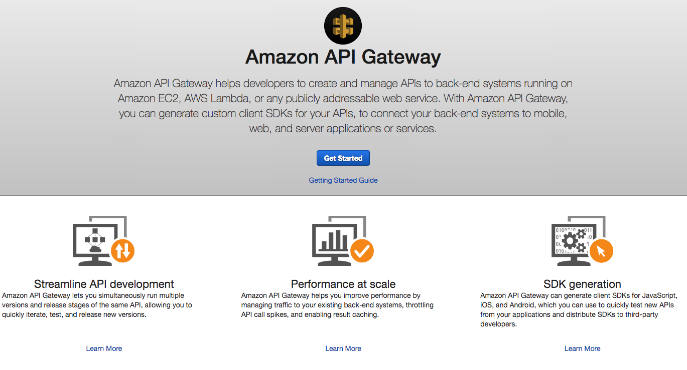

Click "Get Started". Ignore the PetStore Example API, and click "New API". Call it "helloworld"

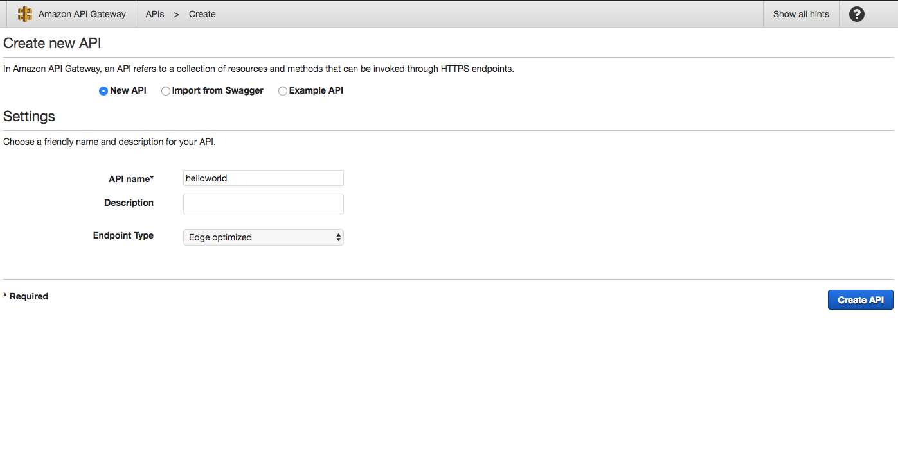

Click "Create API". You'll be brought to this page:

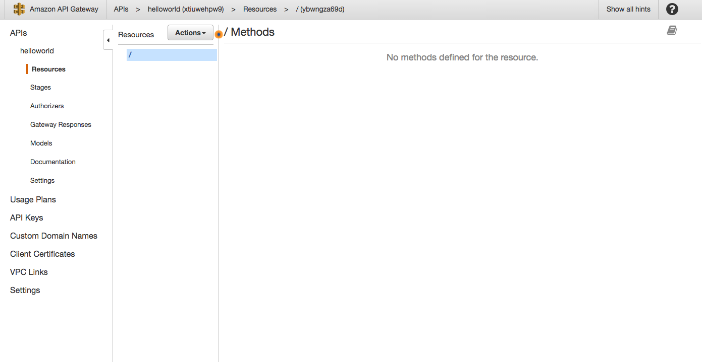

As you can see, you already have an API, although now it only has a root endpoint. You will notice that you are in a section called Resources. Click on the "Actions" dropdown menu, and you'll see this:

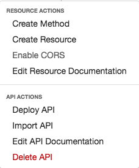

"Create Method" is pretty self explanatory. It allows you to select an HTTP method for a resource. You could even assign a method to the root endpoint, although for this tutorial we are going to create our own resource. Click on "Create Resource".

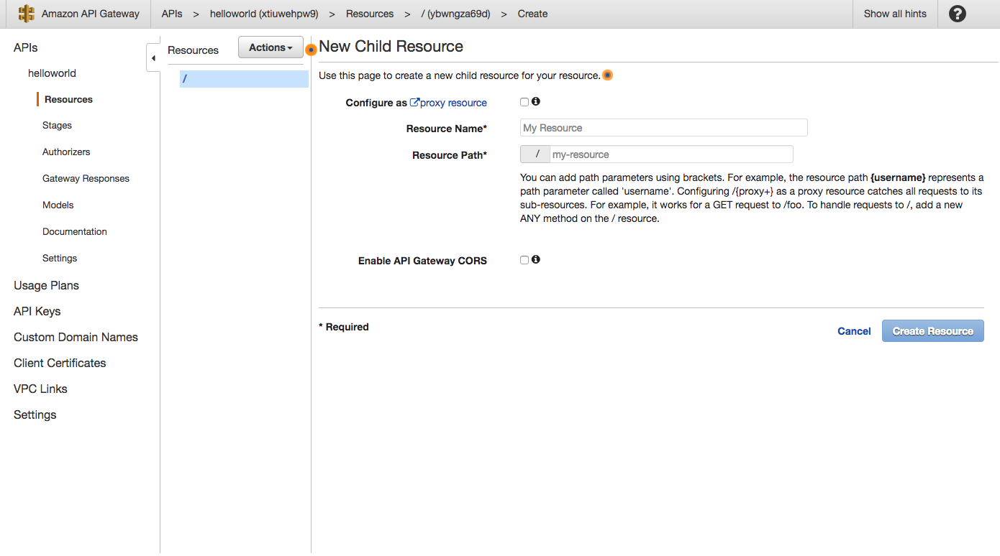

Next to "Resource Name," type in "hello-world". You will notice that "Resource Path" is also being set as "hello-world". You can change the name if you like. Click "Create Resource". Our API now looks like this:

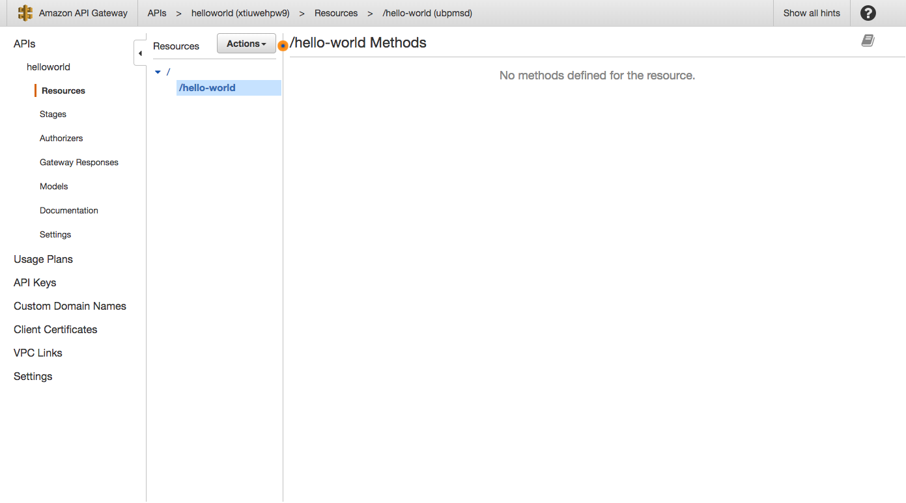

While "/hello-world" is highlighted, click "Actions" again and select "Create Method". A blank dropdown will appear under the resource. Click it and select "GET".

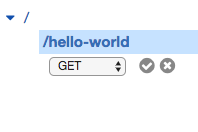

Click the check mark next to the dropdown and the method will be created. You'll be taken to this page.

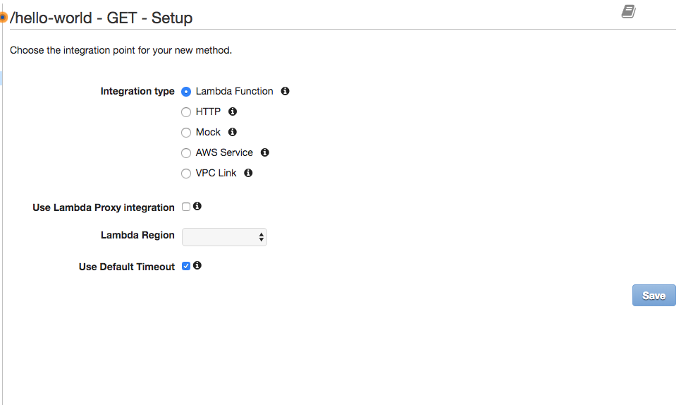

You'll notice that the "Integration Type" is already set to "Lambda function". This is what we want. You'll see a dropdown next to "Lambda Region". Select the region your Lambda function is in, and then you'll see an input called "Lambda Function". Type in "helloWorld".

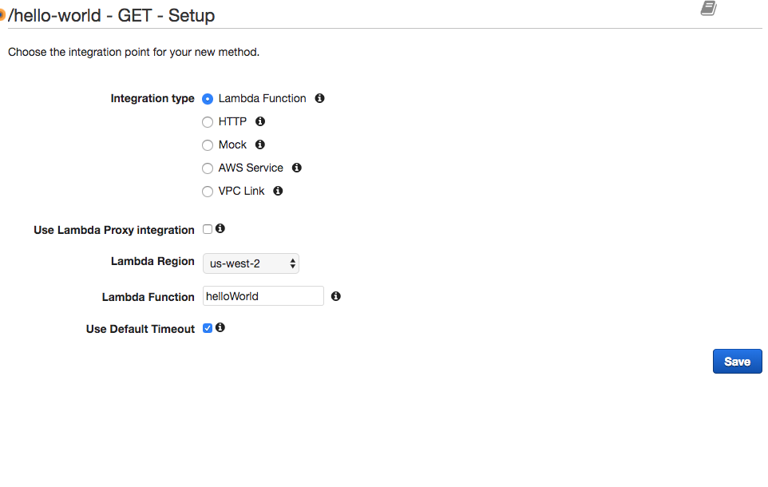

Click "Save". A pop up dialog will notify you that you are giving API Gateway permission to trigger this Lambda function. Click "Okay". You'll be directed to this page:

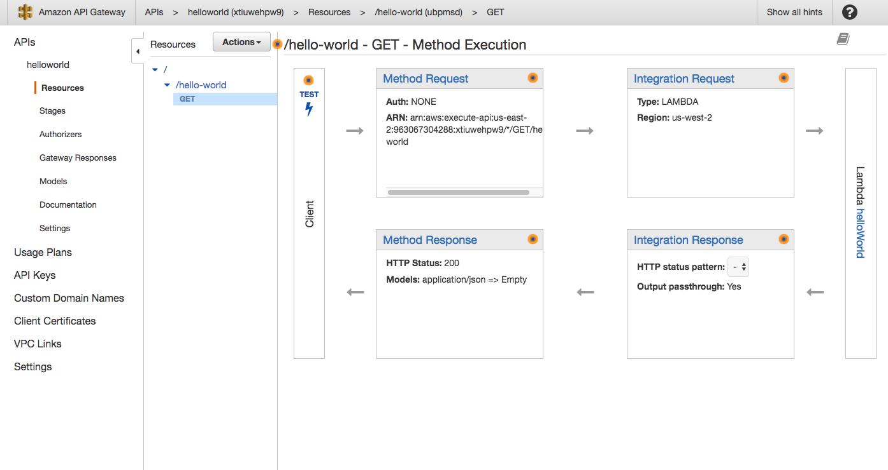

A quick breakdown of what's going on is that API Gateway sets up the resource and allows a user to make an HTTP request:

1. "Method Request" configures how you're going to access the endpoint (such as authorization)
2. "Integration Request" handles how an API call works related to other AWS services. In this case, we are integrating with a particular Lambda function.
3. "Integration Response" in similar fashion handles what is returned from the AWS service and configures an HTTP response. In our case, it sets the method response status to 200 (successful). Depending on how we configure AWS Lambda this may not be necessary.
4. "Method Response" then returns the HTTP response. Our API returns a response that includes what is called back in our "helloWorld" Lambda function ("Hello from Lambda") along with the 200 status.

In the "Client" box to the left, click "TEST". You'll be directed to a method test.

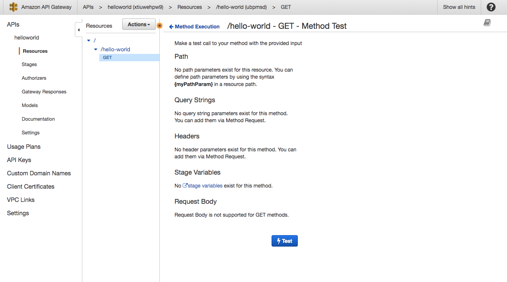

Click the "Test" button and you'll get this output:

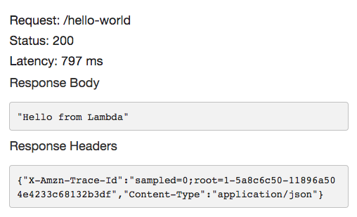

This proves that we have the HTTP response that we want. Note that if you callback an error in your Lambda function you will get a response with a 500 status code (but since we're only calling back a string this is what we're going to get).

Click "Actions" again and click "Deploy API". You'll see this pop up dialog:

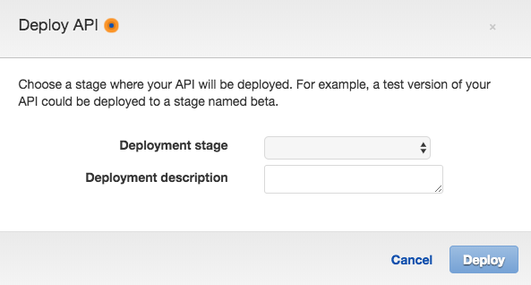

In the Deployment Stage dropdown, select "[New Stage]". Name it "dev" (we will name it different things based on where we are in the development cycle, but when you are in the initial development phase always name it "dev").

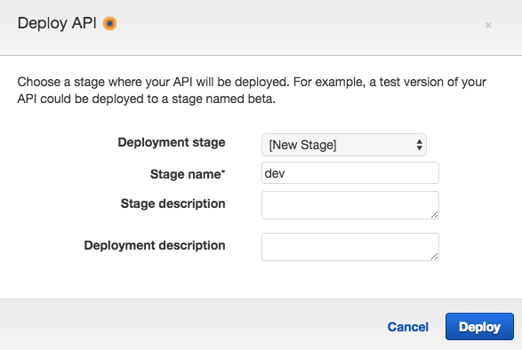

Click "Deploy". You'll be brought to this:

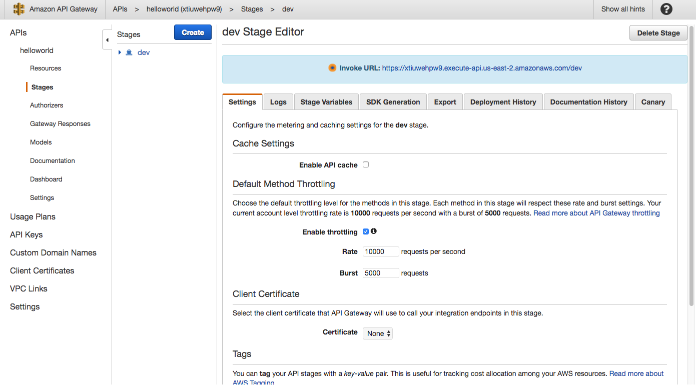

Don't worry about configuring the stage right now. To call the endpoint you made and configured in your API, click on the arrow to the left of "dev". You'll see this tree.

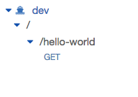

Click on "GET" below "/hello-world". You'll be brought to this:

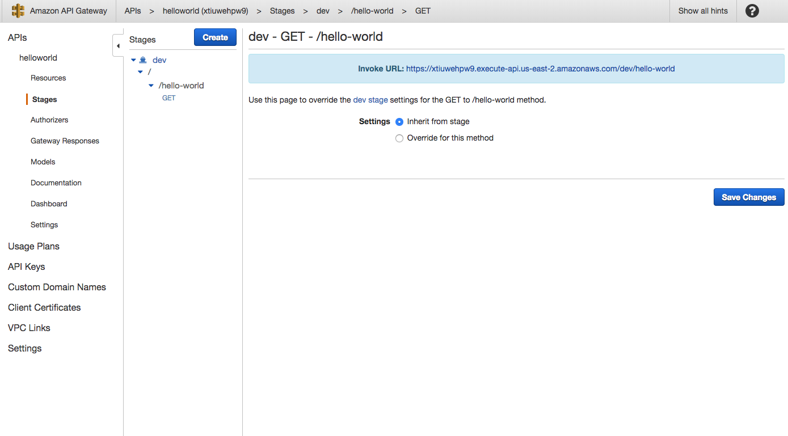

If you copy and paste that link in a browser, you will see the string `"Hello from Lambda"` displayed. You have successfully completed your very first API using Lambda and API Gateway!

Note that if you're making endpoints that utilize other methods (e.g., PUT, POST, DELETE) you will certainly require a tool such as [Postman](https://www.getpostman.com/) or [cURL](https://en.wikipedia.org/wiki/CURL) to do so, but in this case just using a browser is fine.

## How to Develop Lambda Functions that Interact with API Gateway

When developing Lambda functions that API Gateway calls, it is important to think about what you're using in your callback. In general, it's best to not call back a string like in the Lambda function used in the example above (`callback(null, 'Hello from Lambda');`). Instead, you should callback a JSON response object, such as this:

    const response = {
      statusCode: 200,
      body: JSON.stringify({
        data: 'Hello from Lambda'
      })
    };
    callback(null, response);

Depending on whether or not this is a successful case, you can put in other status codes. [Refer to this page](https://en.wikipedia.org/wiki/List_of_HTTP_status_codes) to find a status code that is appropriate for your needs.

## Conclusion

Hopefully by now you have some grasp at how to use API Gateway to trigger Lambda functions. Lambda functions can be used to read from and write to databases, send text messages or email, and many, many other things. The following tutorials will mostly focus on Lambda functions with the assumption that you can later on trigger these functions with API Gateway.
