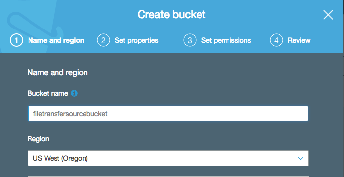
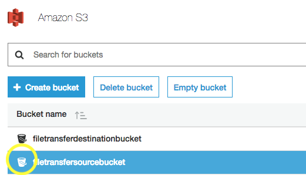
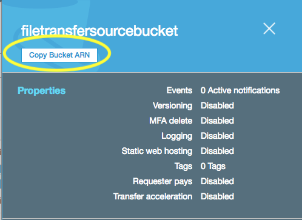

# Using Lambda to Transfer Files Between Buckets
----
#### By Andrew Levy
#### Edited by Eric Hendrickson

## Overview
----

In this tutorial we will demonstrate how to use an AWS Lambda function to transfer a file from one S3 bucket to another.

If the buckets you will be using do not already exist you will need to create them. Make sure they are both in the same region (for MK Decision, this will be us-west-2/Oregon).

We will need the resource names (ARN's) for both buckets to set up the Lambda function and provide it the necessary permissions. You can obtain a bucket's ARN by going to S3, clicking on the bucket icon next to the left of the bucket's name, and clicking hte "Copy Bucket ARN" button near the top of the module that appears.

