# Using Cloudwatch in Conjunction with API Gateway

The Amazon Web Services (AWS) resource Cloudwatch is a one-stop shop for monitoring all the other AWS resources you might be utalizing. In the left hand menu in the Cloudwatch console, you can see the different features Cloudwatch comes equiped with. (Dashboards, Alarms, Events, Logs, and Metrics)

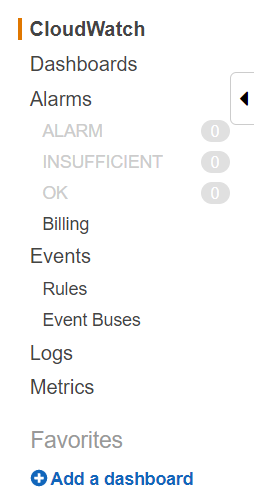

## Dashboards

In the Dashboards section, you can set your most viewed metrics to display for easy access. To set up a dashboard, click on the 'Dashboards' section of the left hand menu and then click on the 'Create dashboard' button.

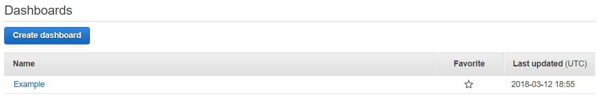

This will prompt a pop-up where you name your dashboard. Next, you will be prompted to add metrics to your dashboard.

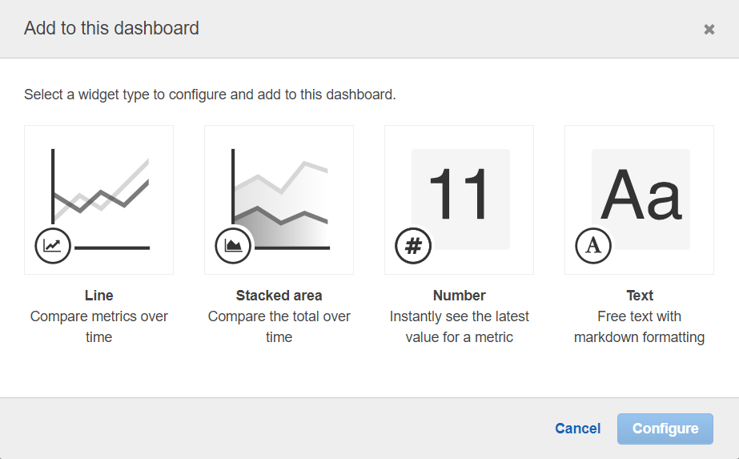

Go through the steps as you are prompted to set up the metrics. It is extremely similar to viewing the Metrics as seen in the Metrics section below. If you want to add a widget to your dashboard at a later time you can simply click the 'Add widget' button in the top left. Once the set up is complete, click the 'Save dashboard' button to complete your changes.

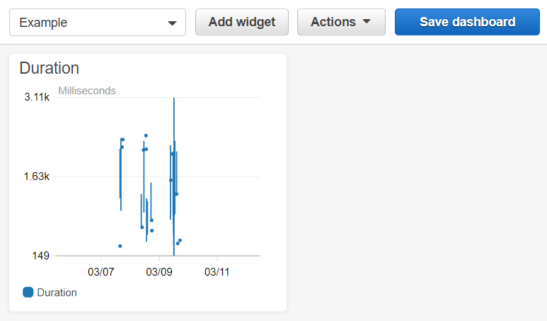

## Alarms

Another helpful feature of Cloudwatch is the Alarms section. In this section, you can set Cloudwatch to alert you when certain events occur.

Some examples include:
* when certain phrases appear in the logs
* when a certain number of errors have occured in a given amount of time
* and when the disk space is running low

To do this, click on the 'Alarms' section in the left hand menu and then click the 'Create Alarm' button in the top left.

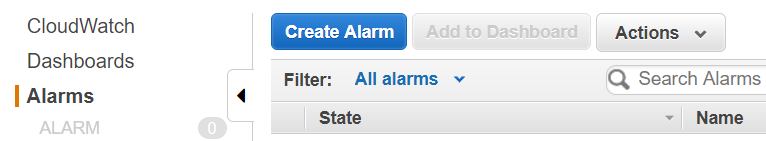

This will bring up a pop-up menu where you can choose which category to set an alarm for. For example, let's say we want to create an alarm for when a certain S3 bucket stores 10 files. Under the section header 'S3 Metrics,' click on the 'Storage Metrics' link.

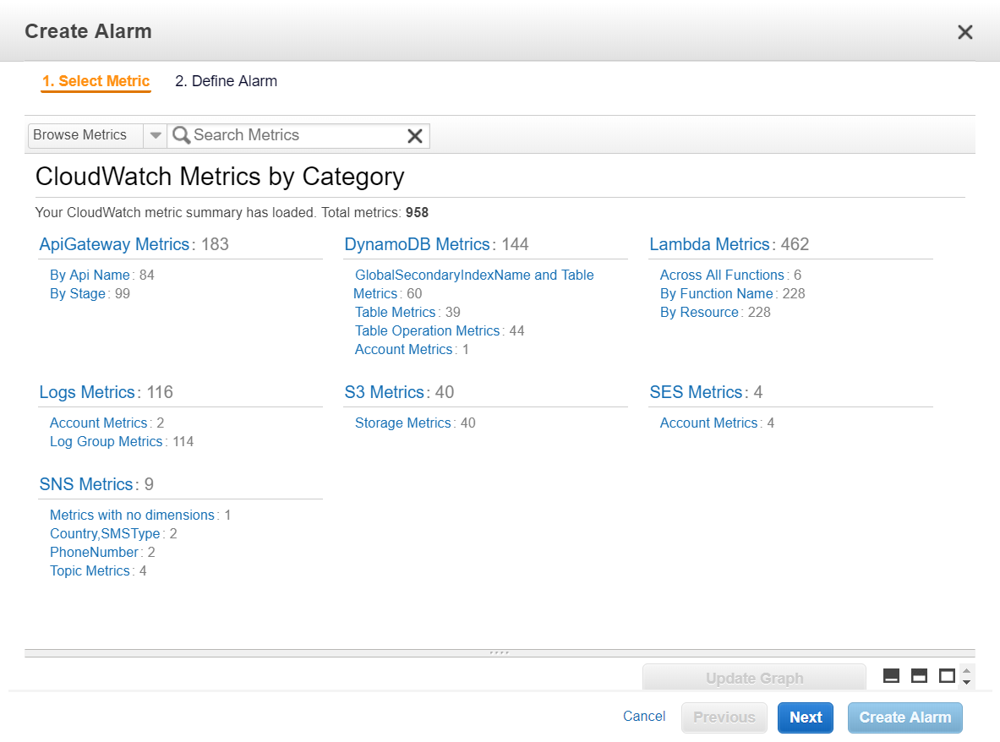

This will bring up a list of all the S3 buckets available to you in the AWS region you currently are in. Choose the bucket you wish to set the alarm for. There will be two options for each bucket. Choose if you want to monitor the number of objects in the bucket or the bucket size in bytes. When you make your selection, you can see a graph appears in the lower left that shows the metrics of that specific selection. In the lower right hand side, you can set a time range for the graph. This can either be in relative time (e.g. past 7 days) or in absolute time (e.g. December 25, 20X7 - January 1, 20X8).

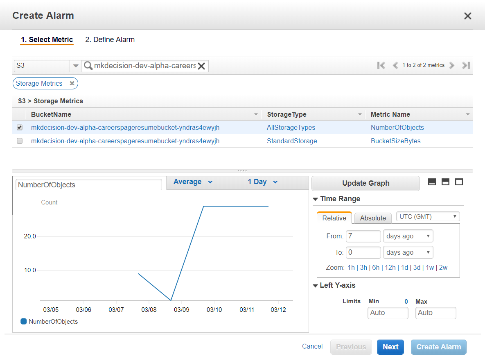

Next, click the 'Next' button and enter the name, description, trigger setting, and other additional settings for the new alarm. To finish, click the 'Create Alarm' button in the lower right.

## Events

Events are similar in nature to Alarms. But instead of sending out notifications, the events are set up to preform certain actions when certain occurances take place without the programmer needing to propmt the resource. These preset events are dictated by 'rules.' Through the Events section, you can create a rule by clicking on the Events section in the left hand menu and then clicking the 'create rule' button.

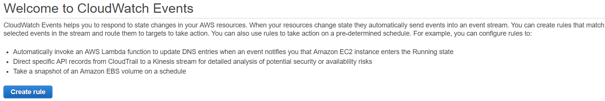

Next, on the left hand side, choose whether you want the rule to be on a time basis or an event basis and set up the corrisponding settings. On the right hand side, select the resource you wish to target with the rule.

A common example of a rule would be calling a lambda function that would automatically update a DynamoDB table with new information on a schedules basis, perhaps once a day at 3 A.M.

(To be continued...)

## Logs

One of the most useful features on Cloudwatch is the Logs feature. This creates a record of all the events and outputs of a Lambda function from the time the function gets called to the time the function finishes or exits. In these logs you can see certain pieces of data that you have console logged in your code. This is also the place where you can see any errors that have arisen. This is especially important for backend development when the programmers are using an API in the API Gateway that is calling a Lambda function. This is essentially the console for backend developers where they can follow the flow of the function and see if and where any problems occur.

To see specific logs, click on the 'Logs' section in the left hand menu. Make sure you are in the correct AWS region. This will bring up a screen with a list of all the log groups which contian the names of the lambda functions that have had activity for that region. Find the log group you wish to view and click on that link. This will bring you to another screen with a list of log streams. Cloudwatch will create a new log stream every time the lambda function gets updated. Cloudwatch will then log all of the activities of the function under this one stream even when the function gets called multiple times until a new log stream is created. The most recent log stream will be the first one listed by default.

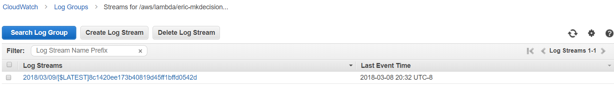

Now if you click on one of the streams, you can see the individual logs starting with a log that contains the word 'Start.' You can then click on individual logs to show more information about that event. Below is an example of a stream of logs that logged an error in the application process. You can tell that this iteration of the function has run twice, what the error was, how much memory is used each time, and how long each call took to complete:

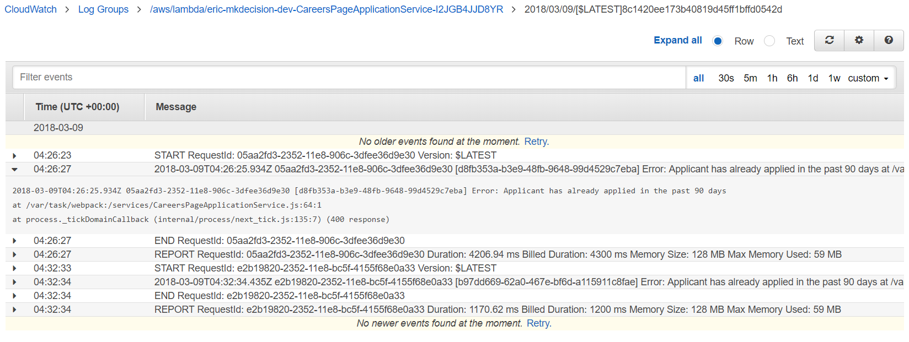

## Metrics

You can see all of these different metrics in a visual format at any time by clicking the 'Metrics' section of the left hand menu. In the lower half of the screen, select the AWS resource you wish to access and then the item of the resource you wish to view. The metric graph will appear in the upper half of the screen. You can also customize the graph view slightly by time and/or amount of units.

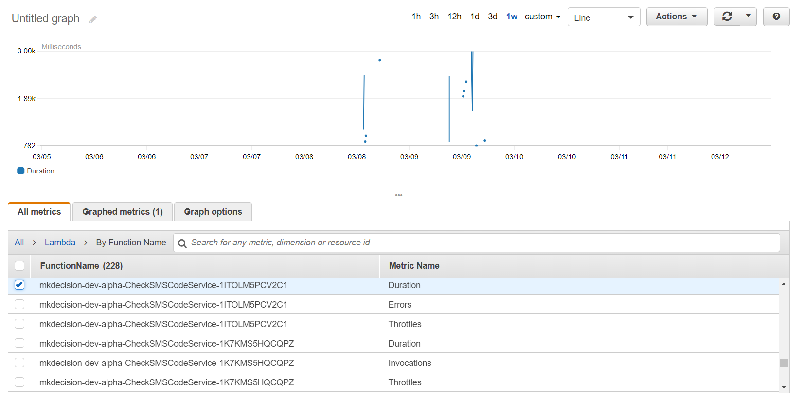
