# Writing to a DynamoDB Table Using a Lambda Function

### By Andrew Levy

In this tutorial we will demonstrate how to use an AWS Lambda function to transfer a file from one S3 bucket to another.

## The Table

For this example we will use a table whose primary key is a unique string.

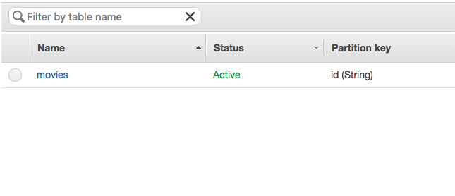

Once the table has been created, click on its name to see an overview of it. Copy down its Amazon Resource Name (ARN) from the "Table details" section as that will be used to give the Lambda function access to the table.

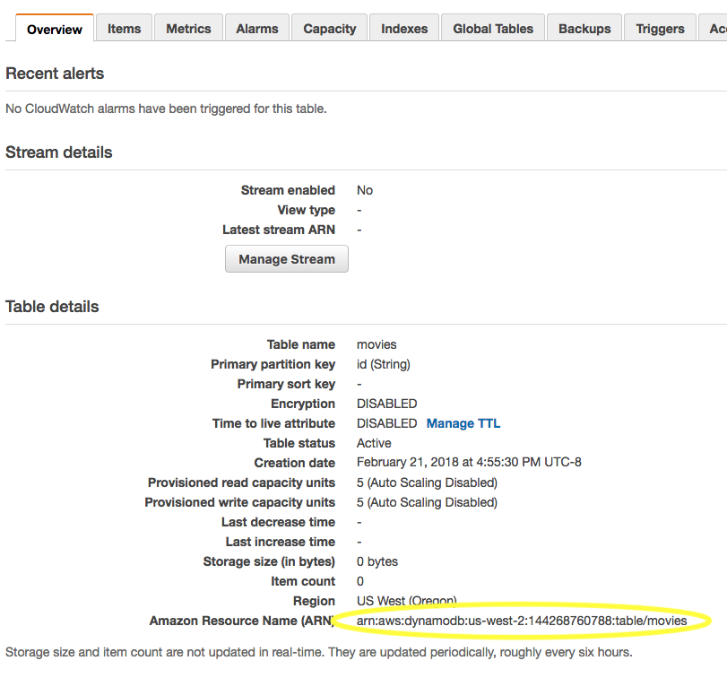

## Permissions For Lambda

We will need to give our function permission to write to our table. All Lambda functions must be assigned a role, and we give the function permissions by attaching policies to that role using the AWS IAM service. Your technical supervisor may provide you a role with the necessary policies. For example, the role used for Lambda functions in the TFE Workspace should have all the needed policies already. However, even if you are not creating the role yourself, it is still important to understand how roles and permissions work in AWS. For more information on using IAM to create a role and/or add policies to it, please see MK Decision's IAM documentation [here](../../introduction-to-aws/iam/iam.md#creating-a-role-and-adding-policies-to-it). The below JSON is the policy we will be attaching to our function's role to give it permission to write to the table.

```json
{
    "Version": "2012-10-17",
    "Statement": [
        {
            "Effect": "Allow",
            "Action": [
                "dynamodb:PutItem"
            ],
            "Resource":[
	    	"Table’s ARN goes here"
            ]
        }
    ]
}
```

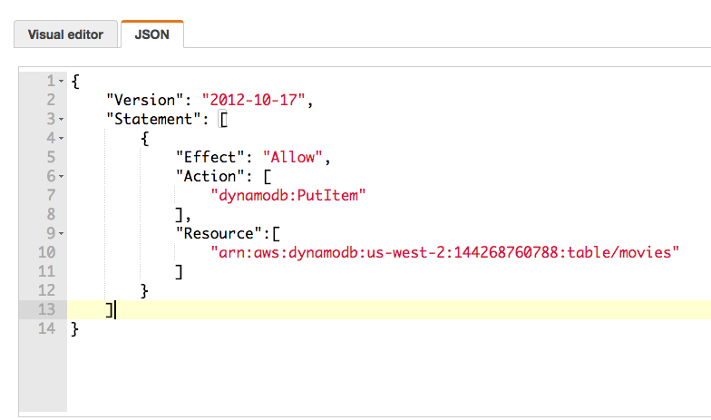

For our function an appropriate role name might be "put-movies-dbtable-role."

## Creating the Lambda Function

Recall that in our table, the primary key is a string that we have named "id". We will be generating these id's using a Node package. This means we will need to create the function locally and install the package to it before deploying it to Lambda.

Create a directory for the function, open a terminal in the directory, and initialize the project using pnpm.

We will be creating unique id's for the table using the node package [uuid](https://www.npmjs.com/package/uuid). A uuid is a [universally unique identifier](https://en.wikipedia.org/wiki/Universally_unique_identifier), which is an encoded number generated based on unique components such as a timestamp, a random number, and network information about the host generating the uuid. Using uuid's is an effective way to ensure that we will be getting unique values, which is important for the primary key of a table. The terminal command to install the package to the project is `$ pnpm install uuid`.

Create index.js in the project and open it in your editor. This is where we will be writing the function itself.

First add the dependencies. We need to import the uuid package we've just installed. We also need to require the AWS SDK (which all Lambda functions have access to, so we don't have to install it locally). The SDK will then allow us to create an instance of the DynamoDB document client.

```javascript
const AWS = require('aws-sdk');
const docClient = new AWS.DynamoDB.DocumentClient({region: 'us-west-2'});
const uuid4 = require('uuid/v4');
```

This docClient instance is a standard way to target DynamoDB. It provides a simple way to create JavaScript sets. As we are specifying a region here, our function will be able to write to the table even if they are in different AWS regions.

Now for the function itself. As with all Lambda functions, we will use an `exports.handler` function that has three arguments: event, context, and callback.

```javascript
exports.handler = function(event, context, callback) {

	}
}
```

First we need to specify the parameters we will passing into the DynamoDB docClient method. This includes an `Item` object for the table entry itself. All entries must have an id as that is the primary key, and because it is a movies table each entry will have a name and a score. The id is created by calling the uuid function we have added, and the other two values will come from the event object. Besides `Item,` we also need a `TableName` key, the value of which will naturally be the name of our table.

```javascript
exports.handler = function(event, context, callback) {
	const uuid = uuid4();
	const params = {
		Item: {
			id: uuid,
			name: event.name,
			score: event.score
		},
		TableName: 'movies'
	}
}
```

Next we'll pass those params into the docClient method. In docClient we'll then call a function to handle the result. This is where the callback parameter of our main handler function comes into play. Callback() is a method available to Lambda functions that has two arguments: the first is an error, and the second is non-error data. Therefore, if docClient.put() returns an error, we call callback() with the error as the first parameter and the second as null. If there is no error, we have null as the first argument and the return as the second one.

```javascript
docClient.put(params, function(error, data){
	if (error) {
		callback(error, null);
	} else {
		callback(null, data);
	}
});
```

Here is the entirety of index.js as we have it so far:

```javascript
const AWS = require('aws-sdk');
const docClient = new AWS.DynamoDB.DocumentClient({region: 'us-west-2'});
const uuid4 = require('uuid/v4');

exports.handler = function(event, context, callback) {
	const uuid = uuid4();
	const params = {
		Item: {
			id: uuid,
			name: event.name,
			score: event.score
		},
		TableName: 'movies'
	}

	docClient.put(params, function(error, data){
		if (error) {
			callback(error, null);
		} else {
			callback(null, data);
		}
	});
}
```

Now we can deploy our function to Lambda. In the AWS Lambda console create a new Lambda function and assign it the new role we have created for it. The runtime setting should be Node.js 6.10.

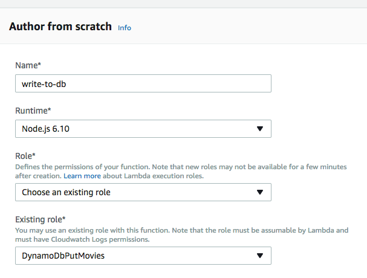

Once you have created the function in the AWS console, deploy it. At MK Decision you will typically deploy using the terminal command `pnpm run package && pnpm run deploy`; however, setting up your stack to deploy to Lambda automatically with these commands is beyond the scope of this tutorial. For the purposes of our project, we can simply compress the contents of our project directory into a zip file and use the AWS console to upload it.

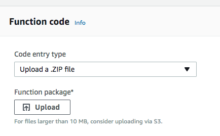

## Testing the Function

As mentioned before, we will run the docClient() function with our `params` object, which has three properties: id, name, and score. Id is generated by our uuid package, and the other two are passed in from the Lambda function's `event` parameter. Therefore, to test the function we'll need to create a test event with a name and a score.

Let's write a test that will create an object with these properties.

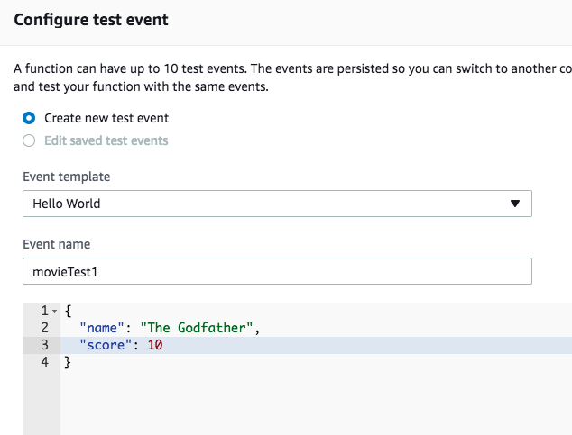

Let's run the test, and then check our table to see if anything has been written.

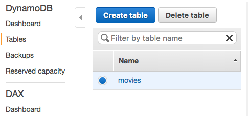

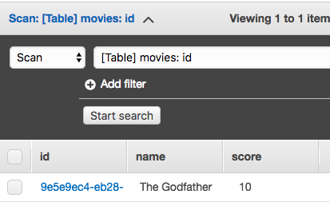

We can see that the table now has an item with a uuid for the id, and values matching the parameters we passed using the test.

## Validating the Event with a JSON Schema

There is currently nothing in our settings mandating that the movie’s name must be a string and the score must be a number. This is less than secure, and might lead to bad or useless data being added to our table. To restrict this, we will be using a JSON schema in our Lambda function to validate event data before it is written to the table.

Please note that if you are writing a function that will eventually be called using a front end script such as with a form, it is possible to validate your inputs there as well. In fact, it is good practice to have redundancy and validate in multiple places to make sure you are getting good data.

As the JSON schema requires another npm package, we will be installing it locally using the command line and redeploying the function.

We will be using a package called [ajv](https://github.com/epoberezkin/ajv). You can install it to your function using the terminal command `pnpm install ajv`.

Now in index.js outside of the handler we need to require the package, use it to create a validator instance, and add a meta-schema to that instance (see the ajv docs for more info about meta-schemas).

```javascript
const Ajv = require('ajv');
const ajv = new Ajv();
ajv.addMetaSchema(require('ajv/lib/refs/json-schema-draft-06.json'));
```

Inside the handler we can now add the schema itself in JSON format. For this example we will require that the movie's name be a string, the score be an integer, and that both values be present. We have also required that the id be a string, but of course we already have another package taking care of this for us. We will have ajv compile the schema and we can store it as a constant at the top of the handler.

```javascript
const schema = {
	"properties": {
		"id": { "type": "string" },
		"name": { "type": "string" },
		"score": { "type": "integer" }
	},
	"required": ["name", "score"]
};
const validate = ajv.compile(schema);
```
Below the comiled schema we will add another constant called `valid` which runs the validate function on our handler function's `event` argument. This will assign a boolean value to `valid` that will indicate whether or not the input is valid per the schema.

```javascript
const valid = validate(event);
```

Lastly we will modify the conditional statement at the end of the handler function, which writes the data to our table. This will now log any errors if the input is not valid, and only write to the table if it is valid.

```javascript
	if (!valid) {
		console.log(validate.errors);
	} else {
		docClient.put(params, function(error, data){
			if (error) {
				callback(error, null);
			} else {
				callback(null, data);
			}
		});
	}
```

Note that we typically wouldn't use a `console.log` to handle our errors, but it will suffice for our function just to make sure everything is working. In a production environment we'd likely use another instance of `callback(error, null)`.

Here is all of index.js as it stands with our new additions:

```javascript

const Ajv = require('ajv');
const ajv = new Ajv();
const AWS = require('aws-sdk');
const docClient = new AWS.DynamoDB.DocumentClient({region: 'us-west-2'});
const uuid4 = require('uuid/v4');

ajv. addMetaSchema(require('ajv/lib/refs/json-schema-draft-06.json'));

exports.handler = function(event, context, callback) {

	const schema = {
		"properties": {
			"id": { "type": "string" },
			"name": { "type": "string" },
			"score": { "type": "integer" }
		},
		"required": ["name", "score"]
	};

	const validate = ajv.compile(schema);
	const uuid = uuid4();
	const params = {
		Item: {
			id: uuid,
			name: event.name,
			score: event.score
		},
		TableName: 'movies'
	};

	const valid = validate(event);
	if (!valid) {
		console.log(validate.errors);
	} else {
		docClient.put(params, function(error, data){
			if (error) {
				callback(error, null);
			} else {
				callback(null, data);
			}
		});
	}
};
```
Once we redeploy the function to Lambda, we can write tests to send any input we want to the table to make sure the validation works. For instance, here is a test that attempts to write to the table, but it lacks one of our required fields: the name.

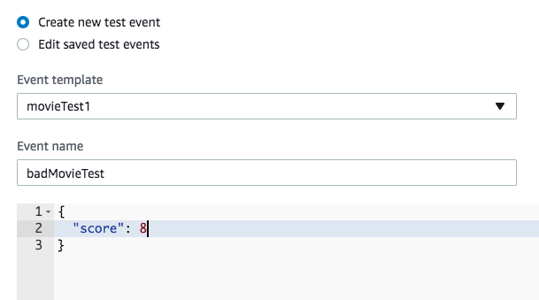

When we run this test, we can verify that nothing has been written to the table, and we see the following error in our logs showing that the input is not valid.

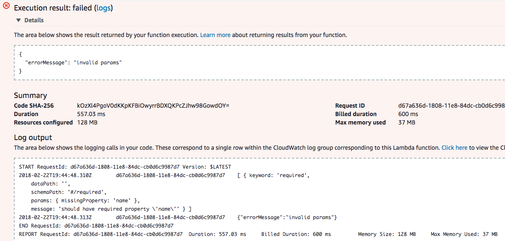

However, if we run a test with valid input…

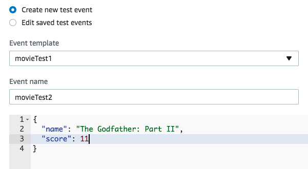

...we see no such validation error in our logs.

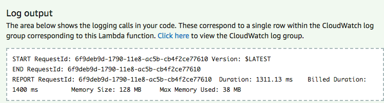

And when we check our table, we see that the function has successfully written the new event to our table, meaning the schema is working as intended.

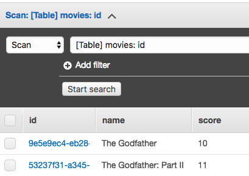
