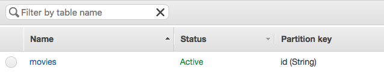
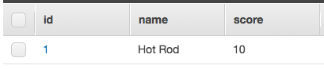
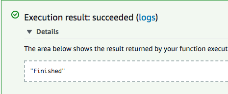

# Writing to a DynamoDB Table Using a Lambda Function

### By Andrew Levy

In this tutorial we will demonstrate how to use an AWS Lambda function to transfer a file from one S3 bucket to another.

## The Table

For this example we will use a table whose primary key is a unique string. Once the table has been created, copy down its Amazon Resource Name (ARN) as that will be used to give the Lambda function access to the table.




## Permissions For Lambda

We will need to give our function permission to write to our table. We do this by giving the function a role. Your technical supervisor may provide you a role, but if not you will need to create one. However, even if you are not creating the role yourself, it is still important to understand how roles and permissions work in AWS.

To create the role, go to the console for the AWS IAM service. Select the "Policies" tab, and then click the "Create policy" button.



In keeping with best practices, we will give the function the fewest permissions necessary to complete its intended task. It will only be able to write to DynamoDB (via the PutItem function), and only the one table that we specify.

Select the JSON tab to write out the policy. This JSON code will provide the necessary access:

```json
{
    "Version": "2012-10-17",
    "Statement": [
        {
            "Effect": "Allow",
            "Action": [
                "dynamodb:PutItem"
            ],
            "Resource":[
				"Table’s ARN goes here"
            ]
        }
    ]
}
```


Click "Review Policy," give the policy a name and description, and click "Create Policy."



Next we'll need to create the function's role and attach the policy we've just created. Select the "Roles" tab on the side navbar and click "Create role."


Select Lambda as the service that will use this role and click "Next: Permissions."


Search for the policy you've just created in the search box, check the box next to it, and click "Next: Review."


Give the role a name and description, and click the button to create the role.


## Creating the Lambda Function

Recall that in our table, the primary key is a string that we have named "id". We will be generating these id's using a Node package. This means we will need to create the function locally and install the package to it before deploying it to Lambda.

Create a directory for the function, open a terminal in the directory, and initialize the project using pnpm.

We will be created unique id's for the table using the node package [uuid](https://www.npmjs.com/package/uuid). A uuid is a [universally unique identifier](https://en.wikipedia.org/wiki/Universally_unique_identifier), which is an encoded number generated based on unique components such as a timestamp, a random number, and network information about the host generating the uuid. Using uuid's is an effective way to ensure that we will be getting unique values, which is important for the primary key of a table. The terminal command to install the package to the project is:

```
$ pnpm install uuid
```

Create an index.js file in the project and open it in your editor. This is where we will be writing the function itself.

First add the dependencies. We need to import the uuid package we've just installed. We also need to require the AWS SDK (which all Lambda functions have access to, so we don't have to install it). The SDK will then allow us to create an instance of the DynamoDB document client.

```javascript
const AWS = require('aws-sdk');
const docClient = new AWS.DynamoDB.DocumentClient({region: 'us-west-2'});
const uuid4 = require('uuid/v4');
```

This docClient instance is a standard way to target DynamoDB. It provides a simple way to create JavaScript sets. As we are specifying a region here, our function will be able to write to the table even if they are in different AWS regions.

Now for the function itself. As with all Lambda functions, we will use an ```exports.handler``` function that has three arguments: event, context, and callback.

```javascript
exports.handler = function(event, context, callback) {

	}
}
```

First we need to specify the parameters we will passing into the DynamoDB docClient method. This includes an "Item" object for the table entry itself. All entries must have an id as that is the primary key, and because it is a movies table each entry will have a name and a score. The id is created by calling the uuid function we have added, and the other two values will come from the event object. Besides "Item," we also need a "TableName" key, the value of which will naturally be the name of our table.

```javascript
exports.handler = function(event, context, callback) {
	const uuid = uuid4();
	const params = {
		Item: {
			id: uuid,
			name: event.name,
			score: event.score
		},
		TableName: 'movies'
	}
}
```

Next we'll pass those params into the docClient method. In docClient we'll then call a function to handle the result. This is where the callback parameter of our main handler function comes into play. Callback() is a method available to Lambda functions that has two arguments: the first is an error, and the second is non-error data. Therefore, if docClient.put() returns an error, we call callback() with the error as the first parameter and the second as null. If there is no error, we have null as the first argument and the return as the second one.

```javascript
docClient.put(params, function(error, data){
	if (error) {
		callback(error, null);
	} else {
		callback(null, data);
	}
});
```

Here is the entirety of index.js as we have it so far:

```javascript
const AWS = require('aws-sdk');
const docClient = new AWS.DynamoDB.DocumentClient({region: 'us-west-2'});
const uuid4 = require('uuid/v4');

exports.handler = function(event, context, callback) {
	const uuid = uuid4();
	const params = {
		Item: {
			id: uuid,
			name: event.name,
			score: event.score
		},
		TableName: 'movies'
	}

	docClient.put(params, function(error, data){
		if (error) {
			callback(error, null);
		} else {
			callback(null, data);
		}
	});
}
```

Now we can deploy our function to Lambda. In the AWS Lambda console create a new Lambda function and assign it the new role we have created for it. The runtime setting should be Node.js 6.10.


Once you have created the function in the AWS console, deploy it. At MK Decision you will typically deploy using the terminal command ```pnpm package && deploy```; however, setting up your stack to deploy to Lambda automatically with these commands is beyond the scope of this tutorial.

## Testing the Function

As mentioned before, we will run the docClient() function with our "params" object, which has three properties: id, name, and score. Id is generated by our uuid package, and the other two are passed in from the Lambda function's "event" parameter. Therefore, to test the function we'll need to create a test event with a name and a score.

Let's write a test that will create an object with these properties.


