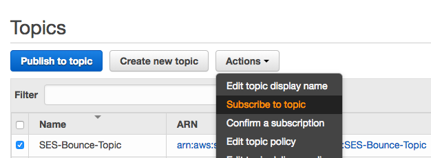
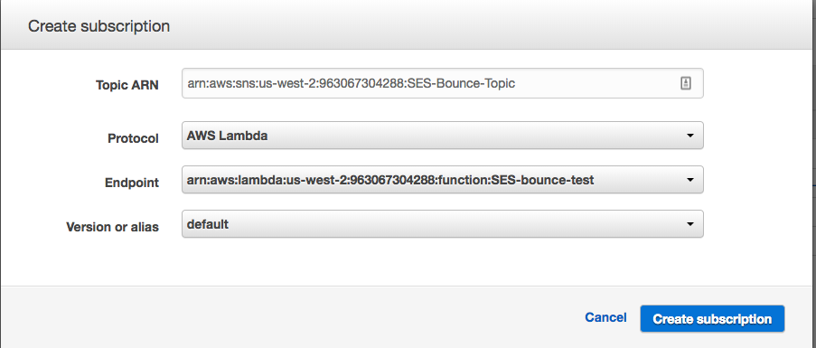
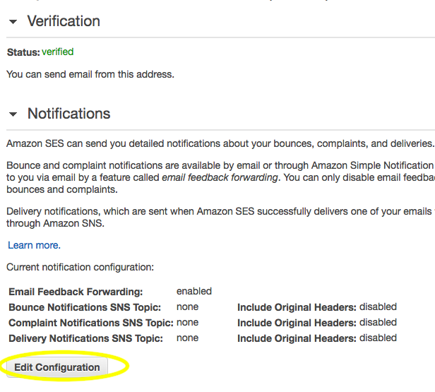
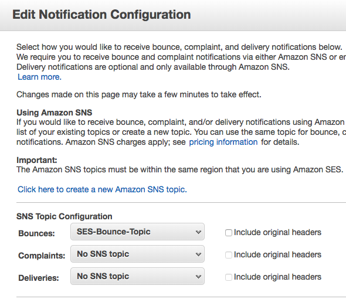
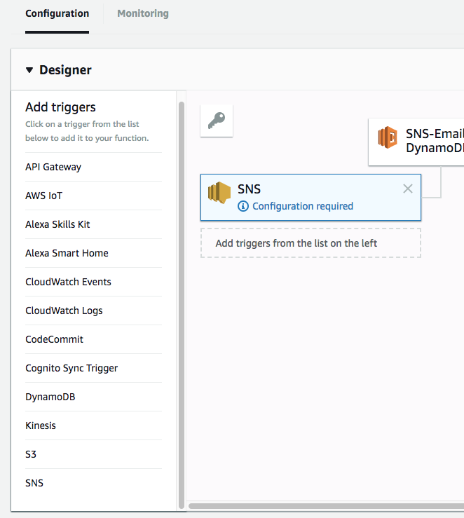
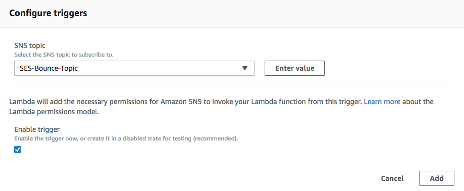
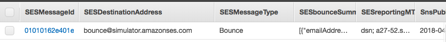

# Using an SNS Topic to Trigger a Lambda Function on SES Email Bounce

## Overview

Using AWS Simple Email Service (SES) is a convenient way to automate the sending of emails. As with any other programming concept, a developer must always be cognizant of how errors are handled when a program is run, and one error to watch for is an email not making it to its intended destination.

This tutorial will demonstrate how to set up a Lambda function using Node.js that is triggered by an AWS Simple Notification Services (SNS) topic, which listens for email bounces. For our example we will write the information of the email bounce to a DynamoDB table, though the triggered Lambda function can be set up to do just about anything.

Please note that when writing our JavaScript we will be using some older conventions, such as instantiating dependencies with the "require" keyword rather than the newer "import." This is only for the sake of keeping this guide focused on the main topic of interest. For practical applications it is advisable to use Babel.js to allow the use of newer ES6 conventions when writing Lambda functions.

## Setting Up Resources

The first component we will need for our project is a simple Lambda function that sends an email to bounce. Make sure its role gives it permission to call SES's `sendEmail()` function. Also make sure that the source email address is verified in SES (see relevant [documentation](../ses-lambda/ses-lambda.md) for more info about SES in general, including verifying email addresses).

Here is the code we will use for this function:

```javascript
const AWS = require('aws-sdk');

exports.handler = () => {
    const ses = new AWS.SES({
        region: 'us-west-2',
    });
    const emailParams = {
		Destination: {
			ToAddresses: ['bounce@simulator.amazonses.com'],
		},
		Message: {
			Body: {
				Text: {
					Data: `Email body`,
				},
			},
			Subject: {
				Data: 'SES email',
			},
		},
		Source: '<YOUR EMAIL ADDRESS HERE>',
	};
	const send = (params) => {
	    return ses.sendEmail(params).promise();

	};
	return send(emailParams)
	.catch((err) => {
	   	console.log(err);
	});
};

```

bounce@simulator.amazonses.com is a resource provided by AWS for testing purposes. Any email sent to this address will bounce.

The next resource we'll need is an SNS topic to trigger the next Lambda function. Create the topic, then select it in the SNS console, click the dropdown menu, and select "Subscribe to Topic".



The topic's resource name (ARN) will auto-populate. For protocol select AWS Lambda, and for the endpoint select the Lambda function that sends the email. Click "Create subscription".



More detailed documentation regarding SNS can be located [here](../sns-error-alert/sns-error-alert.md).

With the SNS topic created, we need to configure SES to send a notification to the topic whenever we have an email bounce. Go to the SES console and under the left sidebar's Identity Management section, click "Email Addresses". Click the hyperlink displaying the verified email address you will be using as a sender, and under the "Notifications" section click "Edit Configuration".



In the "SNS Topic Configuration" section, select your SNS topic's name under the dropdown for "Bounces". Now, whenever the source email sends a message that bounces, the SNS topic will be notified.



Lastly, we'll need to set up a DynamoDB table to write to whenever there is an email bounce. The primary key of the table will be a string called "SESMessageId". More info about DynamoDB tables can be located [here](../lambda-dynamodb/lambda-dynamodb.md).

## Lambda Function to Handle Email Bounces

We will set up this function locally before deploying it to Lambda (deployment strategies are beyond the scope of this tutorial, but typically at MK Decision this will be done using AWS CloudFormation via the AWS Command Line Interface).

Set up the project directory with `index.js` as the entry point. The `index.js` handler will be very simple; its only purpose is to call a function that writes the triggering event (an email bounce) to the table. We are creating this table-writing function separately from the handler for the sake of flexibility. This way, if we later decide that instead of writing to DynamoDB we want to store the data in S3 or some other Amazon service, we can simply write a different function and have the handler call that instead. Separation of concerns is a good habit for a developer to cultivate.

Here is the code for our handler:

```javascript
const aws = require('aws-sdk');
const dbWrite = require('./lib/dbWrite');
const ddb = new aws.DynamoDB({
	params: {
		TableName: '<YOUR TABLE NAME HERE>',
	},
});
exports.handler = (event, context, callback) => {
	return dbWrite(event, ddb)
		.then(()=> {
			callback(null, 'finished');
		})
		.catch((err) => {
			callback(err, null);
		});
};

```
Note the Promise chain starting with our `dbWrite()` call. We should make a mental note that `dbWrite()` will need to return a Promise.

We are instantiating DynamoDB with the name of the table to write to. We then pass that instance, along with info from the triggering event, into our database-writing function.

Note that it is also possible to create the DynamoDB instance right in the function that will be using it, but it is generally good practice to create such instances in higher level functions so that even if they are to be used in multiple places, they only have to be created once.

The `dbWrite()` function will be based on code provided in AWS's documentation [here](https://aws.amazon.com/premiumsupport/knowledge-center/lambda-sns-ses-dynamodb/). However, this code will write to a table not just in the case of email bounces, but also for successful deliveries and complaints. While this doubtlessly can be useful information, some of it is beyond what we need for our particular project. In addition, this example code makes extensive use of callback functions for error handling, which can be messy, difficult to read, and prone to excessive nesting of functions (AKA "callback hell"). Since the AWS [documentation](https://docs.aws.amazon.com/AWSJavaScriptSDK/latest/AWS/DynamoDB.html#putItem-property) for DynamoDB tells us that the `putItem()` function returns an AWS request, we know that it will support calling that function as a Promise instead. Doing this will lead to simpler, cleaner code. See [here](../../../languages/javascript-promises/javascript-promises.md) for more info about using Promises with the AWS SDK.

Inside our project's `lib` folder, it's time to create `dbWrite.js` for the function that writes to the table.

The event from SNS that will trigger the Lambda function has a lot of information contained within an array of `Records` objects, including the message ID; destination address; and SNS topic's resource name. Our function will write all this info in one table row. Obviously, this is fully customizable, and the function can be made to save whatever info is needed for the project. With DynamoDB, the only data points that are absolutely needed are any required keys. In our case, the primary key is the message id.

Here is the function:

```javascript

module.exports = function dbWrite(event, ddb) {
	console.log('Received event:', JSON.stringify(event, null, 2));
	const SnsPublishTime = event.Records[0].Sns.Timestamp;
	const SnsTopicArn = event.Records[0].Sns.TopicArn;
	let SESMessage = event.Records[0].Sns.Message;
	SESMessage = JSON.parse(SESMessage);

	const SESMessageType = SESMessage.notificationType;
	const SESMessageId = SESMessage.mail.messageId;
	const SESDestinationAddress = SESMessage.mail.destination.toString();
	const LambdaReceiveTime = new Date().toString();
	if (SESMessageType == 'Bounce') {
		const SESreportingMTA = SESMessage.bounce.reportingMTA;
		const SESbounceSummary = JSON.stringify(SESMessage.bounce.bouncedRecipients);
		const itemParams = {
			Item: {
				SESMessageId: {
					S: SESMessageId,
				},
				SnsPublishTime: {
					S: SnsPublishTime,
				},
				SESreportingMTA: {
					S: SESreportingMTA,
				},
				SESDestinationAddress: {
					S: SESDestinationAddress,
				},
				SESbounceSummary: {
					S: SESbounceSummary,
				},
				SESMessageType: {
					S: SESMessageType,
				},
			},
		};
		return ddb.putItem(itemParams).promise();
	};
};
```

Deploy the function to Lambda with whichever means you are using for the project. When it comes to permissions, this function's role should give it permission to write logs to AWS CloudWatch, and of course to write to our DynamoDB table.

The last step is to set up the function to be triggered by the SNS topic we created earlier. In the Lambda console for the function, go to the "Designer" section under the "Configuration" tab, and under the "Add triggers" sidebar select "SNS".


In the "Configure Triggers" section below, select your SNS topic from the dropdown, make sure the "Enable trigger" box is checked, and click "Add". Save the function.



Now it's time to test the function. Our set up should have enabled the first Lambda function to send an email through SNS, which bounces. This in turn should notify the SNS topic, which triggers our second Lambda function to write the data received from the SNS topic to the DynamoDB table.

Test the first Lambda function in the console. Since it doesn't make use of any of its event data, it doesn't matter what the test is. Now we can check the DynamoDB table to see if anything is written.



We can see that the information from the email bounce has been written to the table as intended.
