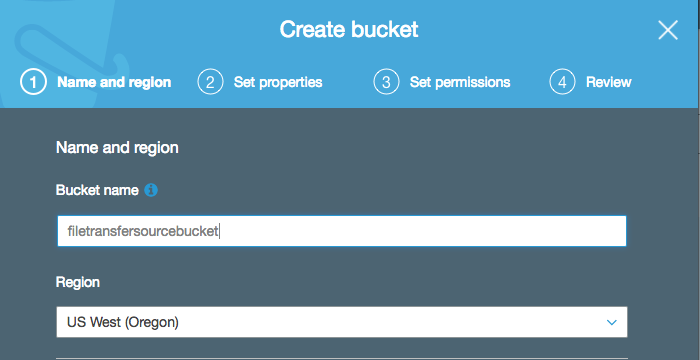
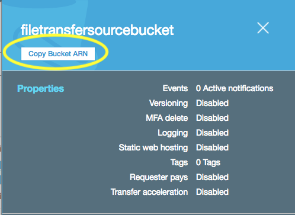
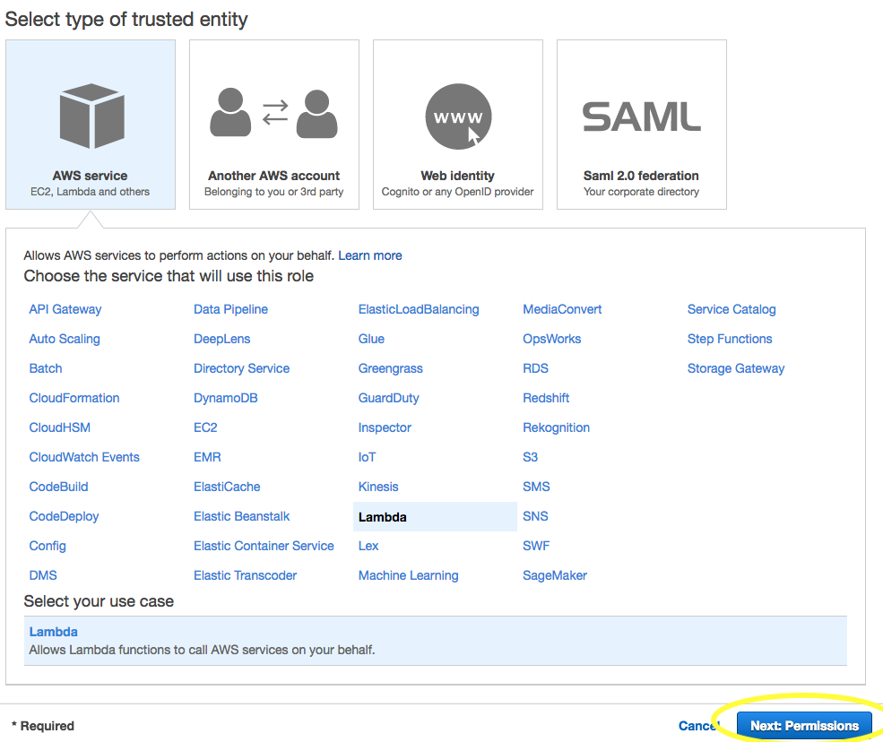
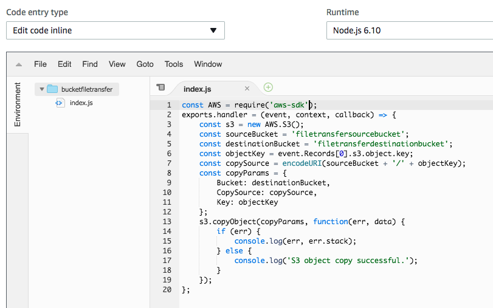
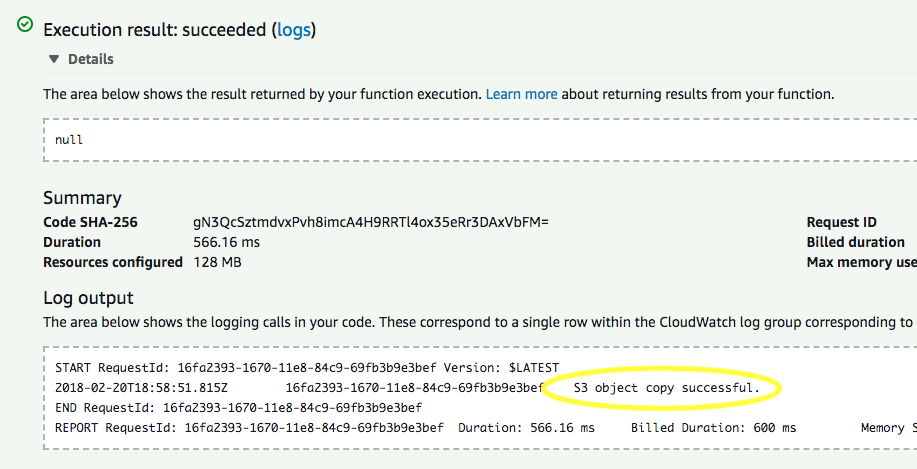
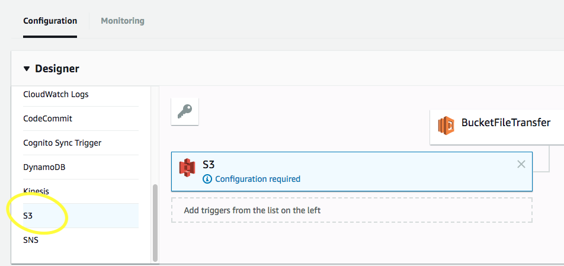
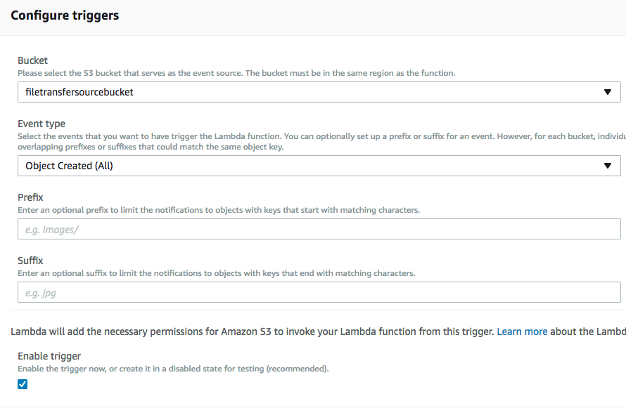

# Using Lambda to Transfer Files Between Buckets

In this tutorial we will demonstrate how to use an AWS Lambda function to transfer a file from one S3 bucket to another.

## Setting Up S3

If the buckets you will be using do not already exist you will need to create them. Make sure they are both in the same region (for MK Decision, this will be us-west-2/Oregon).



We will need the resource names (ARN's) for both buckets to set up the Lambda function and provide it the necessary permissions. You can obtain a bucket's ARN by going to S3, clicking on the bucket icon next to the left of the bucket's name, and clicking the "Copy Bucket ARN" button near the top of the module that appears.




Upload a file into the source bucket to be copied.

## Setting Permissions in IAM

Lambda functions need to be provided a role to give then permissions to access other AWS services such as S3. Your technical supervisor may be providing you access to a role that will meet your function's needs, but if not you'll need to create it yourself.

To create the role, open the AWS console for the IAM service. Permissions are provided to roles in the form of policies, so click the "Create Policy" button in the IAM console.


Select the JSON tab to enter the permissions statement as a JSON object. Typically it is best practice to give AWS services just enough permissions to complete the tasks required of them. In this case that means access to just the S3 service, and in particular just read permissions for our source bucket and write permissions for our destination bucket.

```json
{
	"Version": "2012-10-17",
	"Statement": [
        {
            "Effect": "Allow",
            "Action": [
                "s3:GetObject"
            ],
            "Resource": [
                "<Your Source Bucket ARN>/*"
            ]
        },
        {
            "Effect": "Allow",
            "Action": [
                "s3:PutObject"
            ],
            "Resource": [
                "[Your Destination Bucket ARN]/*"
            ]
        }
    ]
}
```

Don't forget to append /* to the end of each ARN in the JSON object.


Once you've updated the JSON, click the Review policy button, add a name and description, and click "Create Policy."

Now that we've created the policy, we'll need to attach it to a role. Back in the IAM console, select "Roles" on the left navigation menu, and click "Create role."


Select Lambda to indicate that will be the service using this role, and click "Next: Permissions."



Search for the name of the policy you have just created in the search box, check the box next to the policy to attach it to your role, and click "Next: Review."


Add a name and description for your role and click "Create role."

## Creating the Lambda Function

Go to the Lambda console and click "Create function." Under runtime select Node.js 6.10, give the function the role you have just created, and click "Create function."


Typically developers at MK Decision will use the package manager pnpm to deploy Lambda functions due to the use of Node.js packages. However, since our simple example function will not be using any packages, we can edit our code inline directly in the Lambda console. Here is the JavaScript code that will transfer a file between our two buckets.

```javascript
const AWS = require('aws-sdk');
exports.handler = (event, context, callback) => {
    const s3 = new AWS.S3();
    const sourceBucket = 'Source Bucket Name';
    const destinationBucket = 'Destination Bucket Name';
    const objectKey = event.Records[0].s3.object.key;
    const copySource = encodeURI(sourceBucket + '/' + objectKey);
    const copyParams = {
		Bucket: destinationBucket,
		CopySource: copySource,
		Key: objectKey
    };
    s3.copyObject(copyParams, function(err, data) {
        if (err) {
            console.log(err, err.stack);
        } else {
            console.log('S3 object copy successful.');
        }
    });
};
```

(Of course, the actual bucket names will need to go in the strings defining the appropriate constants).



All Lambda functions have access to the AWS SDK, so we need only require it as a constant. This will in turn give us access to the S3.copyObject() method.

copyObject() needs an object with three parameters as its first argument. These parameters will be our destination bucket to copy to, the source bucket to copy from, and the info of the file that will be copied (this will be provided by the event that triggers the function).

copyObject()'s second argument will be a callback function to handle errors if there are any, or otherwise to let us know of success. Typically in a production environment we wouldn't use console logs to meet these needs, but this will suit our purposes just so we can see whether the function is working or not.

## Testing the Function

Next we will call the function and let it know what file to copy. To start out, we will do this through a Lambda test event to make sure the function is operating as intended.

At the top of the Lambda console, click the "Select a test event" dropdown and select "Configure test events."


Lambda helpfully provides us a template to place a file in a bucket. In the "Event template" dropdown select "S3 Put." This will give us a sample event in JSON format that we can modify as needed.

Look in the "Records" array, which contains an "s3" object, which in turn contains an "object" object. Change the value for "key" to the filename of the image you have uploaded into the source bucket. Then in the "bucket" object also inside the "s3" object, change the value for "arn" to your source bucket's resource name, and change the value for "name" to the source bucket's name. The destination bucket is already defined in the function itself and does not need to be reiterated here in the test event.

```json
{
  "Records": [
    {
      "eventVersion": "2.0",
      "eventTime": "1970-01-01T00:00:00.000Z",
      "requestParameters": {
        "sourceIPAddress": "127.0.0.1"
      },
      "s3": {
        "configurationId": "testConfigRule",
        "object": {
          "eTag": "0123456789abcdef0123456789abcdef",
          "sequencer": "0A1B2C3D4E5F678901",
          "key": "image1.jpg",
          "size": 1024
        },
        "bucket": {
          "arn": "<source bucket ARN goes in this string>",
          "name": "<source bucket name goes in this string>",
          "ownerIdentity": {
            "principalId": "EXAMPLE"
          }
        },
        "s3SchemaVersion": "1.0"
      },
      "responseElements": {
        "x-amz-id-2": "EXAMPLE123/5678abcdefghijklambdaisawesome/mnopqrstuvwxyzABCDEFGH",
        "x-amz-request-id": "EXAMPLE123456789"
      },
      "awsRegion": "us-east-1",
      "eventName": "ObjectCreated:Put",
      "userIdentity": {
        "principalId": "EXAMPLE"
      },
      "eventSource": "aws:s3"
    }
  ]
}
```


When we run the test we have just created, function's logs should have the console log we defined to indicate success, and our image should be duplicated from the source bucket to the destination bucket.





## Adding a Trigger

Currently, the function will only duplicate the file when we run the test, using an already-uploaded file that we specify in the test. To end this demonstration we will make the function trigger automatically whenever a file is uploaded into the source bucket.

In the console for the Lambda function, create a trigger. Select S3 from the list of triggers and fill out the "Configure triggers" form as such:

Under bucket, select the source bucket.

Under event type select "Object Created (All)."

If desired, narrow down the type of files that activate the trigger using the Prefix and Suffix fields.





Click the "Add" button to save the trigger, and click "save" at the top of the page to save the changes to the function.

Now the function will trigger whenever a file is added to the source bucket, and automatically duplicate it into the destination bucket.
