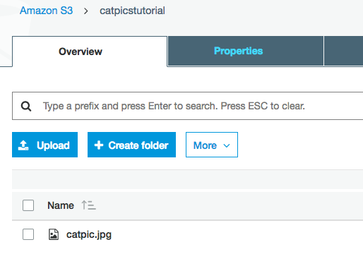
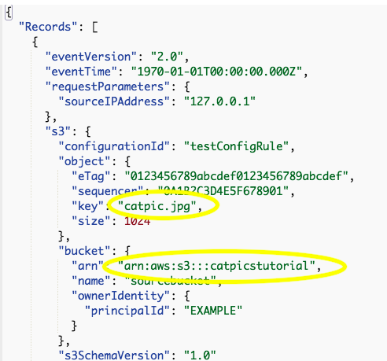
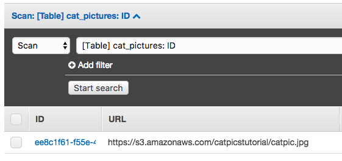
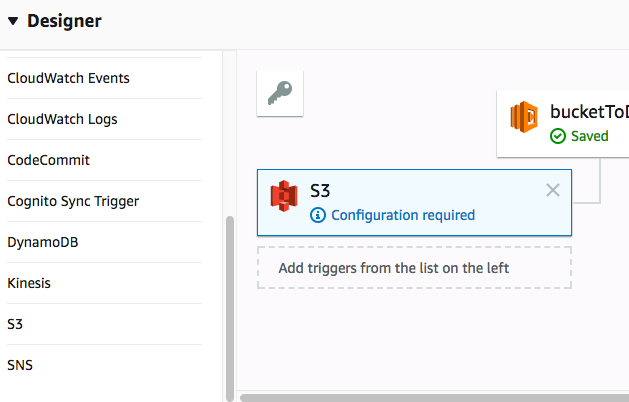
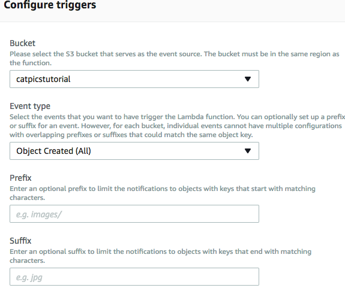
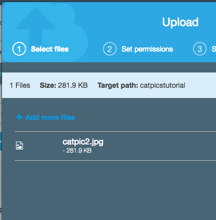
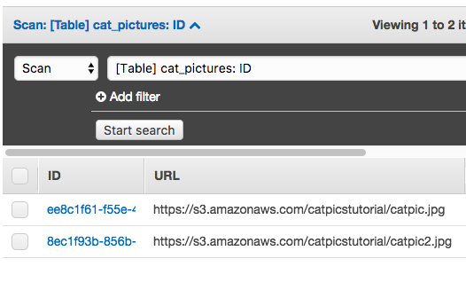

# Storing S3 Object Links in DynamoDB

Note: Read about [Promises](languages/javascript-promises/javascript-promises.md) if you haven't already before reading this.

This chapter will show you how to create a Lambda function which detects when an object is uploaded to an S3 bucket and automatically writes an entry to a DynamoDB table with a link to that object.

## Getting Started

Create a bucket in S3 entitled "catpicstutorial". Make sure this bucket is in region `us-west-2`. Note that you might need to make a slightly different variation of this name if it's not available. For the purposes of this tutorial, we will be making our S3 bucket’s contents publicly available by default so we can make sure our links in the table work (this is generally not advisable in a production environment). We can take care of this by adding a policy to our bucket. Here is the JSON we will be adding in the bucket’s policy editor:

```json
{
  "Version": "2012-10-17",
  "Statement": [
    {
      "Action": [
        "s3:GetObject"
      ],
      "Effect": "Allow",
      "Resource": "[your bucket ARN here]/*",
      "Principal": {
        "AWS": [
          "*"
        ]
      }
    }
  ]
}
```

Create a table in DynamoDB called "cat_pictures". Note that you might need to make a slightly different variation of this names if it is not available. Make sure this table is also in region `us-west-2`.

As far as IAM is concerned, if you're working in the TFE Workspace and using `tfe-lambda-role` for your Lambda function, you will not need to set a custom IAM policy, but if you're working on your own workspace you will need to add a custom role and policy. The minimum policy you need to complete this project is below:

```json
{
  "Version": "2012-10-17",
  "Statement": [
    {
      "Effect": "Allow",
      "Action": "s3::GetObject",
      "Resource": "[your bucket ARN here]"
    },
    {
      "Effect": "Allow",
      "Action": "dynamodb:PutItem",
      "Resource": "[your DynamoDB ARN here]"
    }
  ]
}
```

## The Lambda Function

We are now ready to create the function itself. Since all tables need a primary key which is unique to each object, we will be adding an npm package to our function which creates unique identifiers for every entry the function writes to the table. The unique ID is incidental to the primary purpose of this tutorial (and has been covered in more depth elsewhere), but here is a brief explanation:

* A uuid ([universally unique identifier](https://en.wikipedia.org/wiki/Universally_unique_identifier)) is an encoded number generated based on unique components such as a timestamp, a random number, and network information about the host that generated the number.
* The documentation for the package we will be using is located [here](https://www.npmjs.com/package/uuid).
* Since we are using an npm package, we need to develop this function locally and upload it to AWS. This can be done manually by zipping the files in your workspace, but you should ask a technical supervisor to help set you set up a deployment environment.
* The terminal command to install the package is `pnpm install uuid`

In your index.js, type the following code:

```javascript
const AWS = require('aws-sdk');
const uuid4 = require('uuid/v4');

module.exports.handler = function(event, context, callback) {
  // S3 bucket instance
  const s3 = new AWS.S3();

  // DynamoDB instance
  const docClient = new AWS.DynamoDB.DocumentClient({region: 'us-west-2'})

  // Bucket info
  const bucket = '[your bucket name]';
  const objectKey = event.Records[0].s3.object.key;
  const url = 'https://s3.amazonaws.com/' + bucket + '/' + objectKey;
}
```

As you can see, we have defined our `s3` and our `docClient` instances inside the scope of the handler. This is very important, because if you declare these objects globally they can cause problems with our code.

Notice that we have also configured our bucket information. There are three variables here:
* **bucket:** The name of our bucket.
* **objectKey**: The object key of the image whose link we want to store in DynamoDB. In this case, we've configured it to be the picture in the S3 bucket that was uploaded latest. The value of `objectKey` in this case will be the same as the filename.
* **url**: The URL reference to said picture that was most recently uploaded. Eventually we will store this into DynamoDB.

Next, let's define the parameters that will be written to the table. Add this to the function:

```javascript
let id = uuid4();
const params = {
  Item: {
    id: id,
    url: url
  },
  TableName: '[your table name]'
}
```

These parameters will write entries containing an id and the url of the picture. After `params`, write the code below:

```javascript
let writeToDb = docClient.put(params).promise();
writeToDb.then(function (data) {
  callback(null, data);
}).catch(function (err) {
  callback(err, null);
});
```

This code creates a promise for S3's `put()` function. It then runs that promise, and in the `then()` block (successful case) calls the handler callback inputting data and in the `catch()` block (unsuccessful case) calls the handler callback inputting the error. At MK Decision we use promisified AWS SDK functions as much as possible, but a different way (the way the [AWS SDK documentation](https://docs.aws.amazon.com/AWSJavaScriptSDK/latest/AWS/DynamoDB.html#putItem-property) uses) would be something like this:

```javascript
docClient.put(params, function (err, data) {
	if (err) {
		callback(err, null);
	} else {
		callback(null, data);
	};
});
```

All in all, our handler function should look like this:

```javascript
const AWS = require('aws-sdk');
const uuid4 = require('uuid/v4');

module.exports.handler = function(event, context, callback) {
  // S3 bucket instance
  const s3 = new AWS.S3();

  // DynamoDB instance
  const docClient = new AWS.DynamoDB.DocumentClient({region: 'us-west-2'})

  // Bucket info
  const bucket = '[your bucket name]';
  const objectKey = event.Records[0].s3.object.key;
  const url = 'https://s3.amazonaws.com/' + bucket + '/' + objectKey;

  // configure params
  let id = uuid4();
  const params = {
    Item: {
      ID: id,
      URL: url
    },
    TableName: '[your table name]'
  }


  let writeToDb = docClient.put(params).promise();
  writeToDb.then(function (data) {
    callback(null, data);
  }).catch(function (err) {
    callback(err, null);
  });
}
```

Upload this code to Lambda. Make sure that whatever role is assigned to this function has permissions to access the S3 bucket and the DynamoDB table you created.

We can now write a test for the function using a file that we've already uploaded to the bucket:



In your Lambda console, choose click on "Configure test events". Since Lambda provides a number of templates to base your tests off of, we can create a new test event based off of "S3 Put". In the "s3" object within "Records" change the value for the "key" parameter to be the name of your file’s key, which as already stated will be the same as the file’s name (you can also get the key by going to the bucket in the AWS console and looking at the object’s properties). Then in the "bucket" object set the "arn" property to that of your bucket. Below is an example of that in action.



Save the test case and click "Test" on the AWS Lambda console. After we run the test we can open the table in DynamoDB and should see that an entry has been written to our table:



Because we have made the bucket’s contents publicly available, opening that URL in our browser gives access to the file.

Lastly, let’s create a trigger for the function so that any time a new file is uploaded to the bucket, the function automatically runs and creates a corresponding entry in the table.

In the Lambda function, go to the trigger designer and select S3 to add it.



Then below, configure the trigger so the event type is "Object Created (All)". For this example we want this to trigger for all objects added to the bucket, but if you wanted to specify only certain objects to be referenced in the table you would do so using the "Prefix" and "Suffix" fields.



Make sure "Enable trigger:" is checked, click "Add" to activate it, and save the function. Let’s upload a new file to the bucket to test the trigger.



Once the new image is uploaded, we can see its URL has shown up in our table.



When we click on the link, we can confirm that the photo has been properly uploaded.
