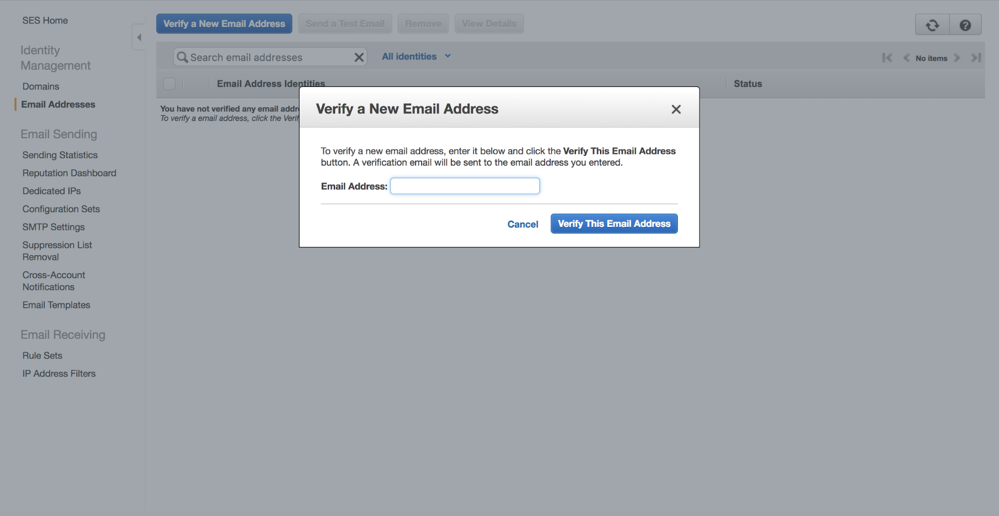

# Using SES and Lambda to Send Emails

Note: Read about [Promises](languages/javascript-promises/javascript-promises.md) if you haven't already before reading this.

This tutorial aims to explain how to create a Lambda function to send email using SES. Please note that to send email to unverified addresses you must be using a business account that has requested permissions to AWS because of their anti-spam restrictions. To do that read the documentation [here](https://docs.aws.amazon.com/ses/latest/DeveloperGuide/request-production-access.html).

## Getting Started

Register an email address by entering it into the AWS SES Email Address section and clicking the link that got sent to that address in a verification email. This is only used for the email that is sending a message, or if you are using an account that has not been given permissions by AWS. While testing, recipient emails must also be verified.



Next, give your Lambda function permission to use SES. You’ll need to make a custom policy in AWS IAM. Go to the Roles section and click on the role to edit in. Create an inline policy and enter this JSON:

```json
{
    "Version": "2012-10-17",
    "Statement":[{
       "Effect": "Allow",
       "Action": ["ses:*"],
       "Resource":"*"
       }
    ]
 }
 ```

For more information on how to configure permissions in SES, read the [documentation](https://docs.aws.amazon.com/ses/latest/DeveloperGuide/control-user-access.html).

There are two ways to write a Lambda function that calls SES to send an email. One is simple, but cannot include attachments. The other allows for attachments.

## The Simplest Way

The first way is more simple, but cannot include attachments in the email, so MIME (Multipurpose Internet Mail Extensions) is not required. The AWS documentation that the following code is based on can be found [here](https://docs.aws.amazon.com/sdk-for-javascript/v2/developer-guide/ses-examples-sending-email.html). Here is the code for this Lambda function:

```javascript
const aws = require('aws-sdk');
const ses = new aws.SES({
   region: 'us-west-2'
});

exports.handler = function(event, context) {
    console.log("Incoming: ", event);

    let params = {
        Destination: {
            ToAddresses: ["example@mkdecision.com"]
        },
        Message: {
            Body: {
                Text: {
                    Data: "Hey! What is up?"
                }
            },
            Subject: {
                Data: "Email Subject!!!"
            }
        },
        Source: "example@mkdecision.com"
    };

    console.log('===SENDING EMAIL===');
    var email = ses.sendEmail(params, function(err, data){
        if(err) console.log(err);
        else {
            console.log("===EMAIL SENT===");
            console.log(data);
            console.log("EMAIL CODE END");
            console.log('EMAIL: ', email);
            context.succeed(event);
        }
    });
};
```

This function can only send text. In order to send emails with attachments, you need to use `sendRawEmail()`.

## Sending Emails with Attachments

This way is a little more complicated, but can include attachments. This function is based on a GitHub project referenced [here](https://github.com/andrewpuch/aws-ses-node-js-examples/issues/1).

```javascript
const aws = require('aws-sdk');
const email = "example@mkdecision.com";

exports.handler = function(event, context, callback) {
  const ses = new aws.SES({
     region: 'us-west-2'
  });

  console.log("Incoming: ", event);

  let ses_mail = "From: 'AWS Tutorial Series' <" + email + ">\n";
  ses_mail = ses_mail + "To: " + email + "\n";
  ses_mail = ses_mail + "Subject: AWS SES Attachment Example\n";
  ses_mail = ses_mail + "MIME-Version: 1.0\n";
  ses_mail = ses_mail + "Content-Type: multipart/mixed; boundary=\"NextPart\"\n\n";
  ses_mail = ses_mail + "--NextPart\n";
  ses_mail = ses_mail + "Content-Type: text/html; charset=us-ascii\n\n";
  ses_mail = ses_mail + "This is the body of the email.\n\n";
  ses_mail = ses_mail + "--NextPart\n";
  ses_mail = ses_mail + "Content-Type: text/plain;\n";
  ses_mail = ses_mail + "Content-Disposition: attachment; filename=\"attachment.txt\"\n\n";
  ses_mail = ses_mail + "AWS Tutorial Series - Really cool file attachment!" + "\n\n";
  ses_mail = ses_mail + "--NextPart--";

  let params = {
      RawMessage: { Data: new Buffer(ses_mail) },
      Destinations: [ email ],
      Source: "'AWS Tutorial Series' <" + email + ">'"
  };

  ses.sendRawEmail(params, function(err, data) {
      if(err) {
          callback(err, null);
      }
      else {
          callback(null,data);
      }
  });
};
```

The ses_mail section is using MIME types (Multipurpose Internet Mail Extensions). You write the input type and subtype, like `multipart/mixed`, along with the message and files, to a string. You then buffer that string. Afterwards, `sendRawEmail()` utilizes that buffer to create an email message and immediately queue it for sending. When calling this operation, you may specify the message headers as well as the content. The `sendRawEmail()` function is particularly useful for sending multipart MIME emails (such as those that contain both a plain-text and an HTML version).

Documentation on MIME can be found [here](https://developer.mozilla.org/en-US/docs/Web/HTTP/Basics_of_HTTP/MIME_types). It is recommended that you also read the [documentation](https://docs.aws.amazon.com/ses/latest/DeveloperGuide/send-email-raw.html) for `sendRawEmail()` as well as other SES actions.
