# Using SNS and CloudWatch to Set Up Error Alerts

In this AWS tutorial we will demonstrate how to set up a CloudWatch alarm that triggers an SNS email alert for the purpose of notifying developers of an error in a Lambda function.

Let's start with a simple function in Lambda that does nothing but throw an error.

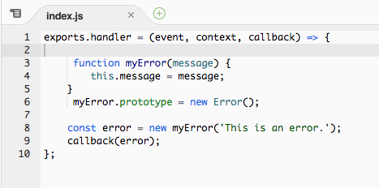

When we run any simple test on the function (using the default “Hello World” template will suffice) we can see that it does, in fact, err out, and refers to a log in AWS CloudWatch.

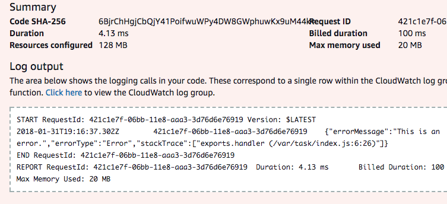

Looking in the CloudWatch log group for this function, we can see the log for the error.

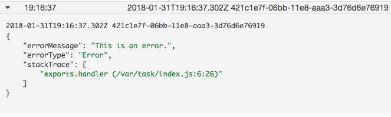

However, at this point we can only become aware that there was an error by checking the logs either in the CloudWatch or Lambda console. Instead, we want to be notified automatically when there is an error. This will involve setting up an alarm in CloudWatch. Before that, however, we need to create an SNS subscription so the alarm has someone to notify.

Go to the AWS SNS service and create a new topic. We will shortly provide its resource name (ARN) to our soon-to-be-created CloudWatch alarm.

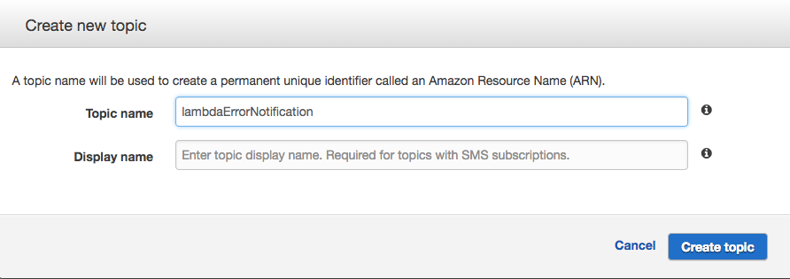

Once the topic is created, go to the “Subscriptions” page in SNS and create a new subscription.

To set up an email subscription:
* Add your new topic’s ARN
* Protocol is “Email”
* Endpoint is the email address you will be notifying.

SNS will send an email to the specified email addresses in order to confirm the subscription. Once this is done, we’re finally ready to create our CloudWatch alarm.

Under the “Alarms” tab in CloudWatch, click “Create Alarm”.

For our example we will click “By Function Name” under “Lambda Metrics” and click “Next.”

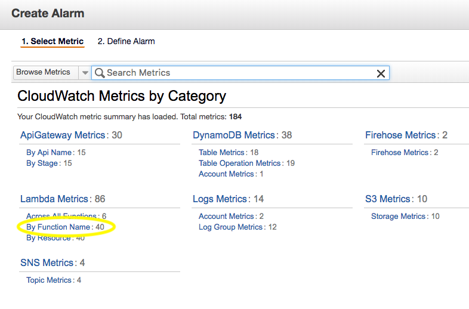

We will locate the metrics for our example function (in this example the function we’ve created is called errorAlert), check the box next to the one for errors, and click “Next” again.

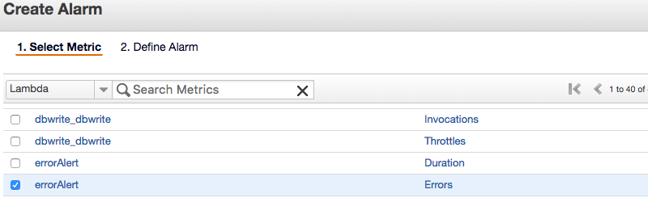

Give your alarm a name and description. We’ll set it to run whenever the number of errors is greater than 0.

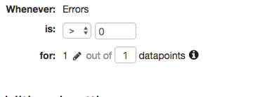

Now we’ll set the period of the alarm. Since for this example we want the alarm to trigger when the function encounters a single error, and because the alarm will only notify us once for the whole period for which it is set, we’ll set the period for as short a time as CloudWatch allows us. That will allow the alarm to run again as soon as possible.

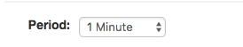

Finally, under “Actions” make sure your notification state is set to ALARM (so that the action is taken when and only when the alarm is triggered), and the notification is sent to the SNS topic we created earlier (enter the ARN, or click “Select list” and select the topic from the dropdown if it appears there).

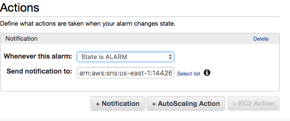

Save the alarm and note that it starts in the “INSUFFICIENT_DATA” state.

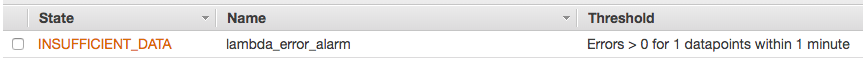

This means that because the alarm has not detected the function being run, there has not been sufficient data for the alarm to check.

Let’s test our function again. Of course, we can see the error in the Lambda console as before, but let’s check the endpoint email address to make sure the alarm has been set up properly to notify us. Note that because in the alarm config we set the period to one minute, it will take at least a full minute from testing the function until the period closes and the e-mail is sent.

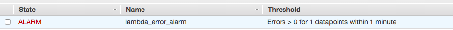

Success - we can see we’ve received an email notifying us of the state change, and a timestamp of when the state change occurred.

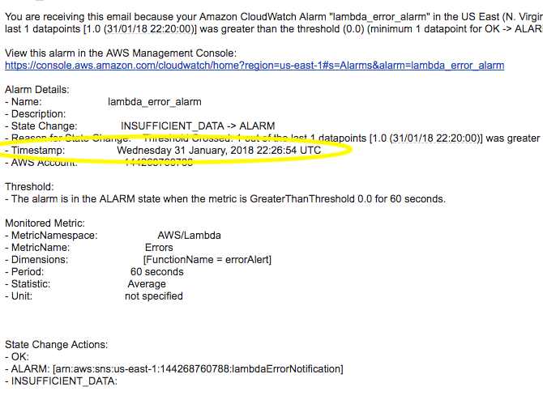

While the e-mail does not contain the actual error message, we can open our CloudWatch logs for the Lambda function…

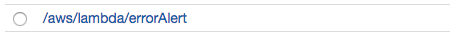

...and see a log with a timestamp matching the one in the email (adjusting for the fact that CloudWatch logs are by default in UTC time)…

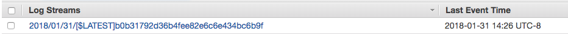

...and see an entry with error message we set up in the Lambda function.

Be aware that once the alarm state has been set to “ALARM” it will take a few minutes reset to “INSUFFICIENT DATA.” During this time the alarm will not be usable.

Lastly, once the alarm’s state has reset, let’s check that it is working as expected and not firing when there isn’t an error. Let’s change the function to contain just a console log.

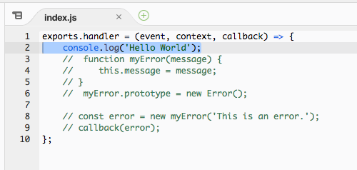

Test the function and we see that there aren’t any errors.

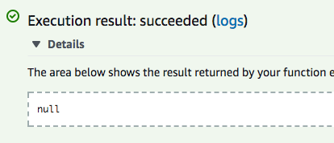

And when we go back to our Alarms tab in CloudWatch, we can see that the alarm’s state has instead changed to “OK”.

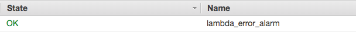

And we have not received any emails.

As with the “ALARM” state, it will take up to several minutes for the state to reset from “OK” to “INSUFFICIENT DATA.” During this time the alarm will not be usable.
