# How to pass a file type through API Gateway

### By Tim Petrone

API Gateway now allows for the passing of binary media types (i.e. files). In this document, we will be showing you how to pass through a .PDF file.

First create an API in API Gateway by clicking the “Create API” button in the top left of the screen and following the instruction to name and create the API.

&nbsp;&nbsp;&nbsp;&nbsp;&nbsp;&nbsp;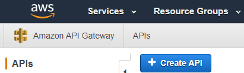


 After that, under the API name on the left side of the screen , click on settings.


 &nbsp;&nbsp;&nbsp;&nbsp;&nbsp;&nbsp;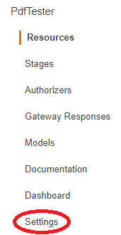


From there, you can add all files to the accepted binary media types by adding */* (we are allowing the API to accept all file types and can validate elsewhere such as in the Lambda function itself).


&nbsp;&nbsp;&nbsp;&nbsp;&nbsp;&nbsp;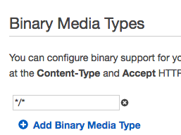


Next, we need to link up our Lambda function to an API Gateway Resource. Create a resource by going to the Resources section under the API name on the left side of the screen, click on the “Actions” dropdown menu and select “Create Resource.”


&nbsp;&nbsp;&nbsp;&nbsp;&nbsp;&nbsp;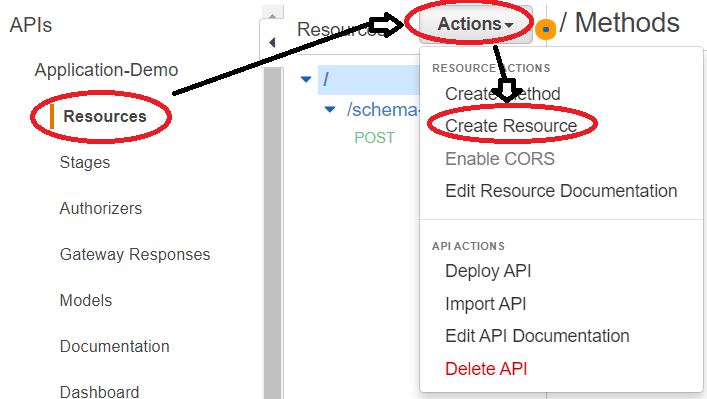


Name your new resource and click “Create Resource”


Next, select the new resource created, click the “Actions” drop-down menu again, and click “Create Method.”


&nbsp;&nbsp;&nbsp;&nbsp;&nbsp;&nbsp;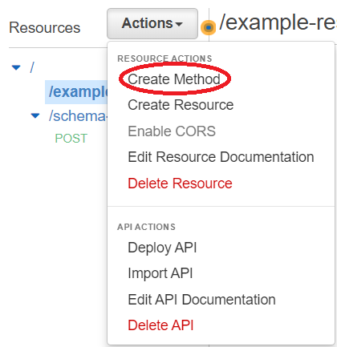


A dropdown field will appear below the resource. Click on the field and select “POST”. A “POST” section will appear below the resource.


&nbsp;&nbsp;&nbsp;&nbsp;&nbsp;&nbsp;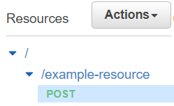


Clicking on the “POST” section will provide you with the setup page to the right. Under Integration type select Lambda Function. Click the checkbox for Use Lambda Proxy integration. Under lambda region, select your AWS region (for MK it will be us-west-2). Once that is entered, another field will appear asking for the Lambda Function you will be connecting to the resource. If you have already made a function, enter the name and click Save.


&nbsp;&nbsp;&nbsp;&nbsp;&nbsp;&nbsp;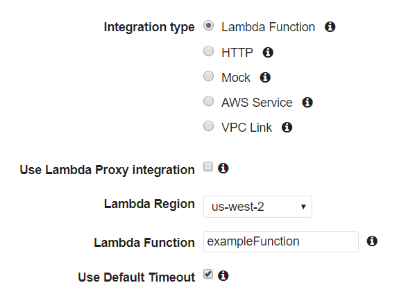


Now, let’s take a look at our Lambda function we are linking to our API method.

```javascript
exports.handler = (event, context, cb) => {

  const response = {
    statusCode: 200,
    body: ''
  };

  cb(null, response);
};
```

This is a simple function for binary events. All binary event functions should have at least the 2 keys in the response const: statusCode and body. Other keys that can be included if needed are headers: {} and isBase64Encoded: true or false.

To check if this is working with a real .PDF, download and open Postman. While you are doing that, grab the URL of the method in API Gateway. First deploy the API by going to the Resources section, clicking the “Actions” drop-down button and selecting “Deploy API.”


&nbsp;&nbsp;&nbsp;&nbsp;&nbsp;&nbsp;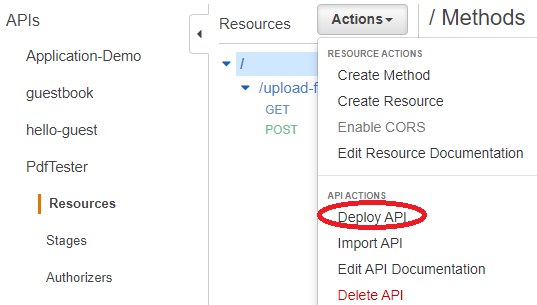


Select the Deployment stage. If there is none, create a new deployment stage and name it “prod.”

After the API has been deployed, go to the Stages section under the API name on the left side of the screen, click on your new deployment, click on your resource, and click on the POST method.


&nbsp;&nbsp;&nbsp;&nbsp;&nbsp;&nbsp;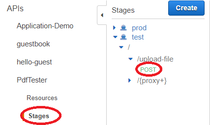


From there, grab the URL on the top of the new window.


&nbsp;&nbsp;&nbsp;&nbsp;&nbsp;&nbsp;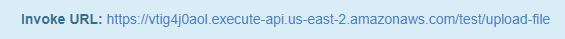


Back in Postman, change the request to POST and input the URL provided by API Gateway you just grabbed above, go to the Body tab, select the form-data input, change the key to be a file type, and browse to choose your .PDF test file. If you are not sending the .PDF through a form, you can simply use the binary input option.


&nbsp;&nbsp;&nbsp;&nbsp;&nbsp;&nbsp;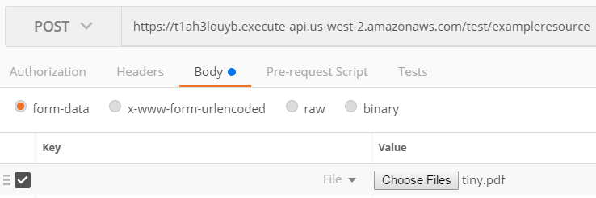


Press on the “Send” button in the top right. The response field should be empty. If there are any errors, they would show up in here. Some common errors I found while testing were 403: Missing Authentication Token, which means your URL is probably incorrect or  502: Internal server error, which means your Lambda function is probably not correct.

To check if the .PDF is actually being sent through, we can check the Cloudwatch logs. In the Cloudwatch service, click on the Logs section on the left side of the screen and choose the lambda function you have been using.


&nbsp;&nbsp;&nbsp;&nbsp;&nbsp;&nbsp;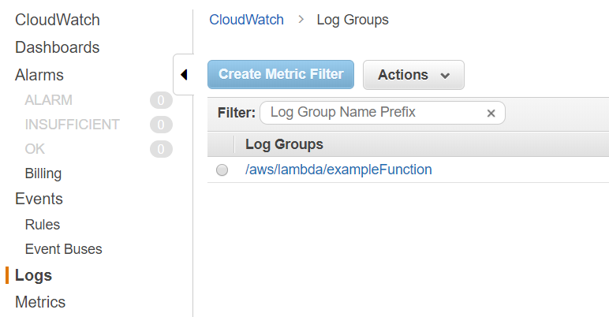


After that, click on the latest log stream which will be the first log on the top of the list.


&nbsp;&nbsp;&nbsp;&nbsp;&nbsp;&nbsp;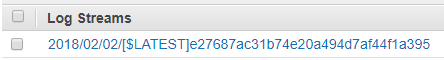


In this log you will see all of the events that occured while running this lambda function. In one of the events you can see that the .PDF file is being passed through.


&nbsp;&nbsp;&nbsp;&nbsp;&nbsp;&nbsp;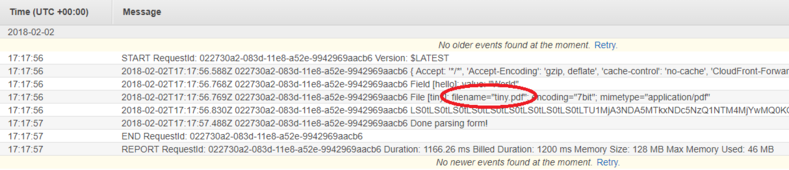


If you have not made an S3 bucket yet, make one now. In the bucket, you will have to change the permissions to make the bucket public. To do this, click on your bucket in the S3 service, click on the permissions tab, click on the Bucket Policy section, and copy the following code into the IDE:

(Please refer to the document “[AWS - Using Lambda to transfer file between buckets](https://docs.google.com/document/d/1awH_pgaMtY9g7kJUtBUNPY3ZCCmZJcdO--Z7Fr5lZ-o/edit)” for a more detailed explanation of how to set up buckets, if needed.)


&nbsp;&nbsp;&nbsp;&nbsp;&nbsp;&nbsp;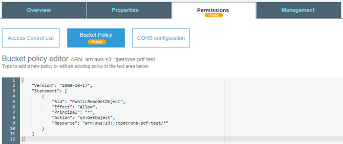

```javascript
{
  "Version": "2008-10-17",
  "Statement": [
    {
      "Sid": PublicReadGetObject",
      "Effect": "Allow",
      "Principal": "*",
      "Action": "s3GetObject",
      "Resource": "arn:aws:s3:::<bucket name goes here>/*"
    }
  ]
}
```

Now that we know the .PDF is successful being passed through API Gateway and we have our S3 bucket setup, we need to parse the file data back to being usable so we can send it to S3 from the Lambda function. For this we will use a Node.js package called Busboy. We need to update our Lambda function as follows:

```javascript
const AWS = require('aws-sdk');
const s3 = new AWS.S3();
const busboy = require('busboy');

exports.handler = (event, context, callback) => {

 const response = {
   statusCode: 200,
   body: ''
 };

 let bb = new busboy({ headers: event.headers });
 console.log(bb);
 bb.on('file', function (fieldname, file, filename, encoding, mimetype) {
   console.log('File [%s]: filename=%j; encoding=%j; mimetype=%j', fieldname, filename, encoding, mimetype);

   s3.upload({
     Bucket: '<bucket name goes here>',
     Key: filename,
     Body: file
   }).promise()
   .then(function(){
     callback(null, response);
   });
 })
 .on('field', (fieldname, val) => {
   console.log('Field [%s]: value: %j', fieldname, val)
 })
 .on('finish', () => {
   console.log('Done parsing form');
   callback(null, response)
 })
 .on('error', err => {
   console.log('failed', err);
   callback(err)
 })

 bb.end(Buffer.from(event.body, 'base64'));
 console.log('event.body', event.body)
}
```

This code uses Busboy to parse the incoming file. The .on is an event listener which recognizes when a file is present and executes certain commands. Busboy outputs a stream that we can use to upload to S3 by using the s3.upload function seen above. By the time Busboy ends, the file will be in the S3 bucket specified.


If the Lambda function is not setup properly, you may experience a .PDF being saved into the S3 bucket, but when opened is blank. With a little refactoring, the .PDF will show.

Now we must grab the S3 URL of the newly imported file so we can reference it later in a database, we can build the URL using the basic AWS S3 web link and the information we already have. It will look something like this: let url = 'https://s3-us-west-2.amazonaws.com/' + s3Bucket + '/' + s3Key; We have to update the Lambda function very slightly to build this URL. Add in and update the few missing variables in the given URL above.


If you are submitting the information through a form and you have other non-binary data that needs to be parsed out, we can do this by updating the .on(‘field’) portion of the Busboy function. The way I did it was to define jsonObject and jsonComplete as empty objects outside of the Busboy function. After that you can make changes to the .on(‘field’) portion like so:

```javascript
.on('field', function (fieldname, val) {
  jsonObject[fieldname]=val;
  let url = 'https://s3-us-west-2.amazonaws.com/' + s3 bucket = '/' + s3Key;
  jsonObject.resume = url;
  jsonComplete = {
    statusCode:200,
    body: JSON.stringify(jsonObject)
  };
  console.log('JSON', jsonComplete);
})
```

This essentially will iterate every time the function sees an event key. The jsonObject[fieldname]=val; line is creating a new JSON object key every iteration and assigning all of the keys to be the correct name and, therefore, the correct value.

The next two lines about the URL will add in the S3 reference that the .PDF file created to the JSON object so you can store the reference with the rest of the information.

The jsonComplete object is giving API Gateway an OK response and stringifying the newly completed JSON. After this, add a line in the .on(‘finish’) section to callback(null, jsonComplete) to get the desired output.
