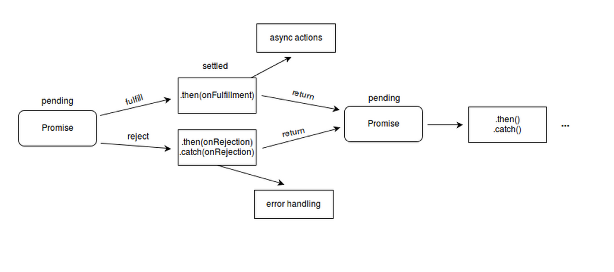

# Promises

## General Explanation

“Sometimes people don't understand the promises they're making when they make them." --John Green, _The Fault in Our Stars_

Promises are constructs which were introduced to reduce the complexity of asynchronous JavaScript code. They can be a little difficult for a novice coder to understand and utilize effectively. This chapter is meant to clarify what Promises are and how you should use them.

From Mozilla’s [official documentation](https://developer.mozilla.org/en-US/docs/Web/JavaScript/Reference/Global_Objects/Promise#Description): "A Promise is a proxy for a value not necessarily known when the promise is created. It allows you to associate handlers to an asynchronous action's eventual success value or failure reason. This lets asynchronous methods return values like synchronous methods: instead of the final value, the asynchronous method returns a promise for the value at some point in the future." In simpler words: a Promise is a word taken for some action, the other party who gave the Promise might fulfill it or deny it. In the case of fulfilling, the promise gets resolved, and in another case, it gets rejected.



Here is an example of a function containing a simple Promise:

```javascript
function numberPromise(number) {
	return new Promise(function (fulfill, reject) {
		try {
			if (number === 1) {
				fulfill(number);
			} else {
				throw new Error('Bad number');
			}
		} catch(err){
			reject(err);
		}
	});
}
```

This function returns a Promise, which checks if a number is equal to 1. If it is, it fulfills the Promise, meaning that it can resolve such that the function returns 1. If the number is not equal to 1, however, an error is thrown and later caught, and the Promise is rejected.

## Promises in Action

Be very careful when working with Promises. If you access data that is expected to be returned from a Promise, you must guarantee that the Promise was fulfilled. There are two ways to do this:

### 1) Promise Chaining

You can chain Promises to access their data. If you call the function above, you can put the result in the next part of the chain, like so:

```javascript
numberPromise(1).then(function (result) {
	console.log(result);
});
```

Basically what this function does is call the function `numberPromise()`. Assuming you pass in the number 1, 1 will be returned by that function. in the `.then()` portion, 1 is passed into the function as the parameter `result` and then `1` is printed in the console output. You can add as many `.then()` blocks as you like this way.

Error handling is also a breeze with this method. For that, simply add a `catch()` portion, like so:

```javascript
numberPromise(5).then(function (result) {
	console.log(result);
}).catch(function (err) {
	console.log(err.message);
});
```

When you call this, assuming `number` is not equal to 1, you will throw an error, and that error will be passed to the `catch()` portion, where `err` is passed in as a parameter and then `Bad number` is printed.

### 2) Using Promise.all()

Sometimes you want to run two asynchronous calls at the same time. That is, after all, the point of asynchronous functions. To do that, you need to use `Promise.all()`. Take the code below for example:

```javascript
let promise1 = numberPromise(1);
let promise2 = numberPromise(1);

Promise.all([promise1, promise2]).then(function (values) {
	console.log(values);
});
```

This code creates two variables assigned to Promises. `Promise.all()` then makes sure to wait until both Promises are done working and have resolved to run. In this way, you can be certain that you have everything you need if you want to run two or more Promises at the same time.

### A Note about the AWS SDK

Whenever we call a function from the AWS SDK, if it returns a [Request](https://docs.aws.amazon.com/AWSJavaScriptSDK/latest/AWS/Request.html) object, we always want to add `.promise()` afterwards, [as demonstrated in the AWS SDK documentation](https://docs.aws.amazon.com/AWSJavaScriptSDK/latest/AWS/Request.html#promise-property).

## Resources

* [MDN on Promises](https://developer.mozilla.org/en-US/docs/Web/JavaScript/Reference/Global_Objects/Promise)
* [MDN on Promise.all()](https://developer.mozilla.org/en-US/docs/Web/JavaScript/Reference/Global_Objects/Promise/all)
