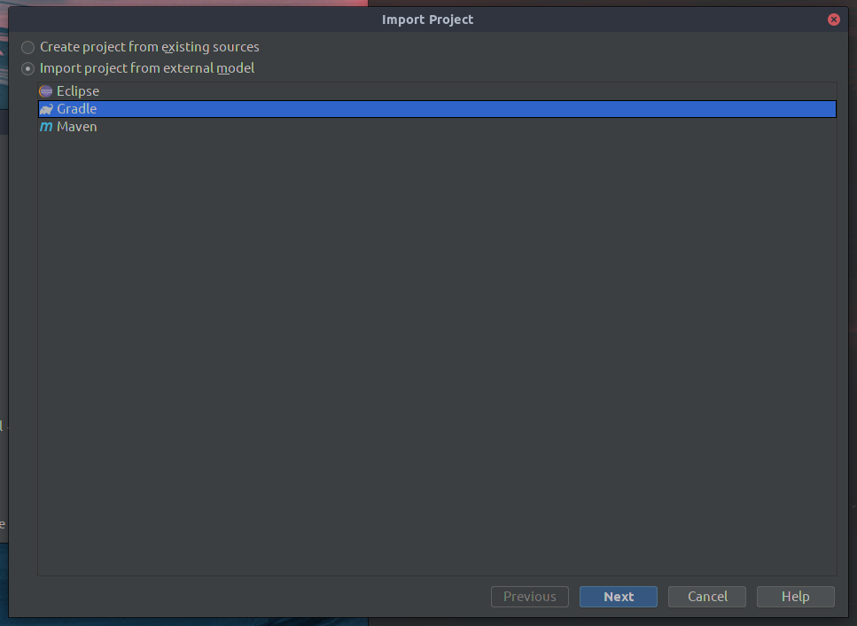
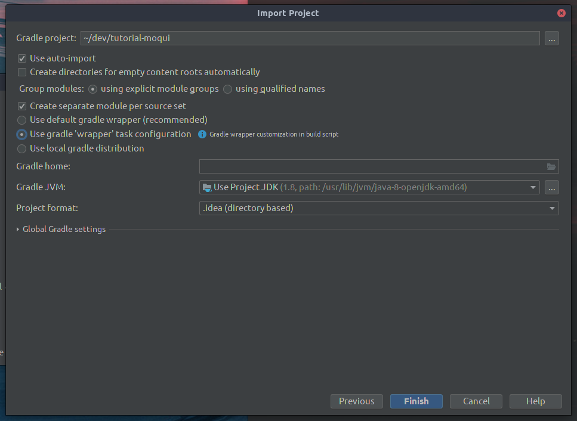
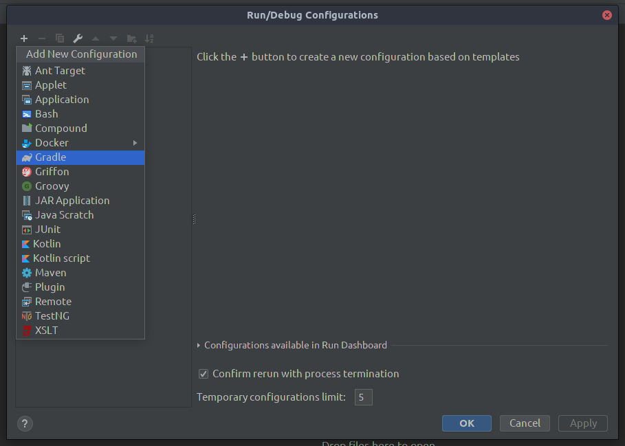
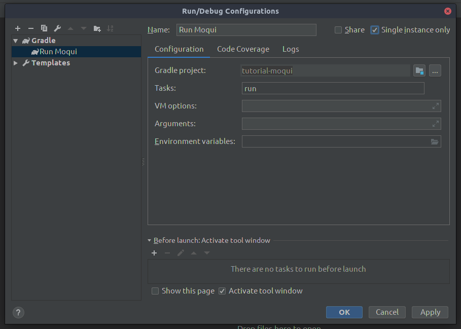

# Intellij Idea Tutorial

1. Install IntelliJ Idea by following these steps:

[Install and set up IntelliJ IDEA - Help | IntelliJ IDEA](https://www.jetbrains.com/help/idea/install-and-set-up-product.html)

2. Open IntelliJ and click "Import Project"

3. Select Gradle as the project type and hit next

4. Configure the project to look like below and then click Finish:
    - Check "Use auto-import"; this makes sure that all of your gradle build files are kept updated in the background by IntelliJ
    - Check "Use gradle 'wrapper' task configuration" to tell IntelliJ to use Moquis' gradle wrapper.

## Set up a run configuration

One powerful feature of an IDE is running and debugging your application, so we'll set up a run configuration that will allow you to do that.

1. Click "Add Configuration..." in the top-right next to the green hammer
2. Click the + button at the top-left of the dialog and choose the "Gradle" option
 

3. Set up your configuration like below:
    - Click the folder button next to the "Gradle project" input and select the top-most directory
    - Input "run" as your task. It uses the same tasks you would use with `./gradlew`
    - Check "Single instance only"

4. Hit OK and you can now use the green play button where you found the run configurations to run Moqui.